# 云计算虚拟化技术和容器技术详解

> 原文：[`c.biancheng.net/view/3887.html`](http://c.biancheng.net/view/3887.html)

虚拟化技术是云计算的重要技术，主要用于物理资源的池化，从而可以弹性地分配给用户。物理资源包括服务器、网络和存储。但是计算资源的池化不一定要用虚拟化技术，金属裸机也能池化，比如 IBM 的 Softlayer 就是直接使用物理机来实现云计算的。

主机虚拟化的思想可以追溯到 IBM 机器的逻辑分区，即把一台 IBM 机器划分成若干台逻辑的服务器，每台逻辑服务器拥有独占的计算资源（CPU、内存、硬盘、网卡），可以单独安装和运行操作系统。IBM 机器价格昂贵，相对于当时的计算任务来说，机器的计算能力太过强大，所以需要划分为更小的计算单元。

后来随着个人计算机处理能力的不断发展，1998 年 VMware 公司成立，这家公司专注于机器虚拟化的软件解决方案。也就是说，对于不支持逻辑分区的计算机，可以直接通过安装 VMware 虚拟化软件来模拟更多的虚拟机，然后再在这些虚拟机里安装操作系统和应用软件，可以给虚拟机灵活配置内存、CPU、硬盘和网卡等资源，如图 1 所示。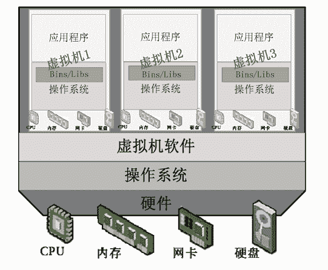
图 1  虚拟机结构
在一台物理机上可以创建很多虚拟机，虚拟机里允许安装不同的操作系统，配置不同的网络 IP 地址。

可以动手做个实验：购买一台计算机（配置：双核 3.0GB CPU、4GB 内存、500GB 硬盘、1000MB 网卡），首先安装 Windows 8 操作系统，把所有的硬件驱动安装好，然后安装办公软件、QQ、音视频播放软件和 C 语言开发工具等。接下来安装 VMware Workstation 12.0 虚拟化软件，安装完成后重新启动计算机，并双击桌面上的“VMware Workstation”图标启动虚拟化软件，如图 2 所示。

在里面可以创建很多虚拟机，比如图 2 中就创建了 14 台虚拟机，虚拟机里安装的操作系统分别是 Windows 7、Windows 8、Windows Server 2012、Windows XP 和 Linux 的各种发行版。只要不启动虚拟机，就不会消耗内存和 CPU 资源，但是会占用硬盘空间。能同时启动的虚拟机数目与计算机的物理内存容量和 CPU 速度有关。另一款免费的桌面虚拟机软件是 Oracle 公司的 VirtualBox。

近几年来，很多大公司不断加入主机虚拟化软件市场，竞争异常激烈。排名靠前的有 EMC（收购 VMware）、微软、思杰、红帽、Oracle、Parallels。微软把虚拟机直接集成在操作系统里；红帽携 KVM 开源虚拟机一路攻城略地；Oracle 的虚拟机算是个小字辈；Parallels 公司的产品既支持虚拟机，也支持容器。

容器是一个轻量级的运行环境，在同样配置的物理机上，能同时运行比虚拟机多三倍的容器。VMware 的虚拟化产品受到微软 Hyper-V、红帽 KVM 及思杰 Xen 的强大冲击，其市场开始出现萎缩的征兆。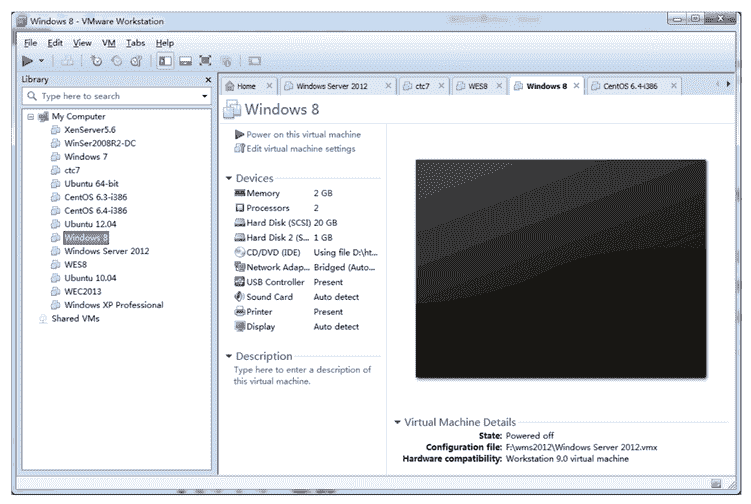
图 2  启动虚拟化软件
目前 CPU 发展到多核，且本身就支持虚拟化。虚拟化软件厂商直接推出了能运行在裸机上的虚拟化软件层，如微软的 Windows Hyper-v 2012、EMC 的 ESXi6、思杰的 XenServer、红帽的 RHEV-H 等，然后在虚拟化软件层上直接创建更多的虚拟机，如图 3 所示。

虚拟化软件层消耗的计算资源很少，一般在 10% 以内，相比前面的方法，同一台物理机可以运行更多的虚拟机。

针对云计算方案，各虚拟化软件厂商还推出了云端虚拟机管理工具，实现虚拟机的创建、删除、复制、备份、恢复、热迁移和监控等统一管理。其中，热迁移就是在不关闭虚拟机的情况下，把虚拟机从一台物理机转移到另一台物理机上，而正在使用虚拟机的租户感觉不到虚拟机被移动了。一台虚拟机的计算能力目前还不能超过其所在的物理机的计算能力。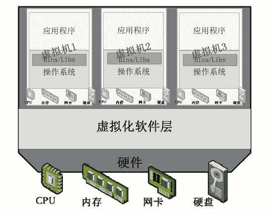
图 3  直接在虚拟化软件层创建更多虚拟机
但是在每台虚拟机里都要安装和运行操作系统的做法，仍然浪费了很多计算资源。

举一个简单的例子：假如一台计算机的配置是双核 3GHz 的 CPU、8GB 的内存、500GB 的硬盘，现在在这台计算机上创建 6 台虚拟机，每台虚拟机分配 1GB 内存、64GB 硬盘、1GHzCPU，虚拟机都安装 Windows 7 操作系统。那么当全部虚拟机启动后，几乎就很难再运行应用程序了，因为内存和 CPU 资源都被操作系统本身消耗掉了。

为此，有公司专门推出了应用软件容器产品，即在操作系统层上创建一个个容器，这些容器共享下层的操作系统内核和硬件资源，但是每个容器可单独限制 CPU、内存、硬盘和网络带宽容量，并且拥有单独的 IP 地址和操作系统管理员账户，可以关闭和重启。与虚拟机最大的不同是，容器里不用再安装操作系统，因此浪费的计算资源也就大大减少了，这样同样一台计算机就可以服务于更多的租户，示意图如图 4 所示。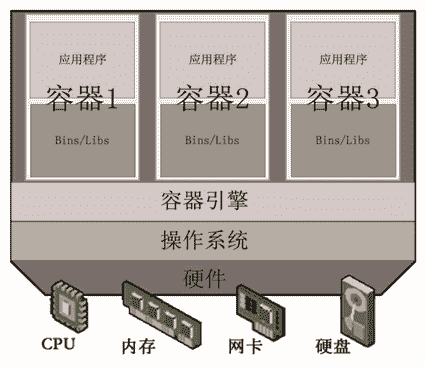
图 4  容器
容器产品提供商 Parallels 针对 Linux 和 Windows 操作系统分别推出了两套应用软件容器产品：OpenVZ 和 Parallels Containers for Windows，其中 OpenVZ 是开源的，Windows 版是商用的，最新版 Parallels Containers for Windows 6.0 支持 Windows Server 2012 Data Center Edition。

开源容器项目 Docker 绝对是后起之秀，受到谷歌公司的大力推崇，发展迅速。微软目前也推出了两种容器产品：Windows Server Container 和 Hyper-V Container，后者的隔离效果介于容器和虚拟机之间。

应用软件容器与虚拟机的第二个不同是，容器里不能进行操作系统级的修改和配置。对于做驱动开发和 Linux 内核定制的人来说，就不适合租赁容器，而虚拟机则没有任何限制。

现在有企业推出了云计算一体机（或称为箱式数据中心），做一个大箱子，里面封装了几台服务器、磁盘柜、计算机网络设备、UPS（不间断电源）、制冷设备等，并且安装了虚拟化软件和云管理工具。微软的云计算一体机采用水冷系统，冷水进去，热水出来，如图 5 所示。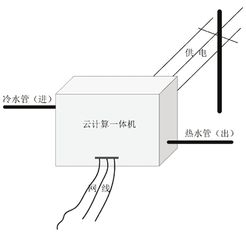
图 5  云计算一体机
云计算一体机消耗的电能（3000W 以上）全部转化为热能被水带出，热水可以进一步利用，真正做到了节约能源，从而使云计算成为名副其实的绿色 IT。图 6 所示为华为的 FusionCube 一体机，不过里面没有制冷设备和 UPS，外表显得“傻大黑粗”。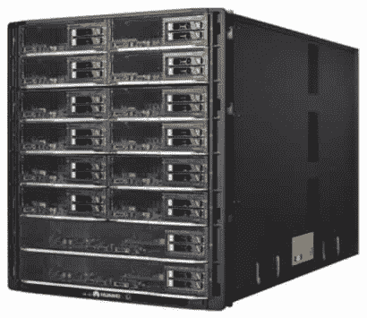
图 6  华为的 FusionCube 一体机
电力使用效率（Power Usage Effectiveness，PUE）是目前国际上通行的用于衡量云端和云计算一体机能源效率的指标，它等于总能耗与 IT 设备能耗的比值。比值越小，表明能源利用率越高，绿色程度越高。

目前国外先进的数据中心机房 PUE 值通常小于 2，而我国的大多数数据中心的 PUE 值为 2～3。在云端，IT 设备主要指服务器、存储设备、网络设备，其他的诸如制冷设备、UPS、安防设备等属于非 IT 设备，其中制冷设备功耗几乎占到总功耗的一半。

出租虚拟机属于 IaaS 云服务，IaaS 的另一种产品是出租裸机，即直接把硬件服务器出租出去，通过服务器上的远程管理卡可以把配置、安装操作系统、开关机等功能整合到租户自助网站上。

最后，对主机虚拟化技术进行总结，如图 7 所示。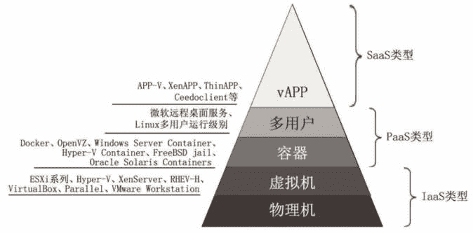
图 7  主机虚拟化技术
在图 7 中，“多用户”是实现远程桌面最轻量化的方案，即在操作系统里创建多个用户账号，然后让这些用户登录使用计算机。

目前微软的远程桌面服务和 Linux 多用户运行级别都是实现“多用户”的方法。最近有不少公司在多用户的基础上进一步做轻量化处理，推出应用程序虚拟化（vAPP），如微软的 APP-V、思杰的 XenAPP、VMware 公司的 ThinAPP、Ceedo 公司的 Ceedoclient 等。

应用程序虚拟化有一个好处，即使计算服务器按应用分工，比如使用一台服务器专门运行 Word 软件，第二台专门运行 Excel 软件，第三台专门运行 QQ，第四台运行 Photoshop，通过应用软件虚拟化技术把 Word、Excel、QQ、Photoshop 整合到用户的桌面上。

使用户桌面环境与应用程序分离有如下几个好处：

#### 1）可以根据应用程序来专门定制服务器硬件

不同的应用软件，对机器配置的侧重点不同，比如图形处理软件对显卡要求较高、QQ 对网络要求较高，根据应用软件定制的服务器运行效率自然会提高不少。

#### 2）节约更多的资源

一台服务器只运行一个应用软件，但同时服务多个用户，可以节约硬盘资源、节约内存资源、节约 CPU 资源，具体原因可以参考操作系统原理和计算机体系结构方面的书籍。

#### 3）提高生产效率

运行同一个程序，等于执行一份相同的软件代码，从而大大提高了各级缓存的命中率，也加快了进程的切换速度，提高了虚拟内存的换入、换出效率。

图 7 中的物理机（也称为裸金属机）是最重型的方案。同一台计算机上租户数越多，表明相应方案越轻量化，反之则越重型化。在实际方案中，要根据租户的需求来确定轻重级别。

目前一台虚拟机不能跨越多台物理机（只能在一台物理机上运行），这意味着虚拟机的运算能力不会超过一台物理机的运算能力，以后的技术能不能突破还很难下定论。目前通过集群联合多台物理机，对外呈现一致的寻址空间，对用户来说，似乎在使用一台超级计算机，但这是虚幻的，集群与虚拟化具有本质的不同。

但是目前主流的主机虚拟化技术都支持过度分配资源，即分配给同一台物理机上的虚拟机的资源之和大于物理机本身的资源数。比如物理机的计算资源是内存 4GB、CPU 8 核、磁盘 100GB，在这台物理机上创建 5 台虚拟机，每台虚拟机分配资源如下：内存 1GB、CPU 2 核、磁盘 30GB，显然 5 台虚拟机资源之和是内存 5GB、CPU 10 核、磁盘 150GB，超过了物理机的资源总数。

在虚拟机运行时，按其实际消耗的资源动态分配，但是不超过管理员给其分配的上限，一般计算机正常运行时资源耗费不会超过其总资源的 75%，这样过度分配资源就容易理解了。CPU 的过度分配率一般为 16 倍，内存的过度分配率一般为 1.5 倍。

接下来我们再来看看网络虚拟化技术。网络虚拟化技术主要用来对物理网络资源进行抽象并池化，以便于分割或合并资源来满足共享的目的。人们很早就意识到了网络服务与硬件解耦的必要性，先后诞生了许多过渡的技术，其中最重要的 6 种分别是虚拟局域网络（VLAN）、虚拟专用网络（VPN）、主动可编程网络（APN）、叠加网络（Overlay Network）、软件定义网络（SDN）和网络功能虚拟化（NFV），如图 8 所示。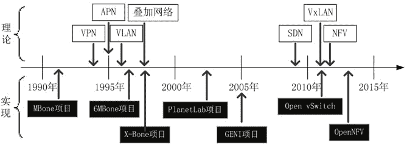
图 8  网络虚拟化的发展历程
APN 把控制信息封装到报文内部，路由器根据报文内的控制信息做决策。SDN 和 NFV 是目前最为热门的网络虚拟化技术，在云计算和大数据时代，其发展不可小视。

网络虚拟化技术已经出现了 20 多年，但是发展却一直不温不火，原因是缺少一个杀手级的应用。云计算的出现对于网络虚拟化来说是一次千载难逢的机会，可以说，有了云计算，网络虚拟化才变得如此热门，如果没有网络虚拟化，就没有大规模的云计算。

众所周知，一个计算机网络必须完成两件事：

1.  把数据从 A 点传送到 B 点，主要包括接收、存储和转发数据。
2.  控制如何传送。主要是各种路由控制协议。

这跟交通网络很相似，连接两个城市的交通网络具备的第一个功能就是汽车从一个城市到达另一个城市；第二个功能是控制到底走哪条线路最好。前者就是由公路组成的交通网络，后者就是交通控制系统。

下面我们再来看看传统的网络设备（比如一台路由器）的逻辑分层结构，如图 9 所示。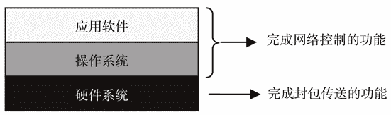
图 9  路由器的逻辑分层
传统的网络设备包含了完整的三层，由厂商统一捆绑销售，第三方很难修改里面的软硬件结构，由此对用户来说有以下几个明显的缺点：

*   容易被网络设备厂商绑定。
*   不能快捷满足业务的需求。
*   成本高。
*   无法实现网络虚拟化。
*   数据传送的路径很难保证全局最优。

如今，SDN 是网络虚拟化技术当中最热门的技术。SDN 技术通过分离网络控制部分和封包传送部分来避免传统网络设备的缺点，处于数据通路上的网络设备蜕化为准硬件设备，网络中的所有网络设备的网络控制部分独立出来由一台服务器单独承担，示意图如图 10 所示。

把网络控制部分从各个网络设备中独立出来，统一由 SDN 网络控制器承担，这样做的最大好处是数据传送的路径是全局最优的。

SDN 网络控制器类似于 GPS 导航卫星，它存储了全局的网络拓扑图，俯视着整张网络，精确导航着每个数据包的流向。当某台网络设备收到一个数据包时，就会询问网络控制器：“这个包要往哪个口送出去？”SDN 网络控制器可能回答：“从 2 端口送出去。”

为了加快转发速度，SDN 网络设备会存储答案，即属于同一个会话的数据包直接从之前的出口送走，类似于现实生活中完成同一个运输任务的车队，在每个交叉路口，GPS 卫星只导航第一辆车，后面的车跟着行驶即可。SDN 网络设备和网络控制器之间采用 Openflow 协议进行通信。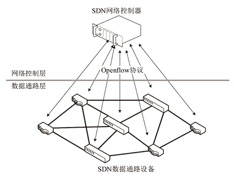
图 10  SDN 原理图
云端一般采用 Open vSwitch 交换机，它是一款开源的网络虚拟化产品，是二层交换机，性能可以与硬件交换机媲美。利用它可以在虚拟机的下面构筑虚拟网络层，通过实时修改 Open vSwitch 的配置，可以组建变化灵活的局域网，使得一台虚拟机能快速地从一个局域网迁移到另一个局域网中，这是物理交换机所无法实现的，如图 11 所示。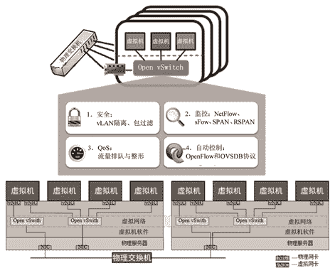
图 11 迁移不同物理机上的两台虚拟机之间的网络通路如图 12 所示。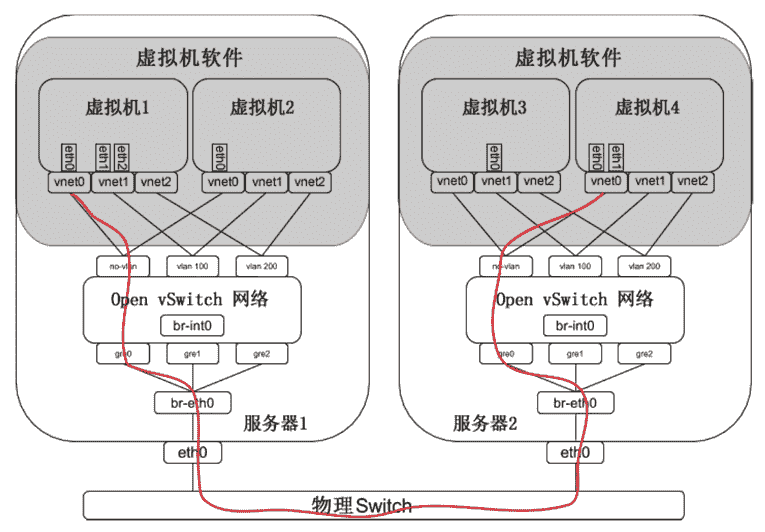
图 12  不同物理机上的两台虚拟机之间的网络通路