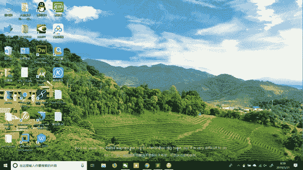
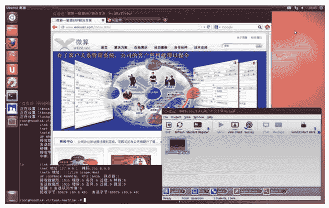
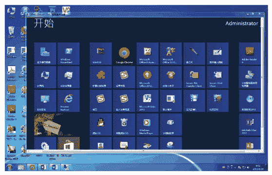

# VDI（远程桌面）是什么？

> 原文：[`c.biancheng.net/view/3896.html`](http://c.biancheng.net/view/3896.html)

使用过 Windows 操作系统的用户都知道，计算机启动完毕后看到的那个屏幕叫桌面，上面有很多小图标，包括此电脑、回收站，以及很多由用户自己创建的应用程序快捷方式。图 1 所示是我的 Windows 10 桌面。
图 1  Windows 10 桌面
图 2 所示是安装了 Linux 操作系统的桌面。
图 2  Linux 桌面
不同的用户登录计算机后看到的桌面是不一样的，每个用户都可以定制自己的桌面，而不会影响到同一台计算机上的其他人的桌面。

如果把桌面放在云端，就成了远程桌面，租户输入账号和密码就可以登录到云端的桌面，此后使用云端桌面与本地桌面一样，没有区别。有人喜欢把远程桌面称为虚拟桌面接口（VDI），这样学术性更浓厚一些。

使用云端桌面能实现移动办公，请看下面的情景描述：

李昭在一家公司做售后，主要工作是解决客户的问题，其活动范围包括家、公司、客户处。他经常出差，具体工作包括写文档、修改软件 Bug、管理问题库工具。李昭家里有台式机，公司有办公计算机，出差时携带笔记本电脑，公司还给他在私有云上创建了一个虚拟机。

李昭在虚拟机里安装了 Windows 8 操作系统，然后又安装了 Office 2013 办公软件、QQ、PDF 阅读器、暴风影音、Visual Studio 2012 开发工具、Photoshop CS5、Chrome 网页浏览器、问题管理工具等软件，最后开启了虚拟机的远程桌面。

这样，李昭就能在家里、公司和客户处登录到云端桌面了。云端桌面成了李昭唯一的办公桌面，如图 3 所示。他写的文档、修改的软件、设计的图片、下载的电影和歌曲等都在这里，不管李昭走到哪里，都可以随时随地访问其数据资料。
图 3  云端桌面
远程桌面协议是实现远程桌面应用的关键技术之一，协议规定终端与云端桌面如何通信。

目前的远程桌面协议有微软的 RDP10、EMC 公司的 EOP/PCoIP、思杰公司的 ICA/HDX、红帽公司的 SPICE，以及 Ericom 公司的远程桌面产品。

微软的 RDP10 客户端软件目前能运行在安装了 Windows10、Windows Server 2012 的计算机上，或者固化了相应操作系统内核（Windows Embedded Standard 10、Windows 10 IoT）的嵌入式终端上，同时发布了针对安卓和苹果操作系统的客户端软件。

而云端桌面的操作系统只能安装 Windows 8、Windows Server 2012 和 Windows Server 2016，比如图 3 就是在安装了 Windows 7 操作系统的计算机上登录到云端的 Windows 8 桌面所看到的开始菜单。

开源项目 FreeRDP 支持 RDP 协议，能在很多操作系统上运行，但是目前不支持 RDP 8.0。微软的 RDP 8.0 协议规范公开在官方网站上，预计不久后，FreeRDP 就会支持 RDP 8.0 了。而其他几个公司同时发布了能运行在 Windows、Linux、Adnriod 和 Mac OS 系统上的多个版本。

以下是实现远程桌面的 3 种方法：

1）基于 IaaS 云服务的虚拟机或裸机，租户租用云服务提供商的虚拟机或裸机，然后自己安装操作系统、应用软件并开启远程桌面，我们称这种远程桌面为 IaaS 云桌面。

2）IaaS 云服务的应用软件容器，租户共享底层的操作系统内核，单独安装应用软件和一些基础运行库，我们称这种远程桌面为 IaaS 容器桌面。比如 OpenVZ 和 Virtuozzo Containers 实现 Linux 的容器桌面，Windows Server Container、Hyper-V Container 和 Virtuozzo Containers 实现 Windows 的容器桌面。

3）基于半平台 PaaS 云服务，并为每个租户创建一个系统账户，其实就是利用了现代操作系统的多用户特点，即同时让许多人登录并使用计算机，我们称这种远程桌面为 PaaS 云桌面。

PaaS 云桌面在私有云中应用比较普遍，尤其是私有办公云。因为搭建 PaaS 云桌面具备很好的伸缩性，所以小的云端用一台计算机即可。一台配置高的台式机（4 核 3.0GB CPU、16GB 内存、1T 硬盘）就可以供 20 个左右的员工日常办公，以后随着公司的发展，员工不断增多，可以不断地增加云端计算机来构建更大的云端。

目前微软的终端服务技术就是典型的 PaaS 云桌面的解决方案，要求每个用户购买许可证，在正规的商业环境下建议购买正规许可证。

由于 IaaS 云桌面是每个租户单独使用一台云主机（虚拟机或裸机），所以租户间的隔离效果最好，IaaS 容器桌面的隔离效果次之，PaaS 云桌面的隔离效果最差。这里的“隔离”，是指一个租户的操作行为和私有数据资料对另一个租户的可见度。比如两个租户登录到同一台计算机的 PaaS 云桌面，那么他们之间是互相可见的：可以看到对方的进程、对方的数据文件，一方关机另一方就会被强行退出，具体内容可参阅后面教程。

在规划具体的云端方案时，要综合考虑到底采用什么类型的桌面，这里提供一些经验如下：

1.  同一个部门的人采用 PaaS 云桌面。
2.  中小企业采用 PaaS 云桌面。
3.  重要岗位（如财务、人事、销售）采用 IaaS 云桌面。
4.  同一个研发团队采用 IaaS 容器桌面。
5.  公共云采用非 PaaS 云桌面。
6.  领导和核心保密部门应采用裸机桌面。