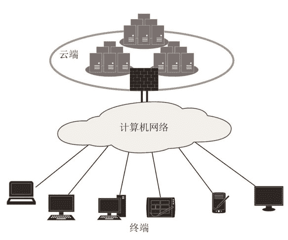

# 负载均衡（Load Balance）简介

> 原文：[`c.biancheng.net/view/3897.html`](http://c.biancheng.net/view/3897.html)

众多的租户通过计算机网络接入云端的计算机并使用里面的计算资源，这里有三点需要注意：

*   租户很多。
*   云端有很多计算机。
*   进入云端的宽带专线条数有限（一般为 1～3 条光纤），如图 1 所示。

图 1  接入云端
负载就是任务，即租户要在云端完成的任务。把众多租户要完成的任务如何合理地分配给云端的各个服务器并能快速处理完，就是负载均衡技术所要解决的问题。

理想的使用情景描述如下：

早上 8：30 前，微算公司云端只有 1 号服务器在开启状态，其他众多的服务器都处于睡眠状态。处于睡眠状态的服务器耗电极少，唤醒一台服务器的时间大概是 1 分钟。然后员工陆续到岗，最先来的 20 名员工登录到云端的 1 号服务器上的远程桌面，1 号服务器还可以接入 5 台终端，此时 1 号服务器唤醒 2 号服务器，接下来的 5 人仍然接入 1 号服务器，后面来的 30 人接入 2 号服务器。2 号服务器配置高一些，所以能接入 30 台终端，2 号服务器在适当的时候唤醒 3 号服务器，此后其他服务器的行为与 2 号服务器相同。

下午 18：00，员工陆续下班。下班时员工有两种做法：一是从云端注销出来，二是不注销而直接关闭终端。没有注销的远程桌面保留全部的工作任务状态，比如正在编辑的 PPT、打开的 QQ、还在播放的《少年派》等继续保持，第二天员工再登录时看到的桌面还是昨天下班前的状态，他可以继续编辑未完成的 PPT、浏览别人发过来的大量 QQ 消息，不过昨天还没看完的《少年派》快播放完了。由于云端检测到终端 30 分钟内没有输入，于是把其桌面转为睡眠，视频播放暂停。现在该员工需要倒回 30 分钟并继续观看。

云端没有活跃桌面的服务器在延时 10 分钟后主动睡眠。下午 19：00，还有员工在加班，云端还有 11 台服务器在工作，但是每台服务器只接了 1～5 个不等的活跃桌面。此时云端启动了活跃桌面合并程序，采用热迁移技术，把 32 个活跃桌面合并到 1 号和 2 号服务器上，其他服务器转为睡眠状态。云端服务器的唤醒、睡眠和活跃桌面合并都是自动完成的。

上面的情景中有一个关键的技术：租户登录时把其桌面分配到一台合适的服务器上，这就是负载均衡技术要解决的问题。对“合适”二字理解不同，实现负载均衡的策略也不同，但前提是保证不会降低租户的体验。下面是常用的负载均衡策略：

1）让唤醒的每台服务器承担尽可能多的活跃桌面。

2）使每台服务器消耗的计算资源的占比尽可能相等。如果全部服务器配置相同，那么本策略就是把活跃桌面尽可能地平均分配给所有的服务器。

3）应用软件相同的租户桌面尽可能地分配到相同的服务器上。同一部门的租户使用的软件差不多，所以相同部门的租户桌面尽可能地分配在相同的服务器上。例如，售后服务部的员工一般都使用客服软件、办公软件、邮件、问题库工具等，所以把售后服务部的员工的桌面放在同一台计算机上且作为半平台 PaaS 云桌面，从而节约很多内存。

4）同一个租户每次登录时，其桌面尽可能地分配到同一台服务器上。这样可以尽量减少桌面漫游次数，从而降低网络带宽的开销。

负载均衡任务由负载均衡器完成，目前既有纯软件的负载均衡器产品，如 LVS，也有厂家推出的硬件负载均衡器，如 F5、深信服、梭子鱼、Radware 等，F5 负载均衡器的价格都在 10 万元以上。

LVS 是开源软件，已经集成到了 Linux 内核，其性能优越，结合一台通用的物理计算机，完全可以搭建一台能与 F5 媲美的负载均衡器。直接采用 DNS 轮询或者 iptables 也可以实现简单的负载均衡任务。