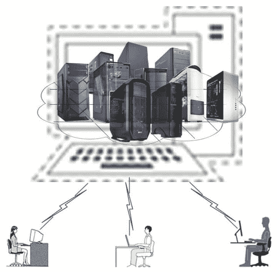
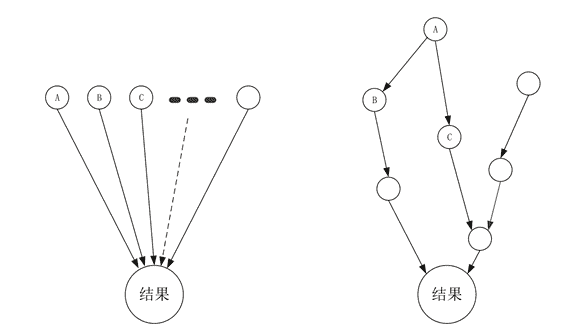

# 服务器集群（cluster）简介

> 原文：[`c.biancheng.net/view/3898.html`](http://c.biancheng.net/view/3898.html)

负载均衡技术用于解决如何把许多互不相关的小型任务或中型任务合理地分配到不同的服务器上的问题。互不相关的小型任务或中型任务是指任务之间没有关联性，而且只用一台服务器就可以完成的任务。绝大多数个人租户的任务都属于这类任务。

对于大型任务，由于一台服务器无法按时完成，所以就要把大型任务拆分成许多中小型任务，然后再分配给多台服务器，由它们协同完成，这就是计算机集群技术所要解决的问题。

对租户来说，由很多台服务器组成的集群系统就像一台超级计算机，不管运行多么复杂、大型的任务，马上就能得到结果，如图 1 所示。而具备同样计算能力的超级计算机价格却异常昂贵，所以当 PC 服务器价格大幅度下降之后，人们热衷于采用廉价的集群系统来完成各种高性能的计算任务。

比较明显的例子就是，谷歌公司用几万台服务器组建搜索集群系统，而且服务器都是他们自己组装的。注意：本节讲述的集群是高性能计算集群，目的是完成大型的任务，下一节讲述的容错计算追求更好地完成任务。
图 1  集群构成的“超级计算机”
显然，集群涉及两大技术：一是任务的拆分，二是任务的调度。

#### 1\. 任务的拆分

任务的拆分遵循的原则之一是尽量降低子任务之间的关联性，从而提高处理任务的并行度。最常见的关联性是任务处理的时间先后关系，比如子任务 A 一定要在子任务 B 完成之后才能开始处理，即 B 任务的输出作为 A 任务的输入。存在一类子任务无关联的大型任务，拆分这样的任务就很容易。

比如在全球上亿的网页中搜索关键词“云计算”，这个任务的拆分方法之一是按国家划分：A 子任务搜索中国的网站，B 子任务搜索美国的网站，C 子任务搜索英国的网站等，这些子任务之间没有关联性，可以并行处理，最终把全部子任务的搜索结果合并起来即可。

再比如中国的天气预报，可以按省份拆分。这类大型任务的拆分示意图如图 2 中的左图所示。

另外一类大型任务很难拆分成互不相关的子任务，如核爆模拟、战争推演模拟等，拆分出来的子任务之间一定存在关联性，即一些子任务之间开始或者结束的时间与其他一些子任务的起止时间存在前后关系，如图 2 中的右图所示。
图 2  拆分任务

#### 2\. 任务的调度

任务的调度即如何把拆分出来的子任务合理地调度给云端服务器并让它们协同完成，这里的“合理”性与租户的要求密切相关。可以这样定义：最能满足租户要求的调度方法就是合理的。

租户的要求各种各样，有的希望任务完成得越快越好，有的要求在将来某个时间前完成任务即可，有的希望结果越精确越好，有的希望计算费用越少越好……根据租户的不同要求，人们提出了相应的任务调度方法。比如在满足租户预期目标的前提下，把任务分配给尽量少的计算机，从而满足“应用最少的计算机按时、按质完成任务”的要求，因为参与的计算机越少，通信的成本就越低。

例如，有一个 100 人日的任务，甲方要求在 10 天内完成。为了在规定的时间内完成任务，乙方更愿意安排 10 个人做 10 天，而不是安排 105 个人做 1 天。由于要管理 100 人，所以后者需要增加 5 个管理人员。

集群是一个复杂的工程，它涉及很多分布式方面的基础算法，如选举算法、一致算法、波算法、快照、故障检测等，感兴趣的读者可以参阅 Gerard Tel 著的《分布式算法导论》。Hadoop 就是一个集群系统，它负责分布式系统的基础算法，从而在 Hadoop 上编写分布式程序就简单多了，详细的介绍请参见教程后续章节。另外，OpenHPC 是一个基于 Linux 的开源集群项目。