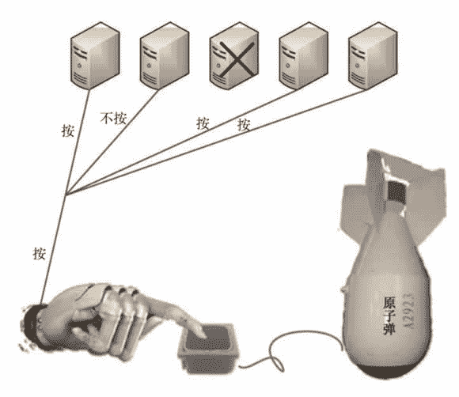

# 容错计算是什么？

> 原文：[`c.biancheng.net/view/3899.html`](http://c.biancheng.net/view/3899.html)

容错计算，也有人称为高可用性计算和高可靠性计算，就是在系统存在故障的情况下，仍能正确地执行给定的算法。为了实现这一点，必须使系统具有故障检测与诊断、功能切换与系统重组（reconfiguration）、系统恢复与重新运行、系统的重构（reintegration）与可扩展等功能，而且这些功能不能影响系统的正常运行或至少不能使系统的性能下降到不能容忍的程度。

容错计算的重点是保证任务在被处理的过程中不会异常终止，以及任务完成后输出结果的正确性。

可靠性是指在规定的使用条件下和规定的时间内完成规定功能的能力，通常用多少个“9”来衡量。比如人们所讲的达到 4 个“9”的可靠性，就是说任务顺利完成的概率为 99.99%；同理，5 个“9”的可靠性就是 99.999%。

严格来讲，容错计算也属于集群的范畴，只不过参与集群的计算机处理同样的任务——并行或者接力。容错计算需要投入更多的计算资源，所以造价较高。对于一些非关键的任务，人们出于成本的考虑，一般较少采用容错集群系统。

## 接力容错

接力容错又叫串行容错，由若干台计算机参与同一个任务的计算，但是同一时刻只由一台计算机处理任务，只有当这台计算机出现故障时，才由下一台计算机接力处理；类似，如果此台计算机又出现故障，那么继续由其他计算机接力；只有当全部计算机都出现故障时，任务处理才会被中断，示意图如图 1 所示。

其实我们可以及时维修故障计算机并让其再次加入容错集群参与下一次的接力活动，这样就能最大限度地保证任务顺利完成。只有在全部计算机同时出故障（或者几乎同时出故障以至于人们还来不及维修）的情况下，租户的任务才会被中断，如供电异常（断电、电压过高或过低等）、雷击都可能导致参与容错集群的计算机同时出故所以云端的建设，供电和防雷是重中之重。

在条件允许的情况下，应采用多路市电接入，每路市电分属于供电部门不同的变压器，甚至是不同的电网，机房配备不间断电源和发电设备，这样就形成了三级供电保障：市电、不间断电源、发电设备。
图 1  接力容错示意图
传统的民用接力容错集群多采用经典的“双机—双工”结构：两台服务器带一台磁盘阵列，如图 2 所示。
图 2  “双机—双工”接力容错
两台服务器都与磁盘阵列相连，同时通过心跳线互联，用来完成任务的软件和软件处理的数据放在磁盘阵列上，这样每台服务器都能访问这个软件，同时双方通过心跳信号感知对方的状态。

平时主服务器运行软件以处理任务，备服务器空转，一旦主服务器出现故障，其就不再向备服务器发送心跳信号，备服务器收不到主服务器发来的心跳信号就知道其出现了故障，此时备服务器会运行软件，从而继续处理任务。

然后机房管理人员对故障服务器进行维修，而租户并不知道负责任务处理的服务器发生了切换。这种双击容错集群系统被企业大量应用于数据库管理系统、邮件系统及一些诸如 ERP 等重要的业务系统，以保证关键应用的高可靠性。

另外，也有采用“双活”主机的方案——两台服务器平时都承担负载，当一台服务器发生故障时，负载才由另外一台服务器全部承担，应用不会重点，但是相应时间可能会延长。

也许有人会问：磁盘阵列坏了怎么办？

在图 2 中，磁盘阵列成了单点故障，为此有人采用存储局域网替换磁盘阵列，并在存储局域网中进行存储容错处理，这种方法成本很高。在以太网网速达到万兆甚至十万兆的今天，去掉磁盘阵列而对服务器上的硬盘直接做实时同步变得可行，可参考王良明的论文《存储寄存算法及其应用》。

主/备服务器的硬盘数据相互寄存的示意图如图 3 所示。

图 3  存储寄存示意图

## 并行容错

并行容错是指，参与容错的计算机同时处理相同的任务，输出相同的结果。可以在服务器内部的部件层次做并行，也可以在服务器层次做并行，前者主要由服务器生产厂商设计和完成。

现在的绝大多数服务器都或多或少地存在一些并行部件，如双电源供电、多网卡捆绑、RAID 1 支持等。至于在服务器层次做并行，普通民用领域很少采用，多见于航空、军事领域。并行容错的示意图如图 4 所示。

在 3 台计算机参与的并行容错集群系统中，不但可以容错，而且还可以纠错。比如在由 5 台计算机组成的并行容错集群系统中，有 4 台输出 A、1 台输出 B，那么根据少数服从多数的原则，最终的结果就是 A。

图 4  并行容错示意图
例如，由 5 台计算机组成并行容错集群系统，它们接受相同的输入信息并运行相同的决策软件。在运行的过程中，有 1 台计算机出现故障（如图 5 所示，中间那台计算机出现故障），最终有 4 台计算机输出结果，其中 1 台计算机给出“不按”下原子弹起爆开关的命令，其他 3 台输出“按”下起爆开关的命令，协商的结果是给机械手发出“按”下命令。

图 5  并行容错