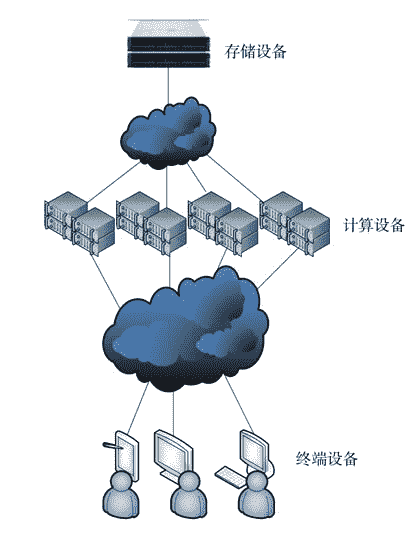
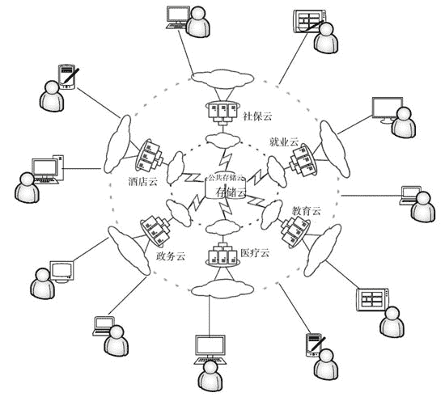

# 家目录（主目录）漫游技术简介

> 原文：[`c.biancheng.net/view/3903.html`](http://c.biancheng.net/view/3903.html)

用户登录计算机后，首先进入的那个目录就是其家目录（也称为“主目录”）。例如，在 Windows 操作系统上，zsan 这个用户的家目录是 C：\Users\zsan。在 Linux 操作系统上，其家目录是 /home/zsan。

家目录下还有更多的子目录，如“电脑桌面”子目录、“我的文档”子目录、“下载”子目录、“我的音乐”子目录、“我的视频”子目录、“我的图片”子目录等。除非特别指定，否则用户的资料都保存在其家目录（或者家目录中的子目录）下。

租户每次登录云端，都可能被分配到不同的服务器上，比如某租户第一次被分配到三号服务器，并编辑了一份个人简历，过了几天，他再次登录云端时被分配到七号服务器，此时他的个人简历不见了，因为简历保存在三号服务器上。

为了解决以上这个问题，就引入了租户家目录漫游技术，即磁盘文件作为软件的输入/输出设备之一，与计算设备通过计算机网络分隔，这样计算设备与输入/输出设备就完全分离了，示意图如图 1 所示。

图 1  家目录漫游
所有租户的家目录全部存放在网络中的存储设备里，在租户登录时自动触发一个动作：把此租户的家目录挂载到本服务器上来。租户退出登录时触发另一个动作：卸载家目录。这样不管租户登录到哪台服务器，他都能正确访问自己的家目录。存储设备在网络上，因此也可以把它当作云端，只不过这个云端的功能是提供存储服务，显然是属于 IaaS 云。

在网速足够快的情况下，建议由政府组建一个公共存储云，每个公民免费分配 1TB 的存储空间，存放个人的全部身份信息、档案材料和私有资料。计算服务云（IaaS、PaaS、SaaS）由企业或者行业主导，他们互相竞争，为租户提供各种各样的计算服务，而租户通过移动或者固定终端随时接入这些云端并获取相应的计算服务。这是一个庞大的系统，需要全社会参与，如图 2 所示。
图 2  公共存储云