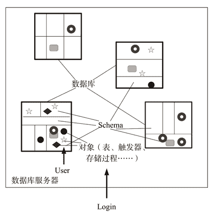
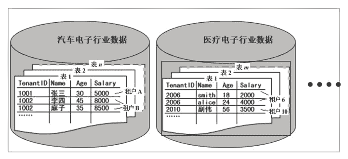

# 云计算租户隔离：给小白的科普文

> 原文：[`c.biancheng.net/view/3905.html`](http://c.biancheng.net/view/3905.html)

租户隔离不是指隔离租户这些现实中的人，而是特指租户登录云端后，其操作行为和数据对于其他已登录云端的租户来说是不可见的。换句话说就是，每个租户都感觉不到他人的存在，似乎就是自己一个人在操作计算机。

租户隔离存在以下两个方面的隔离：

*   租户行为隔离。
*   租户数据隔离，数据隔离比行为隔离更重要。

## 租户行为隔离

租户行为隔离是指一个租户操作计算机的行为，其他租户感知不到。

租户操作计算机的行为是通过消耗的计算资源（内存、硬盘、CPU 和网络）体现出来的，换句话说，一个租户消耗计算资源的变动不会引起其他租户计算资源的可感知变动，感知不到的变动除外。

例如，租户甲内存配额是 4GB，但是他最多也就使用了 2GB，另外 2GB 空闲。此时如果租户乙运行一个大型软件，消耗了很多内存，使得租户甲只剩下 1GB 的空闲内存，但是租户甲感知不到，因为他的软件运行照样流畅、响应速度照样快、网速不卡，一切如故。

现代很多虚拟机厂商倾向于采用如下的行为隔离原则：按实际使用量分配资源，但不超过租用上限。这里的“上限”是指租户租用的资源额度。

比如租户甲租用的内存额度是 2GB、硬盘额度是 20GB。如果他实际要消耗 1.5GB 的内存，就分配 1.5GB 给他，但是他最多只能用 2GB 的内存。这样，同样的一台服务器就能服务更多的租户。比如一台服务器拥有 64GB 的物理内存，假设每个租户租赁 2GB，那么这台服务器很可能允许 45 个用户同时登录。

SaaS、PaaS 和 IaaS 模式都需要实施租户行为隔离。

## 租户数据隔离

在《云计算 SaaS 服务模式精讲》教程中，我们提到租户数据包括配置数据和业务数据。配置数据指租户选择的语言、设置的时区、桌面背景图片、屏幕分辨率、创建的快捷方式及各种软件的界面设置等，而业务数据就是日常操作计算机生成的数据，如个人简历、售前 PPT、邮件、音乐、视频、财务数据、库存记录、客户资料等。

租户数据一般保存在家目录或者数据库中，而家目录和数据库被保存在云端的磁盘中。

PaaS 型租户的数据隔离一般采用容器的形式或者操作系统的访问控制列表（ACL），主要在操作系统层设置。而 SaaS 型租户的数据隔离主要在应用软件层及以上展开，租户身份鉴别和权限控制策略由应用软件开发者负责。

比如一个 SaaS 型的 ERP 系统，账号、密码及权限都被登记在数据库中的一个表中，当租户登录 ERP 系统时，输入账号和密码并单击“登录”按钮后，软件要去查询数据库确认账号是否存在；如果存在，再核对密码是否正确；如果密码正确，再根据权限显示相应的模块菜单项。总之，租户的账户信息一定是租户数据记录的主索引的组成部分，这是实现数据隔离的必要条件。

SaaS 型租户数据一般全部保存在数据库中，对于同一个数据库管理系统的租户数据隔离有以下 3 种方法可选：

*   分离数据库。
*   共享数据库但分离 Schema。
*   共享数据库和 Schema。

我们用图 1 来表示一个数据库管理系统、数据库、Schema、Login、User 的关系。
图 1  数据库管理系统
一个具备 Login 权限的人可以登录数据库管理系统（就好像进入了一个大院子），数据库管理系统里面有很多数据库（类似院子里的仓库），数据库被分割成许多个 Schema（类似仓库里的房间），只有持有 User（类似房门钥匙）身份的人才能进入属于自己的 Schema（房间）。Schema 里存放了很多对象（就像房间里存放的桌子、床铺、凳子、电视机等物品），这些对象指表、触发器、视图、存储过程等。

理解了数据库管理系统、数据库、Schema 的关系之后，我们再来看看前面讲的三种分离方法。

#### 1）分离数据库

就是给每个租户单独创建一个数据库，数据库中只有一个 Schema，相当于在大院子里单独建一栋只有一个房间的仓库，仓库钥匙只给此租户一个人。

#### 2）共享数据库但分离 Schema

就是在一个数据库中单独为每个租户创建一个 Schema，相当于在一栋现存的仓库里隔一个房间出来并分配给租户，房间钥匙只给其一人。

#### 3）共享数据库和 Schema

直接给租户分配一个现存的 Schema，大家共享一个 Schema，即租户的数据保存在相同的表中，相当于配一把房间的钥匙给新来的租户，大家共用一个房间，每个人的物品上写上自己的名字，以免拿错东西。

上面三种方法中，分离数据库的隔离效果最好，但是成本也最高；共享数据库和 Schema 的隔离效果最差，但是成本也最低；共享数据库但分离 Schema 是一个折中的方法。可根据租户的需求确定具体采用哪种方法。

下面以云化的一个大型软件为例，来简单介绍一下 SaaS 型租户的数据隔离策略。

该软件原来是落地运行的，主要用于企业产品质量保证，由于价格昂贵，很难推广到广大的中小型企业，所以考虑云化，然后以 SaaS 形式出租。在云化方案中，关于租户数据隔离部分设计如下。

采取“独立数据库、共享 Schema”的混合方法，即每个行业对应一个独立数据库，同一个行业内的租户共享 Schema，如图 2 所示。
图 2  混合数据隔离方法混合数据隔离方法具有如下好处：

*   方便针对各个行业的特点做定制化。
*   一方面避免表记录数过于庞大，另一方面避免数据库连接成为瓶颈。
*   便于以后扩展（增加新的行业）。
*   便于做数据挖掘和商业智能分析。

每个数据库中包含两类数据：

#### 1）共享数据

共享数据即全部租户共享使用，如基础数据、全局参数、模型数据等，共享数据表不用改动。

#### 2）业务数据

这类数据与租户关联，不同租户的业务数据是不同的，由于租户的业务数据是共享表结构的，所以全部的业务数据表都需要添加一个租户字段 TenantID，且此字段作为主键之一。

同时，还要修改用户登录逻辑，在会话中记录用户所属的租户号和行业数据库，最后需要修改全部的 SQL 语句和存储过程，在 where 子句中都要加上“TenantID=xxx”过滤条件，其中“xxx”是具体的租户 ID 号。

如果出现下面的情况，则表明没有隔离：

*   能看到其他租户运行的软件。
*   能看到其他租户保存在磁盘上的文件。
*   当其他租户运行大型软件时，能感觉到计算机很卡。
*   当其他租户使用迅雷下载电影时，自己打开网页的速度很慢。

IaaS 云服务（包括裸机、虚拟机和容器），平台软件层及以上都是由租户自己安装和管理的，所以 IaaS 云服务天生就具备了很好的隔离效果。

我们在搭建 PaaS、SaaS 云服务时，就要考虑租户隔离问题了，目前没有统一的隔离方法，需要根据租户的需求和性质综合考虑。但是租户隔离不是必需的，比如私有云可以不隔离，因为租户之间互相认识，或亲属，或同事，对于不应公开的资料，自己加密保存或者存储在 U 盘上，此方法既方便又可靠，且节约成本。

对于租户需要输入账号和密码才能登录的公共云服务，必须施行租户隔离。