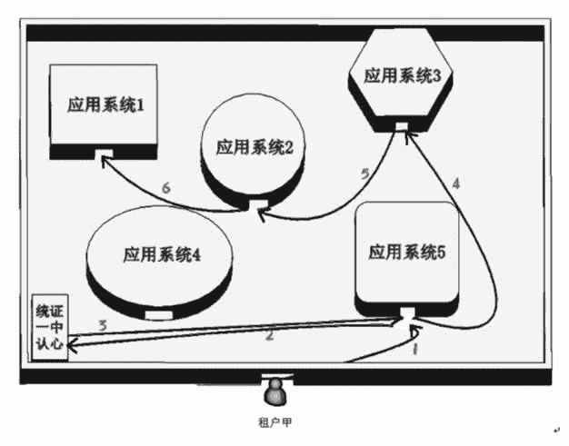

# 统一身份认证（IDS）是什么？云端如何应用统一身份认证？

> 原文：[`c.biancheng.net/view/3908.html`](http://c.biancheng.net/view/3908.html)

以前去井冈山游玩，里面的每个景点都要单独排队购票，很烦琐。现在已改为通票，上山时只需购买一张通票，就可以直接进入任何景点游玩，在每个景点门口出示一下通票即可，一路畅通无阻，既方便又省时。

什么人可以进去、进去后可访问什么资源，以及事后承担什么责任，这是人类社会每天都在发生的事情，如景区参观、厂区上班等。

云端包含很多应用系统，而且租户的家目录还要漫游，统一身份认证就相当于景区的通票，登录云端时只需一次验证，之后就可以进入任何有权进入的应用系统。

统一身份认证与单点登录是同一个概念。如果没有统一身份认证，那么你进入任何一个应用系统都要求输入账号和密码，这样一方面难以记住众多的账号和密码，另一方面使用云端资源很烦琐。

对于云端应用系统的访问控制，通常分为三个层面：

*   认证：解决能否进入的问题。
*   授权：解决进入后能做什么的问题。
*   记账：解决做了事情后就要承担相应责任的问题，可能还要付费。

这就是通常所说的 3A 安全机制（Authentication，Authorization，Accountability）。基于 3A 安全机制的访问控制在现代操作系统中被普遍采用，例如 Linux 操作系统访问控制步骤如下：

1）用户输入账号和密码企图登录系统，此时操作系统会进行认证（Authentication），即核对输入的账号和密码与保存在系统里的账号和密码是否相符。如果相符，则允许登录。

2）登录后的用户并不能为所欲为，其每一步操作都必须被授权（Authorization），比如允许进入什么目录、哪些文件允许读、哪些文件允许写、哪些文件允许删除等，都处于操作系统严密的监视之下。

3）用户的全部操作都被作为日志记录下来（Accountability），方便以后落实责任、事后监督，并作为付费的依据。

Windows 操作系统也采用相同的方法。

作为云端的统一身份认证系统，必须实现以下四个功能：

#### 1）统一用户管理（Identification）

租户的账号、密码等信息集中存储，统一管理。

#### 2）身份鉴别（Authentication）

当租户企图登录某个应用系统时，验证他的票据或者身份是否合法。

#### 3）权限控制（Authorization）

规定允许登录系统的租户具备哪些操作权限。

#### 4）操作日志登记（Accountability）

记录租户的操作行为，以便事后责任追溯。

有了统一身份认证，租户登录云端并访问应用系统的过程如图 1 所示。
图 1  租户登录云端并访问应用系统的过程
租户甲首次登录云端的应用系统 5（第 1 步），但被告知要先去统一认证中心获取票据（第 2 步），拿到票据之后返回并访问应用系统 5（第 3 步），然后凭票据直接访问应用系统 3（第 4 步）、应用系统 2（第 5 步）、应用系统 1（第 6 步）。

租户在访问每个应用系统时，应用系统都会查验他的票据，只有票据合法才被允许进入。应用系统在查验票据时都会与统一认证中心确认，不过这一切都是自动的，租户自己感觉不到，但当租户企图访问没有被授权的应用系统时，就会被告知“没有权限”。

不管租户最先访问哪个应用系统，只要租户没有票据或者出示的票据已经过期，都会引导其先去统一认证中心获取票据。但需要注意的是，对租户来说，获取票据的动作只是在屏幕上输入账号和密码，账号和密码的验证、票据的发放等操作都在云端后台自动完成，此后该租户再访问其他应用系统时，就不会在屏幕上显示输入账号和密码的登录画面，因为云端后台自动帮他出示了合法的票据。