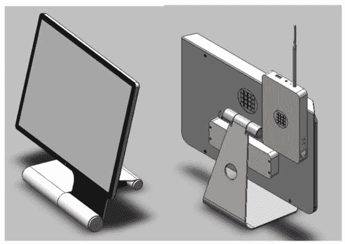
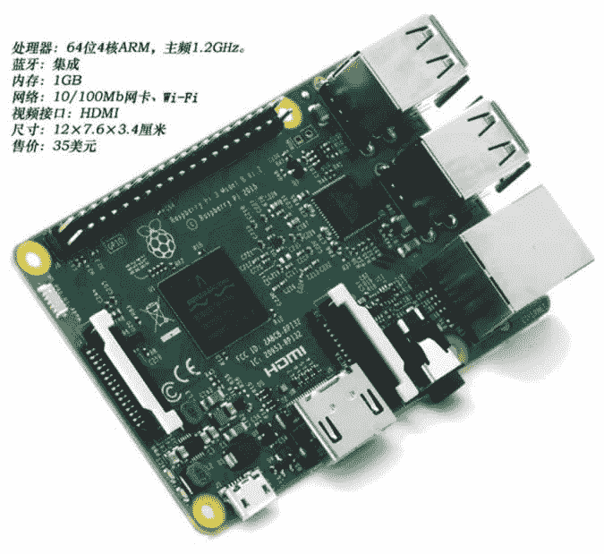
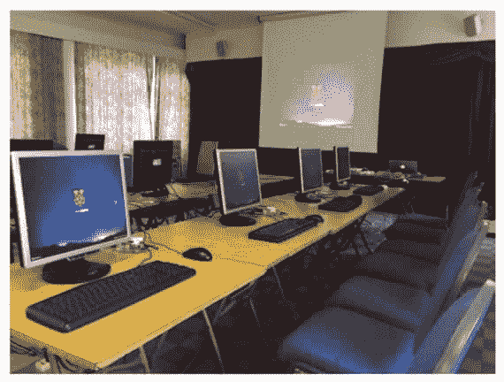

# 云计算终端技术详解

> 原文：[`c.biancheng.net/view/3912.html`](http://c.biancheng.net/view/3912.html)

云终端是用户操作的主要设备，也是用户接入云端的入口。追求完美的用户体验是终端厂商和云服务提供商唯一的选择，也是云计算成败的关键因素。为了使得一款终端实现“用之赏心、观之悦目”的目标，需要从功能、外观、操作、质量几方面入手。

## 终端分类

终端在外观上体现为多样性，分类如下。

#### 1\. 按功能分类

#### 1）人/机交互终端

不断地通过键盘、鼠标、触摸屏、声控等手段输入信息，通过显示器、打印机、音箱、发光灯等设备输出计算结果，人机协同完成各种任务，如各种台式云终端、智能手机、平板电脑等。

#### 2）机/机交互终端

生活中的各种智能家电、工厂里的智能流水线、工业机器人等，这些机器本身与嵌入进来的云终端直接互动，完成控制和信息收集任务。

#### 3）输入终端

持续采集数据并源源不断地传输到云端，这些数据将在云端存储、计算，如检测仪、数据采集卡、摄像头、人体监护器等。

#### 4）输出终端

云端把计算结果通过这些终端输出，如音乐播放器、视频播放器、打印机、机械手臂、导航仪、显示屏等。

#### 2\. 按移动性分类

#### 1）移动终端

靠离线能源续航，且相对轻便、便于移动，常被人拿在手里、穿在身上、戴在头上、放在移动的设备上。

#### 2）固定终端

相对而言，体积大而且比较重，常会在办公桌上、智能设备中、墙壁上见到它们的身影，如图 1 中的左图所示。

#### 3）固定/移动两用终端

终端由几部分组成，这几部分可以轻易拆卸和组装，组装在一起时充当固定终端，用于办公、软件开发和图形处理等；拆卸之后又便于携带和移动，如图 1 中的右图所示。
图 1  终端

#### 3\. 按屏幕尺寸分类

屏幕覆盖 1～50 英寸的各种尺码，按照尺码大小分为以下几类。

#### 1）5 英寸以下的移动终端

主要用于通信、小内容信息收发（短信、微信、微博等）、音乐播放、导航、小游戏、信息采集、远程监控、远程定位、照相等，可随时随地携带和使用，真正体现人机合一的云生活。一般人走动的时候拿在手里使用。但是这样的移动终端很容易丢失、被盗和损坏，所以资料存放于云端就显得非常重要。

#### 2）5～9 英寸的终端

主要功能包括大内容信息阅读（如网页、邮件、各种文档资料、图片、视频等）、各种弱交互性 APP、非经常性的信息收集（如会议记录、采访记录等），配上其他便于交互的部件（如大键盘、鼠标、大显示器等），可以实现日常办公。一般人站立的时候拿在手里使用。

#### 3）10～14 英寸的终端

输入/输出部件分离（如键盘和显示器），能完成绝大多数的日常办公，属于真正的移动办公终端。一般人坐下后放在腿上或桌子上就能投入工作。

#### 4）15～18 英寸（不含 18 英寸）的终端

带触摸屏，常固定，多用于公共场合的信息查询、家庭相册和视屏电话（挂于家庭墙壁上）、老人小孩学习娱乐用机、智能设备的触控、智能会议厅、智慧教室、家庭音乐播放等。

#### 5）18～24 英寸的终端

固定办公终端，替代目前的台式机，完成日常办公、图片处理、音视频剪辑、影视后期制作、软件开发、游戏等，配备标准的输入部件。

#### 6）25～31 英寸的终端

带触摸屏，常固定，多用于公共场合的信息查询，不是大众产品。

#### 7）32～50 英寸的终端

主要用于娱乐和信息展示，采用遥控输入方法。

## 质量控制

云终端是用户直接携带和操作的设备，使用环境千变万化，所以质量非常重要。云终端要做成纯硬件设备，终端上用到的软件要全固化或者半固化。

全固化是指软件根本无法修改和删除；半固化是指不允许用户自己更改和删除软件，但是允许在线升级、打补丁，并提供出厂配置一键恢复功能。这样就可以大大降低产品的故障率，延长折旧期。

另外，终端中尽量少用软件，甚至只固化一个下载程序（BootLoader），启动时由这个下载软件临时从云端下载经过定制和裁剪的操作系统及会话软件，然后执行这个操作系统，最后运行会话软件，完成登录云端的操作。不过，这种技术要求网络速度足够快。

终极方法是连下载程序都不要，直接采用网卡的网络启动技术，开机时由终端上的网卡直接获取需要的软件并启动终端。

## 终端项目

#### 1\. RPTC

RPTC 的全称是 Raspberry Pi Thin Client project，意为树莓派瘦客户机项目。结合树莓派 ARM 小主板（见图 2），就能定制一台全功能的低功耗云终端，项目网站为 [http：//rpitc.blogspot.com/](http://rpitc.blogspot.com/)。从此网站可以下载一个安装镜像文件，这个镜像文件采用 Linux 内核，集成了当前绝大多数的协议客户端。截至 2016 年 10 月，包括的客户端及其版本如下：

*   Citrix ICA 13.3.2.
*   VMware Horizon 4.1.0.
*   NoMachine NX 5.1.24.
*   Thinlinc 4.6.0.
*   Parallels 2x 15.0.
*   RedHat Spice/virt-viewer 4.0.
*   Firefox ESR 48.0.
*   xFreeRDP GIT build added 20160728.
*   dFreeRDP build with NEON support.

图 2   树莓派 3 代

#### 2\. Windows 10 IoT Core

这是微软的物联网版本的 Windows 10 操作系统，经过定制可以运行在各种低功耗、资源受限的设备上，支持 ARM 和 X86 架构，如树莓派 2 代和 3 代。Windows 10 IoT Core 是免费的，采用它和树莓派 3 代可以轻松打造一款支持 RDP8.0 的云终端产品，在线定制网站为 [https：//developer.microsoft.com/en-us/windows/iot/GetStarted＃](https://developer.microsoft.com/en-us/windows/iot/GetStarted＃)，也可以从 [https：//www.microsoft.com/en-us/download](https://www.microsoft.com/en-us/download) 网站搜索 Windows 10 IoT Core 并下载。

#### 3\. PiNet

PiNet 项目是一个基于树莓派的电子教室项目，用一台普通计算机做教师机，里面安装 PiNet，树莓派采用 SD 卡启动。利用 PiNet 创建的电子教室具备如下功能：

*   集中管理学生账号。学生可以在任意终端上输入自己的账号并登录。
*   网络启动终端。终端启动时自动从服务器上下载操作系统并启动。
*   师生共享文件夹。
*   作业发放与提交。
*   广播教学等。

PiNet 项目是 Raspi-LTSP 项目的替代品。图 3 所示是一个实际的电子教室。
图 3  PiNet 电子教室