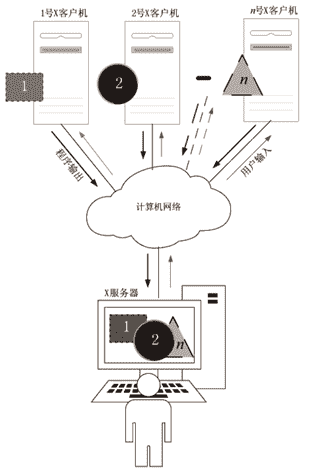

# 云计算通信协议有哪几种？

> 原文：[`c.biancheng.net/view/3913.html`](http://c.biancheng.net/view/3913.html)

看过中国香港警匪片的人应该对下面两个警察的对话耳熟能详：

“阿 Sir，我发现他了，要不要跟上？Over。”

“跟上，但不要靠得太近，以免被发现。Over。”

“明白。他进入超市了，那里人多，要不要暗地疏散人群？Over。”

“……Over.”

这样，两个人“Over”来“Over”去的通话，其实就是警察局制定好的通话规则，只要向对方说出“Over”，就表明话讲完了，该轮到对方说话了。

通话规则也叫通话协议，规定双方通话时必须遵守的规则。终端与云端通信时相互遵守的规则就是通信协议，双方必须严格遵守事先制定好的通信协议，否则通信无法正常进行。

云计算通信协议涉及安全、图像处理、数据压缩、网络传输协议等多个领域，直接决定着租户的终端体验。目前，终端与云端的通信协议主要有如下几种。

#### 1\. HTTP/HTTPS 协议

这是网站采用的通信协议，HTTP 的默认端口为 80，明文通信；而 HTTPS 的默认端口为 443，密文通信。

密文通信是指，通信双方先加密内容然后再发出去，收到对方的信息后需要先解密。本协议常用于 PaaS、SaaS，以及未安装操作系统前的 IaaS。比如租赁了一台裸机（属于 IaaS），通过浏览器打开裸机的远程管理卡网页，然后通过这个网页给裸机安装操作系统。

#### 2\. RDP 协议

这是微软的远程桌面协议，最新版本为 RDP10，这个版本改进很大，具备这些特征：

*   支持最大 32 位色彩。
*   采用 128 位的 RC4 加密算法。
*   远/近端电脑共享剪贴板。
*   允许远程应用使用本地端口（端口重定向）。
*   本地文件系统重定向到远程计算机。
*   远程声音重定向到本地播放。

RDP 协议规范公布在官方网站上，任何人都可以参照此规范开发遵循 RDP 协议的通信软件。

RDP 10 在 Windows 10 和 Windows Server 2016 上直接支持，Windows 8 和 Windows Server 2012 支持 RDP 8.0，Windows 7 上需要打支持补丁包才支持 RDP 8.0。

RDP 也有针对 Android\Mac OS 操作系统的客户端软件，但是用户体验要差一些。

微软发布的远程桌面客户端软件是 mstsc.exe，有安卓版和 Mac 版，但是没有 Linux 版。

有一个开源软件 FreeRDP 可以在 Linux 上运行，但是只支持 RDP 7.0/RemoteFX。另外，Ericom 公司推出了多平台版的客户端和具备 RDP 加速功能的服务器端。RDP 协议常用于 PaaS 和安装了 Windows 的 IaaS 云服务。

RDP 协议能同时支持远程桌面虚拟主机（RDVH）和远程桌面服务（RDS），利用微软的终端服务和 RDP 技术可以搭建规模小、性价比高的云计算系统，如十几个人的私有办公云。

图 1 所示是从 Windows 7 登录到云端的 Windows 8 桌面（单击“开始→所有程序→附件→远程桌面连接”或者直接运行命令 mstsc.exe，然后输入云端 IP 地址），采用的是 RDP 8.0 协议。
图 1  云端的 Windows 8 桌面

#### 3\. PCoIP 协议

这是 EMC 公司（收购 VMware）和 Teradici 公司共同开发的基于 UDP 的远程桌面协议，意为 IP 上的个人计算机（PC-Over-IP），在低带宽的广域网上也能流畅使用。

PCoIP 在主机上做图形渲染，终端只负责解码，因此减少了一些传输量，是专门为瘦终端而设计的。针对 Windows、Linux、MacOS、Android 和 iOS 操作系统，都发布了相应的客户端软件。

利用此协议搭建的云计算系统结构较复杂，软件许可种类多，这是一个缺陷。

图 2 所示是一个最小云计算系统的示意图，从图中可以看出，必须要有一个微软的域控 AD、连接器 Connector、虚拟主机（里面安装连接代理）和终端（安装客户端软件）。

第二个缺陷是目前还不支持微软的远程桌面服务，但是 Teradici 公司的产品 Teradici Arch 弥补了这个缺陷，该公司同时还推出了 PCoIP 的硬件加速卡。
图 2  最小云计算系统示意图
必需的组件包括：AD、Connector、VD 和 View Client。VD 可以是虚拟机桌面，也可以是物理机桌面，被 vCenter 管理的桌面为受管桌面，否则称为非受管桌面，VD 里都要安装 View Agent。vSphere Client 是用来管理 ESXi 或者 vCenter 的，如果没有这些，那么 vSphere Client 也可省掉。客户机上必须安装 View Client。vSphere Web Client 只能访问 vCenter。连接的路径是 View Client←→Connector←→View Agent。

#### 4\. HDⅩ/ICA 协议

这是思杰公司发布的远程桌面协议，采用 TCP，这一点与 PCoIP 采用 UDP 不同。思杰是最早做远程访问的公司，所以其技术积淀比较雄厚，在非常低的网络上（10Kb 左右）也有良好的表现。但不管怎样，采用此协议搭建的云计算系统还是要混合微软的产品的（操作系统、AD 域控等），相比微软的 RDP 协议，其架构较复杂。

主要组件包括：外网访问网关（Access Gateway）、桌面交付控制器（Desktop Delivery Controller）、资源池（XenServer Resource Pool）、文件服务器（File Share）、应用控制器（XenApp Controller）、虚拟机镜像供应服务器（Provisioning Server），如图 1 所示。

在局域网里面，最简化的采用 HDX/ICA 协议搭建的云计算系统为：终端（安装客户端软件）←→ Desktop Delivery Controller ←→ 虚拟机（安装 Agent），虚拟机的基础架构可以是 XenServer 6.x、ESXi 6.0 或 Hyper-V。不过，针对远程虚拟桌面市场，思杰公司特别推出了端到端的解决方案包 XenDesktop，目前版本为 7.6。

#### 5\. SPICE 协议

作为新兴的远程桌面协议，SPICE 协议最初由 Qumranet 公司开发，后来被红帽公司收购并开源，且被整合到红帽的云计算产品中。

SPICE 首先尝试将渲染的工作交给终端，利用终端的硬件资源来加速，再根据协商的结果考虑是否将渲染工作交给主机来处理，这时可以用软件或者 GPU 来渲染。SPICE 的双向音频流技术支持软件拨号和 IP 电话。SPICE 客户端支持 Android、Linux、Windows 和 Mac OS 操作系统，可以单独从 [http：//www.spice-space.org/download.html](http://www.spice-space.org/download.html) 下载。

SPICE 协议包括三部分，分别安装在物理机、虚拟机和终端中，如图 2 所示。在图 2 中，通过终端的 SPICE 客户端软件打开 spice：//10.1.50.102：5903，即可连接到云端的虚拟机 2，如果虚拟机里安装了 Windows 7 操作系统，那么在终端上就可以看到 Windows 7 桌面了。

需要注意的是，终端统一访问物理机的 IP 地址，然后由端口号来区分是哪台虚拟机，比如 5903 代表虚拟机 2、5905 代表虚拟机 3。由此可见，SPICE 不支持微软的终端服务，也不支持裸机（不能直接连接到物理机的 Windows 桌面），只支持虚拟机。SPICE 作为一款开源的远程桌面访问协议软件，具备良好的发展势头，尤其是对于中国首次涉足云计算的公司来说，直接集成 SPICE 到自己的云计算产品中，不失为良策。
图 1  HDX/ICA 协议搭建的云计算系统
图 2  SPICE 通信协议

#### 6\. RFB 协议

RFB 协议即远程帧缓冲（Remote Frame Buffer）协议，它直接把控制台的底层屏幕帧的内容实时同步到终端，所以能适应所有的操作系统。但是其传输信息量大，所以一般只在局域网内做点到点连接（一台计算机只与一台终端连接），以便远程协助解决计算机问题。

VNC 是由 AT&T 的欧洲研究实验室采用 RFB 协议开发的最典型的软件，后来在此基础上又衍生出了很多版本，其中 RealVNC、UltrVNC 和 TightVNC 最具代表性。

RealVNC 既发布商业版，也发布免费版，不过免费版的功能太弱，而 UltrVNC 和 TightVNC 则完全免费。三款软件的功能旗鼓相当，但是也有缺陷：

*   只能看到或者操纵同一个桌面，尽管允许不同的系统账号同时登录，而且这些系统账号必须具有系统管理员权限。
*   有的信息（比如 Windows 7 经常提示的“需要管理员权限才能运行此软件”）只能显示在本地的屏幕上。RFB 协议如图 3 所示。

图 3  RFB 协议
RFB 协议不太适合云计算，而适合远程协助解决问题和广播教学——老师先进入教师机并启动 VNC 软件，学生以“查看”模式登录教师机，这样学生都能看到教师机的屏幕（参考图 3）。

#### 7\. Ⅹ协议

X 协议这是由麻省理工大学开发的开源网络图形显示协议，采用的是客户机/服务器架构。基于这个协议开发的软件有 XFree86 及其继任者 Xorg，被类 UNIX 操作系统广泛采用，作为其图形桌面组件的一部分，比如 Linux 操作系统大多数采用 Xorg。X 协议的客户机/服务器模式可用图 4 表示。
图 4  X 协议
X 协议的客户机/服务器模式与传统的客户机/服务器不同，传统的客户机/服务器是针对用户而言的，即用户操作的计算机为客户机，远方的计算机为服务器；而 X 协议的客户机/服务器是针对程序而言的，即程序运行的那台计算机叫客户机，把结果输出到服务器上，服务器就是用户操作的那台计算机。

如图 5 所示，1 号、2 号和 n 号 X 客户机各运行一个程序，它们分别输出长方形、圆形和三角形，最终都在 X 服务器上显示出来。

令人遗憾的是，X 协议不传递声音，比如在 X 客户机上运行音乐播放器，而坐在 X 服务器旁边的用户是听不到声音的，不过有一些能支持声音的第三方开源项目，如 FreeNX、X2Go、LTSP 等。

利用 X 协议可以打造一台万能终端，即同时接入不同的云端。这一点很重要，因为在云计算时代，没有一家云服务提供商能通吃全部的云服务，一定会存在很多云端，且提供各种不同或者相同的云服务。作为用户，希望只使用一台终端。

PulseAudio 项目弥补了 X 协议不能传递声音的缺陷；开源 LTSP 项目整合了 Linux、Xorg、PulseAudio、OpenSSH 等开源软件，专门用于搭建教育培训机构和中小企业的私有云，终端不用事先安装或者固化任何软件，只要一块支持 PXE 启动的网卡即可，LTSP 的官方网站为[http：//www.ltsp.org/](http://www.ltsp.org/)。针对树莓派的衍生项目 [http：//pinet.org.uk/](http://pinet.org.uk/)，结合低廉的树莓派小主板，就能轻松搭建教学云。

NOMACHINE 公司发布的 NX 协议早期就是压缩 X11 协议并通过 SSH 安全通道传输，后来公司认为这样做不安全，从 4.0 版本开始默认采用改进的 NX 协议直接传输，当然仍然支持 SSH 安全通道，并且针对企业用户不再开源。

#### 8\. HP RGS

惠普远程图形软件（Remote Graphic Software，RGS）是一款高性能的远程图形系统，它允许用户通过标准 TCP/IP 网络访问和共享远程计算机桌面，在远程计算机上完成图形渲染，然后把渲染结果发给客户端。RGS 为客户机/服务器模式，服务器称为 Sender，客户机称为 Receiver。

典型的应用场景是：配置较高（强悍的 CPU、大容量内存、SSD、独立显卡）的远程工作站安装图形处理软件（如 CAD、SolidWorks 等）和 Sender；用户使用的瘦客户机安装 Receiver，然后运行 Receiver 软件连接到远程的 Sender，即可操作那里的应用程序（如 CAD 等）。相比其他协议，RGS 的用户体验要好很多，NASA 与 HP 实验室合作，利用 RGS 的核心压缩技术实现长距离的火星探测，证实了 RGS 绝非等闲之辈。RGS 的一些重要特性如下：

*   流畅支持 3D 图形。
*   先进的视频压缩技术（Windows 和 Linux 有效）。
*   支持 Windows、Linux 和 Mac OS 操作系统。
*   允许多个 Receiver 同时连接到相同的 Sender，轻松实现协同办公或教学。
*   运行同一个 Receiver 同时连接到多个 Sender。
*   采用惠普 Velocity 技术增强跨广域网的用户体验。
*   服务器上的高保真音频能通过本地喇叭播放。
*   本地 USB 设备能挂载到远程机器上。
*   本地设备允许触摸和手势输入。
*   RGS 发送像素而非数据，因此，无论你在使用什么应用，RGS 都可正常运行。
*   可自动进行分辨率和多显示屏设置，以匹配客户端设备。

RGS 的应用领域有桌面虚拟化、远程演示、移动办公、协同办公、教学/培训等。

综上所述，在局域网内做比较，从用户体验方面来看：RGS 最好，PcoIP 协议要优于 HDX 协议，HDX 协议又优于 RDP 8.0（Ericom 公司改进了 RDP 8.0，并且终端可以直接采用浏览器），但是 RDP 10 有了很大改进，RDP 10 要好于 SPICE 协议，X 协议和 RFB 协议似乎垫后。

从架构复杂性方面来看：

*   采用 RDP 组建的云计算系统最简化，产品单一、软件许可证单一，小到一台计算机即可做云端，甚至可做服务全球的云端。
*   采用 LTSP 开源项目搭建简单云端比较容易，而且全部是开源软件，但是缺少 Windows 上一些流行的应用软件（如 Photoshop、MicrosoftOffice 等），如果做类似 iPad 的深度定制化，则是一个不错的方向，Raspi-LTSP 是一个替代项目。
*   采用 SPICE 协议建设的云端复杂度较高，虽然可以全部采用开源软件，但必须具备一支技术水平相当的建设团队。
*   而采用 HDX 和 PCoIP 协议组建的云计算系统架构复杂，管理也复杂。

全部使用微软产品的应用环境使用 RDP 协议较合适；需要支持多种桌面操作系统的企业会发现 Citrix 的产品更加适合；如果希望通过使用瘦客户端或零客户端设备作为 VDI 解决方案的一部分，那么选择 PCoIP 技术可能更适合；局域网内的富图形处理业务选择 RGS 较明智。

总之，技术变化很快，各种协议都处于快速的发展变化之中，现在比较的结果与数月后的比较结果可能会有所不同，而且还可能有新的协议不断诞生。具备一定技术实力的公司可以在开源协议（SPICE、X、RFB）方面深入发展，并做出全部采用开源软件的云计算方案，这应该具备良好的发展前景。