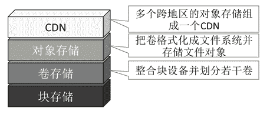
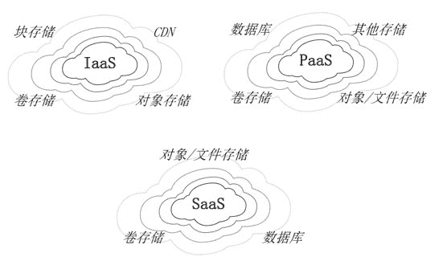
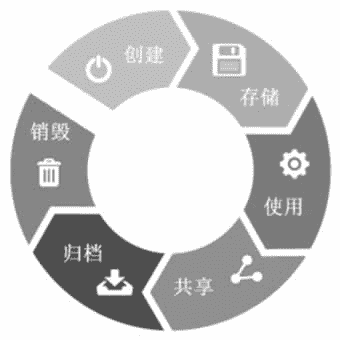
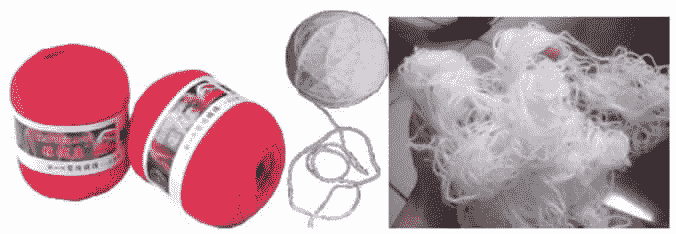

# 云计算安全性：从云计算架构、数据生命周期和数据安全 3 个方面介绍

> 原文：[`c.biancheng.net/view/3917.html`](http://c.biancheng.net/view/3917.html)

信息安全的首要目标是保护我们的系统和应用所处理的数据资料。随着单位组织陆续把应用迁移到云端，甚至是迁移到几年前不可想象的外部或公共云端，传统的数据安全措施面临巨大挑战，随“云”而来的资源弹性、多租户、全新的物理和逻辑架构及抽象层控制，迫切寻求新的数据安全策略。

在云计算时代，如何安全地管理信息是所有组织不得不面临的一项艰巨任务，即使那些暂时还不用云计算的机构也不例外。管理信息具体包括内部数据管理、云迁移，以及被分散于多个单位组织的应用和服务中的数据的安全保障。信息管理和数据安全在云计算时代需要新的战略和技术架构。幸运的是，不仅用户拥有需要的工具和技术，而且迁移到云端后，数据还能得到更好的保护。

建议采用数据安全生命周期来评估和定义云端数据的安全策略，在制定明确的信息治理策略的基础上，通过诸如加密和专门的监测手段等关键技术来增强其安全性。

## 云信息架构

不同的云服务模式具备不同的云信息架构。无论是私有还是公共 IaaS 云服务模式，通常包括下面的存储。

#### 1）原始块存储

存放数据的物理介质，如磁盘、光盘、磁带等。在一些特定的私有云中，这些物理介质能被直接访问。

#### 2）卷存储

包括被附加到 IaaS 实例的卷（如虚拟硬盘驱动器）。在存储后端，卷通常被打散存储以增强可靠性和安全性。卷不同于磁盘分区，磁盘分区是对一块基本的磁盘进行逻辑划分。

比如从 101 柱面到 10000 柱面划为一个分区，从 10001 至 50000 为另一个分区，因此一个分区的容量不可能超过磁盘的容量。而卷是在整合若干存储介质（如硬盘、分区、U 盘等）的基础上进行逻辑划分，因此一个卷允许跨越多个磁盘。

#### 3）对象存储

通常指文件存储。不像虚拟机硬盘这种块设备，对象存储更像文件共享服务。

#### 4）内容分发网络（CDN）

对象存储中的内容被分发到离用户最近的地方，以便增强终端用户的网络体验。

块存储、卷存储、对象存储和 CDN 的逻辑关系如图 1 所示。
图 1  块存储、卷存储、对象存储和 CDN 的逻辑关系
PaaS 云服务在对外提供存储服务的同时也要消耗存储空间。PaaS 能提供的存储服务主要有数据库服务、Hadoop/MapReduce 大数据服务，以及应用存储（被整合到 PaaS 应用平台且通过 APIs 访问的其他存储）服务。而 PaaS 消耗的存储空间包括：

*   数据库：信息内容被直接存储在数据库中（作为文本或二进制对象）或者被数据库表字段所引用的文件中，而数据库本身可能是共享后端存储的 IaaS 实例集合。
*   对象/文件存储：只能通过 PaaS API 访问。
*   卷存储：数据被存储在附加给 IaaS 实例的卷中，但这些数据专门供应 PaaS 云服务。
*   其他存储：不属于上述三类的其他存储。

类似于 PaaS 云服务，SaaS 云服务也提供和消耗各种存储服务，SaaS 云服务提供的存储服务一般通过基于 Web 的用户接口或者 C/S 模式的客户端访问，这点与通过 API 访问的 PaaS 云服务的存储服务不同，不过很多 SaaS 云服务提供商也对外提供 PaaS API 访问接口。

SaaS 云服务可能提供的存储服务包括：

*   信息存储和管理。比如现在流行的网络硬盘就是这类存储。
*   内容/文件存储。专门存储基于文件的内容，如网络相册等。

而 SaaS 云服务消耗的存储包括：

*   数据库。类似于 PaaS 云服务，绝大多数 SaaS 应用程序要依赖后端的数据库服务，甚至是文件存储服务。
*   对象/文件存储。文件和数据被保存在对象存储中，专门供应 SaaS 应用程序。
*   卷存储。数据被存储于附加在 IaaS 实例的卷中，并且专门供应 SaaS 应用程序。

云信息架构如图 2 所示。
图 2  云信息架构图

## 数据打散存储

数据打散存储是一种增强数据安全性的技术，它与加密技术不同，通过对数据分片，每个分片以多个副本的形式分散存储在不同的服务器上，以冗余存储换取数据的高可用性和高可靠性。

目前绝大多数云服务提供商都采用了这种方法。例如，一个 500MB 的文件被划分为 5 个片，每片 3 个副本，一共 15 个片，被分散存储在多台服务器上，这样即使部分服务器损坏，文件也仍然不会遭到破坏。当用户读文件时，读取 5 个分片重新“组装”为一个完整的文件。数据打散存储结合加密技术，将会使数据的安全性得到进一步提高。

## 数据安全生命周期

尽管信息生命周期管理是一个相当成熟的领域，但是它并不能完全满足安全专家的要求，为此，人们提出了数据安全生命周期的概念。

数据安全生命周期从创建到销毁共六个阶段，如图 3 所示。一旦被创建，数据可处于任何一个阶段，也允许跨到任何一个阶段，也可能不经过全部的六个阶段（比如，并不是所有的数据最后都要销毁）。准确跟踪你的数据处于数据安全生命周期的哪个阶段，是进行敏感数据保护的前提，同时能帮助你确定在哪里应用安全控制措施。
图 3  数据安全生命周期

#### 1）创建

在第一阶段，人们创建结构化或非结构化的数据，如微软办公电子文档、PDF 文件、电子邮件、数据库中记录或者图片文件。通常在此阶段，根据企业的数据安全策略对新产生的数据进行密级分类。

#### 2）存储

一旦创建了一个文件，它就被保存在某个地方。此时，你要确保存储的数据受到保护，同时应用了必要的数据安全控制措施。通过有效保护你的敏感数据，可以减少信息泄露的风险。本阶段通常与创建动作几乎同时发生。

#### 3）使用

一旦一个文件被创建并存储，那么随后可能将被使用。在这个阶段，数据被查看、处理、修改并保存。此时，在使用数据的过程中需要施加安全控制——你要能够监控用户活动并应用安全控制措施，以确保数据不被泄露。

#### 4）共享

数据经常在员工、客户和合作伙伴之间共享，因此必须要持续监控存储中的敏感数据信息。数据在各种公共的和私有的存储、应用程序和操作环境之间移动，并且被各个数据所有者通过不同的设备访问，这些情况可能会发生在数据安全生命周期的任何一个阶段，这就是为什么要在正确的时间引用正确的安全控制的真正原因。

#### 5）归档

数据离开生产活动领域并进入长期离线存储状态。

#### 6）销毁

采用物理或者数字手段永久销毁数据，物理手段如硬盘消磁，数字手段如加密切碎。

## 数据安全

数据是否完整、数据是否泄密、数据是否一致都属于数据是否安全的范畴。数据不完整是指在违背数据主人意愿的前提下，数据全部丢失或者部分丢失，数据所有者主动删除数据不属于数据不完整。数据泄密是指他人违背数据所有者的意愿而从数据中获取信息。下面几种情况不属于数据泄密：

1）从网上下载的免费的并保存在计算机中的电影被他人复制了，因为你不是电影的所有者。

2）用 AES 加密过的一份个人文档被他人复制了，因为他人无法解密，从而无法获取里面的信息。

3）一个没有加密的保存重要文档的 U 盘掉到大海里了，他人获得 U 盘中信息的概率可忽略不计。

4）网上银行的密钥卡丢了。

5）我主动把一份重要的方案材料传给客户。

上面的例子中，（2）表明他人虽然复制了经过 AES 加密的文档，但如果没有密码，他是无法解密的，因为就算是使用当今最快的计算机进行暴力破解，也要花上一百多年的时间。（3）表明掉到大海里的 U 盘算是彻底损毁了，谁也得不到它，更不用说获取里面的信息了。在（4）中，网上银行的密钥卡丢了，就算别人捡到了，也无法操纵我的账户，因为他不知道我的网银账户和登录密码。其他两个例子更容易理解。

数据一致性是指数据没有错乱，能从中获取到这些数据所蕴含的全部信息。为了理解数据完整性和一致性的区别，请看下面的例子，如图 4 所示。
图 4  完整性和一致性
如果把数据比作毛线，那么图 4 左侧的毛线就表示数据是完整的而且是一致的；中间的被使用过的毛线团表示数据是不完整的但是是一致的；而右侧乱糟糟的毛线就表示数据是不一致的，很难从中抽出一根完整的毛线来，比如明显看到文件在硬盘里，但就是打不开，或者打开后显示乱码，这就是数据的不一致。

那么，数据放在云端和放在本地到底哪个更安全呢？结论如下：

数据放在云端比放在本地更安全。

原因如下。

#### 1\. 数据完整性方面

云端通过采用服务器集群、异地容灾和容错等技术，可保证数据万无一失，采用数据快照回滚技术，能最大程度降低用户误删数据的损失，所以云端的数据丢失的概率极低；相反，如果数据保存在本地（计算机硬盘、U 盘、光盘、SD 卡、磁带等），这些存储介质都很容易损坏，另外没有任何措施可防止用户误删数据，现在的数据恢复公司业务火爆就充分说明了本地数据丢失的普遍性。

#### 2\. 数据泄密方面

使用密码是目前最常用的防止数据泄密的方法，无论是云计算，还是使用本地计算机，都是如此。比如打开计算机，输入账号和密码登录，然后再输入密码登录 QQ、输入密码登录微博、输入密码登录邮箱、输入密码登录云等。另外，也有采用密码加密文档的，如密码保护的 Word 文档、压缩包等。

在当下云计算还不普遍的情况下，因为本地的存储介质（如硬盘、U 盘、SD 卡、手机、光盘等）丢失而导致数据泄密的概率占到 70% 以上，而其他诸如通过网络泄密的概率不到 30%。因此，把数据保存在云端，可以消除因丢失存储介质而泄密的可能性。另外，就算不用云计算，也存在网络泄密的可能性，除非你的计算机不连接网络。

云服务提供商会采取各种防范网络泄密的措施，如防火墙过滤、入侵检测、用户行为异常分析、泄密预测等高精尖技术，个人用户计算机是不可能花费巨资购买这些设备和技术的。

最后，对于一些敏感的数据资料，用户如果实在不放心，还可以先加密，然后再保存到云端，常用的加密工具有 VeraCrypt、AxCrypt、BitLocker、7-Zip 等，也可以对 IaaS 存储产品（如虚拟机硬盘）全部加密处理。

#### 3\. 数据一致性方面

数据没有错乱，没有遭到破坏，能正常打开和使用，这一点很关键。用过计算机的人应该都有过这样的经历：不正常关机（如突然停电、不小心按下计算机的电源开关或复位开关等）后重新启动计算机，报告硬盘文件遭到破坏需要修复，好不容易修复并启动完毕，发现之前辛苦几天编辑的 Word 文档打不开了，这就是各种干扰因素破坏了数据的一致性。

放在云端的数据一致性遭到破坏的概率要远远小于本地计算机，原因很简单，云端环境更可靠：机房恒温恒湿、多级电力保障、阵列存储系统、异地灾难备份中心、安全防范措施全面、计算机专业人员维护等，这些措施使得数据不一致的概率几乎为零。