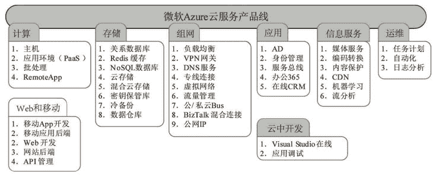

# 国内外主流云服务提供商有哪些？

> 原文：[`c.biancheng.net/view/3929.html`](http://c.biancheng.net/view/3929.html)

前面讲到，经营云端的公司应具备更多的投入和技术以保证其安全性，但是一个真正落地的云端能不能达到理想的安全级别，还要看云端运营公司的声誉、品牌、技术实力，以及当地政府的监管力度。

欧美国家的云服务提供商普遍好于国内的公司，其资金雄厚、技术实力强、品牌声誉好。选择一家技术过硬、实力雄厚、信誉良好、服务到位的云服务提供商很重要，因为云服务不是一次性买卖，供需双方需要长久合作。

为了搞清楚一家云服务公司的产品线，我们首先要理解一个传统数据中心的组成，否则很难搞清楚一家云服务提供商提供的众多产品线的作用和它们之间的关系。

传统的数据中心由若干个局域网、一定数量的服务器、若干存储设备、一些负载均衡器、入侵检测设备、域名服务、数据库服务、DNS 服务、DHCP 服务、邮箱系统、门户网站、目录服务、用户身份认证和权限管理服务、文件服务、虚拟办公桌面等组成。如果一家云服务公司能全面接管一家企业的数据中心，而这家企业只需摆放云终端和出口宽带设备，那么这家云服务公司的产品线是最全面的。

截至 2015 年，云服务提供商以美国企业为主。中国云服务提供商发展迅速，而且绝大多数的云服务提供商提供 IaaS 和 PaaS 类型的云服务，而紧贴人们生活的 SaaS 类云应用不多。下面简单介绍一下目前一些典型的云服务提供商。

#### 1\. 亚马逊 AWS

亚马逊刚开始是做电商的，购买了一批服务器搭建电商平台，由于服务器具备富余的计算资源，于是其考虑对外出租这些资源，从此开展了云计算业务并越做越大。现在，亚马逊算是世界上最大的云计算服务公司，产品线丰富，具体包括如图 1 所示的云服务。
图 1  亚马逊 AWS
图 1 中右侧就是亚马逊公司提供的云计算服务产品线，涵盖了 IT 系统架构的各个层次，加上另外几个部署和运维产品，一个企业的数据中心可以采用亚马逊云计算服务产品来完全替换。亚马逊公司最核心的云服务产品是主机（EC2）和存储，其他是增值产品或者支撑产品。

一台主机（EC2）就是一台供用户租用的虚拟服务器或者物理服务器，属于 IaaS 类型。亚马逊目前提供几十种不同的主机类型供用户选择，主要是 Windows 和 Linux 各版本。用户可以根据实际应用的计算需求来选择不同主机的种类和数量，并可以在数分钟内构建起自己的计算环境。

虚拟桌面（WorkSpaces）就是一个基于云的桌面虚拟化服务，是传统 VDI 方案的一种基于云计算的实现方式，用户可以使用诸如个人计算机、平板电脑、Kindle 和 Android 平板等各种终端设备通过网络访问虚拟桌面，但要首先安装一个相应的小客户端软件，采用 PCoIP 通信协议。只要网速满足要求，用户就可以用任何设备在任何地点接入远程桌面，真正实现移动办公。

软件流（AppStream）将软件界面直接显示到云终端屏幕上，不同于 WorkSpaces 把整个电脑桌面显示到终端上，AppStream 只把运行在亚马逊服务器上的软件界面显示到终端屏幕上，与其他软件界面（无论是本地还是云端的软件）一起整合到本地桌面上。

最终的结果就是，用户的云终端屏幕上同时显示多个软件的界面，而这些软件有的是 Windows 软件，有的是 Linux 软件，有的是 Mac 软件，还有的可能是 Android 软件。有的运行在亚马逊，有的运行在私有云端，有的运行在本地。

亚马逊的 AppStream 与微软的 RemoteApp、思杰的 XenApp 及 VMware 公司的 ThinApp 互为竞争产品。AppStream 特别适合那些需要大量计算资源而操作终端又需要多样化的软件，如跨平台的多人游戏、图形渲染、生命科学研究等软件，如图 2 所示。
图 2  AppStream

#### 2\. 微软 Azure

微软云端的技术绝大多数是自己的，如 Windows 操作系统、SQL Server 数据库、Office 办公软件、活动目录等，优点是架构简洁、综合成本低，但是缺点也很明显，即开放性有待提高，目前虽然引入了 Linux、Hadoop、Eclipse 等开源产品，但还远远不够。微软 Azure 云服务产品线如图 3 所示。
图 3  微软 Azure
微软的云中开发比较有优势，包括开发移动应用、Web 应用和传统软件。另外，微软把 Office 办公套件搬上了云端，取名为 Office 365。

#### 3\. 谷歌云平台

谷歌公司的云计算服务产品线虽然没有亚马逊公司丰富，但是也有其特色，如翻译、大数据、Bigtale 等，如图 4 所示。
图 4  谷歌云平台
谷歌公司的云计算服务产品线具备储如虚拟主机、存储和组网等核心产品，但没有类似亚马逊的虚拟桌面和软件流（AppStream），不过用户可以自己在虚拟主机的基础上配置，比如在虚拟主机里安装 Windows 8，然后采用微软的远程桌面协议 RDP 实现 VDI。

另外，谷歌提供的免费版谷歌硬盘集成了在线办公功能（Google Docs，包括文字排版、表格、PPT 文件等），网站为 [https：//drive.google.com/](https://drive.google.com/)。

#### 4\. 阿里云

阿里云拥有诸如虚拟主机、存储和虚拟网络等核心产品，但是相比国外的云服务公司，其其他产品线有待进一步完善。不过，阿里云的出口带宽和稳定性在国内的云服务公司中还是相当不错的。

另外，阿里云以一个数据中心的平面示意图来标注各个产品的作用和关系（见图 5），从而使用户能轻松理解并购买适合自己需求的云服务，而亚马逊的产品介绍则做得不够人性化。
图 5  阿里云

#### 5\. 华为云

华为云服务产品线如图 6 所示。
图 6  华为云

#### 6\. UCloud

UCloud 云服务产品线如图 7 所示。
图 7  UCloud