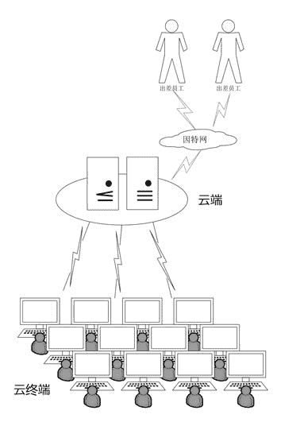

# 云应用之企业私有云办公简介

> 原文：[`c.biancheng.net/view/3933.html`](http://c.biancheng.net/view/3933.html)

与传统的以计算机为主的办公环境相比，私有办公云具备更多的优势，比如：

*   建设成本和使用成本低。
*   维护更容易。
*   云终端是纯硬件产品，可靠、稳定且折旧周期长。
*   由于数据集中存放在云端，从而更容易保全企业的知识资产。
*   能实现移动办公，员工能在任何一台云终端上使用自己的账号登录云端办公。

关于私有办公云的更多优势描述，请参考《云计算的优势和劣势（优点和缺点）分析》节。

比如，一个小企业（员工数少于 100 人），采用两台服务器做云端，办公软件安装在服务器上，数据资料也存放在服务器上。通过有线或无线网络连接到办公终端，每个员工分配一个账号即可，员工随便在哪台终端都可以用自己的账号登录云端办公。示意图如图 1 所示。

在外出差的员工，可以通过 VPN 登录到公司内部的云端。
图 1  企业私有办公云