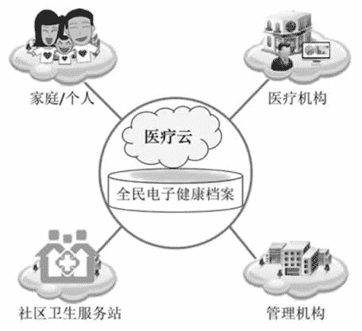

# 云应用之医疗云简介

> 原文：[`c.biancheng.net/view/3935.html`](http://c.biancheng.net/view/3935.html)

医疗云的核心是以全民电子健康档案为基础，建立覆盖医疗卫生体系的信息共享平台，打破各个医疗机构信息孤岛现象，同时围绕居民的健康关怀提供统一的健康业务部署，建立远程医疗系统，尤其使得很多缺医少药的农村受惠，示意图如图 1 所示。
图 1  医疗云示意图
依托医疗云，可以在人口密集居住区增设各种体检自助终端，甚至可以使自助终端进入家庭。建立医疗云利国利民，其重大意义归纳如下。

#### 1）对于国家公共卫生服务管理部门

有利于公共卫生业务联动工作；有利于疾病预防与控制管理；有利于突发公共卫生事件处理；便于开展公共卫生服务；有利于资源整合、减少重复投资，甚至可以把检查检验功能独立开来，专门成立第三方机构；便于实现跨业务、跨系统的数据共享利用。

#### 2）对于医疗卫生服务机构

有利于提高医疗服务的质量；有利于节省患者支出，缓解群众看病贵的问题；便于争抢生命绿色通道的“黄金时间”；有利于充分共享医疗资源；有利于开展远程医疗业务。

#### 3）对于社区卫生服务站

有利于开展“六位一体”业务；有利于开展健康干预跟踪服务。

#### 4）对于个人

能减少重复的检查检验开支；便于“移动”（如转院、跨地区等）治病；通过远程医疗系统便于享受优质的医疗服务；医疗云结合大数据能预测个人疾病，所以能提前预防重大疾病的发生。