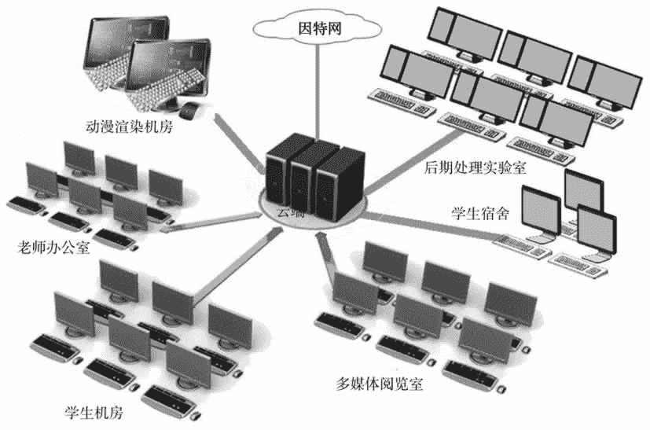

# 云应用之教育云简介

> 原文：[`c.biancheng.net/view/3937.html`](http://c.biancheng.net/view/3937.html)

构建教育云是一个庞大的系统工程，由一个国家层面的公共教育云和成千上万的学校私有教育云组成，而且私有教育云建设要先行启动，教育管理部门制定标准，由各个学校自己主导建设。

公共教育云应该由中央政府牵头完成，承载共性教育资源和标杆教育资源，同时作为连接各个私有教育云的纽带。各个学校的私有教育云承载各种特色资源，履行“教”与“学”的具体任务。

每个学校运营自己的私有云端，而云终端发放到每个老师和学生的手上，形态上可以是固定云终端（放置在老师办公室、机房、多媒体教室、图书馆的多媒体阅览室等）、移动云终端（给老师和学生）、移动固定两用云终端及多屏云终端。云端和云终端通过校园高速光纤互联在一起，如图 1 所示。
图 1  教育云
新生注册时，为每个学生分配一个云端账号和一台手持云终端，一个账号对应一个虚拟云桌面，学生毕业后回收其云端资源。在机房、宿舍、图书馆等场所，只要坐下来，就可以把手持设备插入固定云终端，然后就可以使用大键盘和大屏幕了。手持设备也可以单独接入云端。与传统的非教育云相比，学校采用私有教育云有如下好处：

*   移动教学。无论师生在哪里，都能登录自己的云端桌面。
*   延续实验。由于每个学生都有自己独有的虚拟机，所以跨节次的实验不会被中断。
*   远程教学。老师能选择云端的任何学生的云桌面并广播课件。
*   规范学生用机行为。能轻松控制学生可以安装和使用的软件，杜绝学生沉迷游戏。
*   便于资源共享。
*   便于学生积淀学习笔记和素材。
*   便于计算机学生云中开发。
*   轻松实现高性能计算，如科学研究、动漫渲染、游戏开发、虚拟现实模拟等。
*   便于因材施教。在掌握一定的基础知识后因材施教，最大限度地发挥每个学生的特长，这是最理想的教育方法。利用虚拟现实技术产生学生喜爱的“老师”，利用大数据分析为每个学生制订教学计划，然后给每个学生分配一个“老师”，按照制订的计划来一对一教学。

在私有教育云的基础上再抽取共性资源，形成全国性的公共教育云，同时引入虚拟现实技术，实现远程教育，使得偏远的广大农村受益。