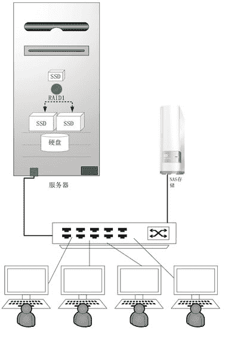

# 小型云计算平台的搭建以及解决方案（超详细）

> 原文：[`c.biancheng.net/view/3953.html`](http://c.biancheng.net/view/3953.html)

俗话说“学起来简单，做起来就难了”，所以下面我们学习一个小型方案的云计算实施例子。

## 需求分析

满足 60 个以内的终端用户（使用场合为办公、教学、多媒体阅览、门柜业务、家庭等），允许适度的不可用，要求满足若干个员工（如财务人员、老板）的高安全性。我们设计了单机和双机两种方案，大家可以根据自己的实际情况选择。

单机方案结构简单、成本低，建设和运维容易，适合对可用性要求不高的场合，如教学、家庭、小公司办公等；而双机能确保很高的可用性，但是架构稍微复杂，成本增加倒是不多。

## 系统设计

采用 Windows 的远程桌面服务，每个用户只能看到自己主目录中的资料。对于要求数据高度安全性的用户，给其分配虚拟机或者容器，以达到完全与他人隔离的目的。

#### 1\. 单机方案

为了确保数据的安全性，我们在物理上采用了四级存储子系统（见图 1）。
图 1  单机方案
首先用一块 120GB 的固态盘安装操作系统、应用程序和静态的配置文件，投入运行后开启写保护，这样能最大限度地保护系统，病毒、断电、误删文件等都不会破坏系统，从而确保机器总能正常运行。

其次采用两块 250GB 的固态盘做成 RAID1（通过硬阵列卡或者软阵列来设置），有效存储容量是 250GB，然后再与 2TB 的机械硬盘做成存储池。这个存储池用于存放虚拟内存页文件和用户经常使用的文档资料，同时 C：盘上的目录 C：\Users、C：\Temp 符号链接到这里。这个存储池拥有 2250GB 的容量，接近 SSD 的性能。

Windows Server 2012 R2 的存储池管理和 ZFS 文件系统都能优化 SSD 和 HDD 的混搭环境，使得经常使用的文件存放在 SSD 中，很少访问的文件存放在 HDD 中，这些都是自动完成的，无须用户手工干预。

按 60 个用户计算，每个用户可分配近 40GB 的硬盘空间，这对于日常办公产生的资料来说足够使用。由于允许过度分配，所以每个用户几乎可以得到 80GB 的空间。对用户启用磁盘配额限制。

最后使用一台 NAS 存储设备，容量为 4TB 以上，用于离线备份，也可以考虑做同步备份。安排一个后台备份任务，设定每 30 分钟增量备份一次。

采用两块千兆网卡，捆绑在一起，这样正常时两块网卡平摊网络流量，即使一块网卡损坏，也不会中断用户会话。

配置 32GB 的内存，至少一块 4 核的 CPU。本方案也支持少量的虚拟机桌面（4 台以内），每台虚拟机要分配 1.5GB 内存。

对于资金预算稍微宽松的公司来说，可以考虑增加一块 2TB 的机械硬盘，两块做成镜像，以增加存储容错能力；相反，预算紧张的企业可以考虑只买一块 250GB 的固态盘，及时做好数据备份，以增加数据的安全性。

#### 2\. 双机方案

与单机方案一样，双机方案仍然采用四级存储子系统（见图 2），只不过采用一块 250GB 的固态盘，再与机械硬盘做成混搭存储池，然后两台计算机的硬盘互为镜像，做成文件系统级同步。存储空间划分为三个分区，分别命名如下。

#### 1）配置盘 D

存放虚拟内存页文件，临时目录 C：\Temp 符号链接到这里，要经常修改又不用同步到其他计算机的文件；存储虚拟机配置文件和虚拟机硬盘文件。

#### 2）用户主目录盘 E

C：\Users 符号链接到这里，用户只能进入各自的目录并在自己的目录里创建更多的目录和文件，系统管理员无权进入用户目录。

#### 3）共享文档资料盘 F

存放公司的共享文档，只有管理员有权利写，其他用户只能读。

图 2  双机方案
E 分区、F 分区和 D 分区上的虚拟机文件目录要同步到另一台计算机，C：、D：盘对普通用户隐藏，普通用户在 E：盘上的配额为 40GB。

配置 32GB 的内存，至少一块 4 核的 CPU；128GB 内存+2 块 4 核 CPU 能应付达 100 个终端用户。本方案也支持少量的虚拟机桌面（4 台以内），每台虚拟机要分配 1.5GB 内存。当然，物理机的配置足够高的话，还可以支持更多的虚拟机。但不管怎么讲，仍以多用户桌面为主。

域控对于本方案至关重要，我们采用工控凌动小主板来组建方案中的域控器。

## 硬件选型

组成个人计算机的四大部件分别是 CPU、主板、内存和电源，它们关系到整台计算机的综合性能和稳定性。但是作为云端服务器，硬盘也至关重要，尤其是硬盘的 IOPS 指标。在下面提供的几个配单中，我们充分考虑了各个配件的性能搭配和整机可靠性。

#### 1\. 高档配置

高档配置如表 1 所示。

**表 1 高档配置**

| 配件名称 | 型号 | 参数 | 大致报价（元） |
| --- | --- | --- | --- |
| CPU | 英特尔至强 E5-2620V2 |   | 2800 |
| 主板 | 华硕 Z9PE-D16C/2L | 支持双路 | 3300 |
| 内存 | 4 根金士顿 DDR3 1600 8G RECC 服务器内存 | 32GB 总容量 | 3000 |
| 固态盘（系统） | 英特尔（Intel） S3 500 系列 SATA 6Gbit/s 固态硬盘 2.5 英寸 120G |   | 980 |
| 固态盘（数据） | 2 英特尔（Intel）S3500 系列 SATA 6Gbit/s 固态硬盘 2.5 英寸 240G |   | 3800 |
| 电源 | 海韵（Seasonic）额定 660W P-660 电源 | 80PLUS 白金牌/全模组/支持双 CPU/支持 SLT/支持背线 | 900 |
| 硬盘 | 1 块西部数据 XE 系列 600G SAS6Gbit/s 10000 转 32M 2.5 英寸企业级硬盘（WD6001BKHG） |   | 1700 |
| NAS | 西部数据（WD）My Cloud 3.5 英寸个人云存储 4TB（WDBCTL0040HWT-SESN） |   | 1600 |
| 工控小主板* | Intel DN2800MT | 再加 2GB 内存、32GBSSD | 1000 |
|   |   |   | 合计：19380 |

*   在单机方案中，不要工控小主板；在双机方案中，只采用一块 250GB 的固态盘。
*   配件可在美国、日本、中国台湾的亚马逊上购买，整体价格大概便宜 30% 左右。

全部采用一线品牌的配件能保证最大的稳定性，本方案基本上就是服务器的配件，也能达到服务器的高可靠性。4 核英特尔至强 CPU 相比同类型的 AMD CPU，价格要贵很多，但是能提供更大的固态盘带宽和更高的内存通信性能。

华硕的这块服务器主板支持双路至强，为以后纵向扩容预留了空间。内存具备自动纠错功能（ECC），每根内存虽然比没有纠错功能的内存要贵 200 多元，但是大大提高了稳定性，避免了因内存导致的蓝屏、死机等问题，所以还是比较划算的。

固态盘采用英特尔产品，因为这个牌子的固态盘稳定性早已被业界认同，同时 IOPS 能达到 4000 以上，只是价格有点贵。

海韵（Seasonic）额定 660W 的电源代表业界最可靠的电源，对于 300W 左右的负载，这款电源的电源转换效率最佳，600W 的额定功率也为以后扩充配置预留了足够的余量。

600GB 的企业级万转 SAS 机械硬盘就是为 7×24 小时运行设计的，机械硬盘 IOPS 远远落后于固态盘，但是比 SATA 机械硬盘要先进，大容量、低价格是其两大优势。

Intel DN2800MT 工控小主板无风扇静音运行，用它来组建域控能保证万无一失。

配单中，主机配件不包括 NAS 和工控小主板，而且 4 核 CPU 和固态盘还有进一步降价的空间，预计一年后整机价格应该还可以下降千元以上。

#### 2\. 中档配置

中档配置如表 2 所示。

**表 2 中档配置**

| 配件名称 | 型号 | 参数 | 大致报价（元） |
| --- | --- | --- | --- |
| CPU | Intel 酷睿 4 核 i7-4770k |   | 2300 |
| 主板 | 华硕 SABERTOOTH Z87 主板 |   | 1800 |
| 内存 | 4 根金士顿（Kingston）骇客神条 Blu 系列 DDR3 1600 8GB |   | 1800 |
| 固态盘（系统） | 英特尔（Intel）S3500 系列 SATA 6Gbit/s 固态硬盘 2.5 英寸 120G |   | 980 |
| 固态盘（数据） | 2 块英特尔（Intel）S3500 系列 SATA 6Gbit/s 固态硬盘 2.5 英寸 240G |   | 3800 |
| 电源 | 海韵（Seasonic）额定 660W P-660 电源 | 80PLUS 白金牌/全模组/支持双 CPU/支持 SLI/支持背线 | 900 |
| 硬盘 | 1 块西部数据（WD）SE 系列 2TB 7200 转 64M SATA3 企业级 硬盘（WD2000F9YZ） |   | 1000 |
| NAS | 西部数据（WD）My Cloud 3.5 英寸个人云存储 4TB（WDBCTL0040HWT-SESN） |   | 1600 |
| 工控小主板* | Intel DN2800MT 再加 2GB 内存、32GBSSD |   | 1000 |
|   |   |   | 合计：14280 |

这是台式机的配置，稳定性不如服务器。

#### 3\. 低档配置

低档配置如表 3 所示。

**表 3 低档配置**

| 配件名称 | 型号 | 参数 | 大致报价（元） |
| --- | --- | --- | --- |
| CPU | Intel 酷睿 4 核 i7-4770k |   | 2300 |
| 主板 | 华硕 Z87-A 主板 |   | 870 |
| 内存 | 4 根金士顿（Kingston）骇客神条 Blu 系列 DDR3 1600 8GB |   | 1800 |
| 固态盘（系统） | 英特尔（Intel）S3500 系列 SATA 6Gbit/s 固态硬盘 2.5 英寸 120G |   | 980 |
| 固态盘（数据） | 英特尔（Intel）S3500 系列 SATA 6Gbit/s 固态硬盘 2.5 英寸 240G |   | 1900 |
| 电源 | 安钛克（Antee）额定 450W TP-450 电源 | 12cm 大风扇/80PLUS 金牌 | 500 |
| 硬盘 | 1 块西部数据（WD）RE 系列 1TB 7200 转 64M SATA3 企业级硬盘（WD1003FBYZ） |   | 600 |
| NAS | 西部数据（WD）My Cloud 3.5 英寸个人云存储 2TB（WDBCTL0040HWT-SESN） |   | 1000 |
| 工控小主板* | Intel DN2800MT 再加 2GB 内存、32GBSSD |   | 1000 |
|   |   |   | 合计：10950 |

相比高档配置，本款配置在性能方面略微降低了一些，在可靠性方面降低得比较多。对于小微型成本敏感的公司来说，可以考虑采用本配单。

#### 4\. 家庭虚拟化主机

对于家庭虚拟化主机，还可以进一步降低成本，表 4 所示为一个参考配单。

**表 4 家庭虚拟化主机**

| 配件名称 | 型号 | 参数 | 大致报价（元） |
| --- | --- | --- | --- |
| CPU | Intel 酷睿 4 核 i5-4430 |   | 1200 |
| 主板 | 技嘉 B85M-D3H 主板 |   | 550 |
| 内存 | 2 根金士顿（Kingston）骇客神条 Genesis 系列 DDR3 1600 4GB |   | 500 |
| 固态盘（数据） | 1 块英特尔（Intel）S3500 系列 SATA 6Gbit/s 固态硬盘 2.5 英寸 240G |   | 1900 |
| 电源 | 安钛克（Antee）额定 450W TP-450 电源 | 12cm 大风扇/80PLUS 金牌 | 500 |
| 硬盘 | 1 块西部数据（WD）RE 系列 1TB 7200 转 64M SATA3 企业级硬盘（WD1003FBYZ） |   | 600 |
| 移动硬盘 | 西部数据 Elements 新元素系列 2.5 英寸 USB3.0 移动硬盘 2TB |   | 700 |
|   |   |   | 合计：5950 |

本配置能轻松带动 6 个以内的云终端。

终端选型：微算技术有限公司设计的云终端。

## 软件选型

小型私有办公云目前还是以微软桌面为主，用户习惯了使用微软的那套软件，等将来操作系统与硬件捆绑时，到底使用什么操作系统就无所谓了，毕竟我们在乎的是应用软件，就像今天的 iPad，不用安装操作系统，直接在线安装需要的应用软件即可。软件选型如表 5 所示。

**表 5 软件选型**

| 软件类型 | 软件选型 | 备注 |
| --- | --- | --- |
| 操作系统 | Windows Server 2012 R2 | 开启多用户功能 |
| 办公套件 | Microsoft Office 2013 | 也可以采用金山公司的 WPS，与微软的办公软件兼容 |
| 上网浏览器 | Google Chrome |  或者使用 Firefox，建议不用微软的 IE |
| 即时通信 | QQ、Skype |   |
| 平面图形处理工具 | Photoshop 或 Fireworks | Fireworks 是简化版，易学、易用 |
| 矢量图形处理工具 | 微软的 Visio 2013 |   |
| 3D 图形工具 | Solidworks | 易学、易用 |
| PDF 阅读器 | Adobe Reader |   |
| 输入法 | 搜狗拼音输人法、极品五笔 |   |
| 音乐播放器 | 酷狗或 QQ 音乐 |   |
| 视频播放器 | 暴风影音 |   |
| 解/压缩工具 | Winrar |   |
| 下载工具 | 迅雷 |   |
| 项目管理工具 | 微软的 Project 2013 |   |
| 知识管理工具 | 微软的 OneNote 2013 | 结合 OneDrive 网盘，可以实现资料随地访问 |
| 广播教学软件 | NetSupport School | 针对培训或者需要监控用户桌面的方案 |
| 容器 | Windows Server Container 或 Hyper-V Container  |   |

实现 Windows Server 2012 R2 支持多用户桌面的方法有两种：第一种是开启远程桌面服务角色，并购买相应数量的许可证；第二种是打上多用户补丁，这个方法虽然成本低，但是存在法律风险。如果需要创建虚拟机，则还需要启用操作系统的 Hyper-V 角色。

NetSupport School 是针对教育培训机构的广播教学软件，当然也适合监控员工桌面的企业私有办公云，使用它之后，公司老板可以实时监控其他员工的桌面任务。

## 部署与运维

#### 1\. 单机部署

#### 1）安装和配置操作系统。

把机器硬件装配好，并设置好硬件阵列，把两块固态盘做成 RAID 1。如果有两块机械硬盘，也做成 RAID 1。

安装 Windows Server 2012 R2 到 120GB 的 SSD 上并打上最新的补丁；额外安装这些角色和功能：数据重复删除、桌面体验、存储服务、Hyper-V、用户界面与基础结构、Windows Server Backup。

命名好机器名称；把两块网卡捆绑在一起（服务器管理器→本地服务器→单击 NIC 组合旁边的“已禁用”→……）。

创建固态盘和机械硬盘混合的存储池（服务器管理器→文件和存储服务→存储池→新建存储池→……），再在存储池上创建虚拟磁盘，可以考虑为这些类别创建专门的虚拟盘：页文件、C：\Temp 目录、用户桌面环境、公司内的共享资料。

对存放用户数据和共享数据的磁盘启用重复数据删除，页文件指定常驻 SSD 中（采用命令 Set-FileStorageTier-FilePath＜PATH＞-DesiredStorageTier$tier_ssd 完成，采用命令 Clear-FileStorageTier-FilePath ＜PATH＞解除）。把 Windows Server 2012 R2 优化为桌面应用。

#### 2）用户、配额和远程桌面。

创建 60 个用户并加入“Remote Desktop Users”组和“Users”组，可以采用命令 net user、net localgroup、wmic useraccount 等写成批命令来自动化完成创建用户的任务。
C：盘上的目录 C：\Users 转向到其他磁盘，并针对用户启用磁盘配额。
对操作系统启用远程桌面并打上多用户补丁或者安装远程桌面服务功能。

#### 3）安装并配置应用软件。

#### 4）创建若干台虚拟机（这一步可选）。

#### 5）善后处理。

*   打上全部软件的最新补丁。
*   隐藏无须让用户知晓的分区。
*   配置好防火墙。
*   设置好备份计划。
*   对整台服务器做一次完整备份（操作：服务器管理器→工具→ Windows Server Backup：系统备份→一次性自定义备份→勾选“裸机恢复”项，其他关联项自动被选中）。

#### 知识小贴士

*   裸机恢复：当整个系统损坏（含硬盘损坏）时采用裸机恢复，用启动光盘启动→修复计算机→疑难解答→系统映像恢复，然后根据提示操作即可。
*   启动系统盘写保护（采用 UWF 或者 Enhanced-Write-Filter 技术）。

#### 2\. 双机部署

双机部署与单机部署相比，多了机器间的同步配置、域控搭建等步骤。

#### 1）安装域控。

在图 2 中的域控上安装 Windows Server 2012 R2 操作系统，取机器名 BaseDS，网卡设为固定 IP 地址，然后配置 AD DS，域名为 weisuan.com。创建 workmen 全局安全组，创建用户 workmanN（N=1～60），都加入 workmen 组。两台服务器分别命名为 Node1 和 Node2，都加入域。域控上的 workmen 组加入两台服务器的本地组“Remote Desktop Users”中。

#### 2）配置“DFS 复制”（只在 Node1 上操作）。

完成两台计算机间数据文件的双向同步，创建一个复制组，加入需要同步的目录。注意，对于 E：\Users 目录，子目录 TEMP、Administrator、Administrator.WEISUAN 不同步。只针对 E：、F：两个盘做同步策略，D：盘的虚拟机文件改动频繁，建议一天或半天同步一次，其他两个盘做成实时同步。

#### 3）配置“网络负载平衡”（只在 Node1 上操作）。

在服务器管理器中，单击“工具→网络负载平衡管理器”。新建集群，加入 Node1 和 Node2 两台计算机，选择直连的网卡，属性有：名称=remotedesktop，集群操作模式=单播，端口规则=端口范围 3389—3389，筛选模式=多个主机，相关性=单一。

#### 知识小贴士

单播——参与集群的全部机器的网卡配成相同 Mac 地址，如果机器只有一块网卡，那么这些机器之间无法通信，只能作为一个整体与外界通信。
多播——网卡的 Mac 地址各不相同，因此集群中的机器可以互相通信，对外时需要支持多播的路由器配合。

当机器有多块网卡时，建议选择单播。反之，选择多播。“单一”相关性，来自相同源地址的会话路由到相同的服务器上；“无”相关性，以会话为单位平均路由到各个服务器上；“网络”相关性，来自相同源地址的会话被路由到一个网段内的服务器上。