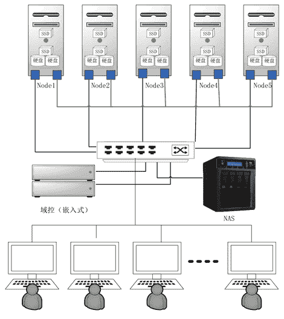

# 中型云计算平台的搭建以及解决方案（超详细）

> 原文：[`c.biancheng.net/view/3958.html`](http://c.biancheng.net/view/3958.html)

本节我们来讲如何搭建中型的云计算解决方案，文中的软件选型和部署运维与搭建小型方案时大致相同，在文中不过多赘述了。大家可先阅读教程《如何搭建一个小型的云计算平台》。

## 需求分析

能满足 100～500 个用户日常办公的需要，每个用户分配一个账号，从而使其能在任何一台云终端上登录云端桌面，实现公司内部的移动办公。应用场所包括大型的阅览室、培训教室、中型公司、大型门柜业务等。

## 系统设计

我们继续在前面双机方案的基础上做纵向和横向扩展：首先，在纵向上提高单台机器的硬件配置，从而提高每台计算机的性能。

其次，在横向上添加更多的机器，比如每台机器能服务 80 个用户，那么 5 台机器就能服务 400 个用户。继续采用分布式存储并定期同步的策略，不引入集中存储设备，这样一来可以降低成本，二来可以简化系统架构。

对 3389 端口做负载均衡处理。中型方案的系统框图如图 1 所示。

图 1  中型方案系统框图
为了增加可靠性，我们增加了一台域控，同时为了提高容量和磁盘性能，采用两块高速机械硬盘做成 RAID 0，并选购更好的固态盘。5 台机器的数据存储做成实时同步，用户登录时通过负载均衡技术被平摊到每台机器上，当某台机器故障时，该台机器上的用户被重新分配到其他机器上。

仍然采用 Windows Server 2012 R2 操作系统，利用操作系统自带的集群、分布式文件系统（DFS）、Hyper-V、备份等组件。

## 硬件选型

单台计算机的配置尽量参考表 1，可以自己组装，也可以购买类似配置的品牌计算机，但是目前还没有 SSD+HDD 混搭存储的商用计算机。

**表 1 单台计算机的配置**

| 配件名称 | 型号 | 参数 | 大致报价（元） |
| --- | --- | --- | --- |
| CPU | 英特尔至强 E5-2620V2  |   | 2800 |
| 主板 | 华硕 Z9PE-D16C/2L | 支持双路，最大 512GB 内存 | 3300 |
| 内存 | 4 根金士顿 DDR3 1600 16G RECC | 64GB 总容量 | 5000 |
| 固态盘（系统） | 英特尔（Intel） S3500 系列 SATA 6Gbit/s 固态硬盘 2.5 英寸 120G  |   | 980 |
| 固态盘（数据） | OCZ 25SAT3-512G | SATA 6.0 GBit/s,100K IOPS | 4000 |
| 电源 | 海韵（Seasonic ）额定 660W P-660 电源   80PLUS 白金牌/全模组/支持双 CPU/支持 SLI/支持背线  |   | 900 |
| 硬盘 | 2 块西部数据（WD）迅猛龙 1TB 企业级硬盘（WD1000DHTZ） | SATA6Gbit/s 10000 转 64M | 3000 |
| NAS | 西部数据（WD） My Cloud EX4 系列 NAS 网络存储云存储 8T WDBWWD0080KBK-SESN |   | 6000 |
| 工控小主板* | 2 块 Intel DN2800MT | 再加 2GB 内存、32GBSSD  | 2000 |
|   |   |   | 合计：27980 |

不计 NAS 和工控小主板，一台机器的价格在 2 万元以内；如果直接从美国进货，则每台机器可控制在 1.5 万元以内；如果购买品牌服务器，要达到相同的性能，价格在 3 万元以上。本配置单支持以后做纵向扩容：增加一块 CPU、增加内存、增加硬盘。

## 软件选型

软件选型与前面的“小型方案”相同。

## 部署与运维

与前面“小型方案”的“双机部署”大致相同，不过在配置 DFS 同步和集群时涉及 5 个节点。