# 大型云计算平台的搭建以及解决方案（超详细）

> 原文：[`c.biancheng.net/view/3961.html`](http://c.biancheng.net/view/3961.html)

本节主要教大家如何搭建一个大型的云计算平台，读完之后你会对云计算有一个更加清晰的认识。

## 需求分析

能接入 500 台以上的云终端，可以满足大型公司内各类员工的办公需求。公司员工用各自的账号能在公司内部的任何云终端上登录自己的远程桌面，实现公司内部移动办公；同时，要求出差在外的员工也能安全访问远程桌面，公司安全管理部门能监控到外发的电子文档资料。对于一家大型公司来说，云终端用户的基本分类如表 1 所示。

**表 1  公司用户分类表**

| 序号 | 用户类型 | 特征 | 常用操作 |
| --- | --- | --- | --- |
| 1 | 访客 | 非公司员工在公司内的公共场合，如会场、餐厅、休息室、大堂、接待室等使用计算机 | 查询、上网、娱乐等 |
| 2 | 合作伙伴 | 授权访问、外部接人 | 与特定的接口人交换信息等 |
| 3 | 普通文员 | 采用一般的轻量级的软件处理日常文字工作、生产调度等，涉及的信息重要级别低 | 文字处理、收发邮件、上网、音视频娱乐、ERP 等 |
| 4 | 重要文员 | 涉及的信息安全级别高，如财务会计、人事档案、项目管理、工资福利等，要求用户间的隔离效果好、可用性高、数据安全性高等。 | 业务软件操作、文件处理、收发邮件、上网、音视频娱乐、ERP 等。 |
| 5 | 研发人员 | 信息安全是关键，项目团队与外围必须绝对隔离，消耗较多的计算资源 | 研发工具、文件处理、收发邮件、上网、音视频娱乐等。 |
| 6 | 领导 | 使用轻量级的软件，但是信息安全级别最高，应用可用性要求最高 | 文字处理、审批、 收发邮件、上网、音视频娱乐、ERP 等。 |
| 7 | 业务人员 | 市场部、采购部、安全部门的员工，他们的共性屎要求信息绝对安全，可用性高。 | 业务软件操作、文字处理、 收发邮件、上网、音视频娱乐、ERP 等。 |
| 8 | IT 运维人员 | 他们除运维外，还要对新技术、新方案做测试和评估 | 运维软操作、测试评估、文字处理、收发邮件、上网、音视频娱乐等。 |

## 系统设计

#### 1\. 技术背景

根据用户在云端共享层次（参见《IT 系统组成》教程）的不同，有如下几种实现技术。

#### 1）共享信息和技术（Ⅰ 型）

这是最轻量级的，所有的人都用同一个账户登录，进入同一个用户环境，可运行同一个程序集中的程序，每个人的数据集对其他人可见。用户一退出，其计算痕迹全部被删除。本方法特别适用于公共场所，如图书馆的多媒体阅览室、教育培训机构的计算机室、智能会议室、查询终端等。

#### 2）独占信息、共享技术（Ⅱ 型）

这是较轻量级的，即每个用户独占数据集和少量应用软件，共享硬件、系统软件（如操作系统）和大部分应用软件。这就是多用户系统，Linux 操作系统是一个典型的多用户系统，Windows 的远程桌面服务也是多用户系统。

多用户系统又存在以下两种实现方法：

*   RemoteApp 方式，即在本地创建快捷方式，指到云端的程序（程序安装在云端并在云端运行）。
*   远程桌面方式，用户直接登录到云端并进入自己的用户环境。

这两种方法都要求事先在云端创建账号，并配置用户环境。在第一种方法中，当用户双击快捷方式时，会自动登录云端（账号和密码事先配置好），然后在云端计算。第二种方法是人工登录到云端桌面。

RemoteApp 方式可以实现“单一入口、分工计算”的目的，即若干台云端服务器可以分工计算，比如有的服务器运行办公软件，有的服务器运行多媒体软件，有的服务器运行游戏软件，有的服务器专门用于科学计算，等等，然后把这些程序都整合到用户的桌面上来。

为了实现这种“单一入口、分工计算”的目的，必须采用单点登录（用户集中认证）和家目录漫游。用户的桌面可以在本地，也可以在云端（专门用一台服务器存放桌面），桌面上的快捷方式可以由用户自己创建（但规定了可选择的程序集），也可以由系统管理员推送过来。当用户数达到几百、上千甚至上万时，采用 RemoteApp 方式较合适。

#### 3）独占信息和应用软件，共享硬件和操作系统（Ⅲ 型）

这是基于操作系统层面的虚拟机，也称为“容器”（常说的 VPS，即虚拟私有服务器）。每个 VPS 都拥有自己的 IP、根文件系统、用户认证系统，以及应用软件集，但是同一台物理机器上的 VPS 共享底层的操作系统内核，用户使用 VPS 就像使用一台单独的物理机器（但是涉及操作系统内核修改的操作是禁止的，比如我们经常会在 Linux 下重构内核，这在 VPS 中是不允许的）。

从整台物理机来看，由于内存中只有一个操作系统在运行，所以与全虚拟机相比，物理机能输出更大的有效计算能力，也能承载更多的“容器”，容器数量几乎多出一倍。另外，与上面两种方法相比，VPS 能达到更好的数据隔离效果。本技术方案特别适合个性化用户和要求数据隔离良好的应用，绝大多数 VPS 提供商都会采用。

#### 4）虚拟机（Ⅳ 型）

虚拟机共享硬件和 Hypervisor 层（有的是操作系统，有的是虚拟层），独占操作系统、应用软件和信息。

与 Ⅲ 型相比，虚拟机具备更佳的隔离效果，用户透明度更高，远程用户几乎不能分辨自己使用的到底是虚拟机还是物理机，在物理机上能进行的操作在虚拟机里都能进行。但是由于一台物理机同时运行多个操作系统，所以资源浪费更大。对于一些要做深度开发的技术工程师（如程序开发员），建议给他们创建虚拟机，允许他们配置虚拟机硬件、安装操作系统、安装开发工具等。

#### 5）物理机（Ⅴ 型）

这是最重量级的，即独占网络层以上的全部信息和技术，直接给用户分配物理机。用户通过远程管理卡连接到物理机，从而可以开关机、配置 BIOS 参数、安装操作系统、配置网络参数、安装应用软件等。物理机的隔离效果最佳，用户个人体验最佳，但是成本也最高。对于一个单位组织的 IT 工程师，建议给他们分配物理机。

#### 2\. 系统拓扑

根据公司用户分类和 IT 系统层次的不同，可制成表 2。

**表 2  物理机的分配**

| 序号 | 用户类型 | 终端数 | 桌面类型 | 备注 | 服务器 |
| --- | --- | --- | --- | --- | --- |
| 1 | 访客 | 100 | 先 Ⅳ 型后Ⅰ型 | 单独使用两台服务器，并与其他服务器在网络上隔离 | 2 台 |
| 2 | 合作伙伴 | 100 | 先 Ⅳ 型后 SaaS 型 | 单独使用服务器，每个应该使用一台虚拟机来承载 | 2 台 |
| 3 | 普通文员 | 350 | 先 Ⅳ 型后 Ⅱ 型 |   | 与本表序号 7 中的业务人员公用相同的物理机：10 台 |
| 4 | 重要文员 | 80 | 直接 Ⅳ 型 | 虚拟机隔离 |
| 5 | 研发人员 | 250 | 先 Ⅴ 型后 Ⅱ 型或先 Ⅳ 型后 Ⅱ 型 | 研发部与其他部门先物理机隔离，然后各个项目间虚拟机隔离，人与人之间可采用容器隔离 | 9 台 |
| 6 | 领导 | 20 | 先 Ⅴ 型后 Ⅳ 型后 Ⅱ 型 | 先与其他部门做物理机隔离，然后领导间做虚拟机隔离 | 2 台 |
| 7 | 业务人员 | 400 | 先 Ⅳ 型后 Ⅱ 型 |   |   |
| 8 | IT 运维人员 | 50 | V 型和 Ⅳ 型 | 部门 Ⅴ 型，部门 Ⅳ 型 | 5 台+若干台低配裸机 |

对表 2 解析如下：

1）公司领导的数据和应用特别重要，所以每个领导分配一台虚拟机，领导的虚拟机运行在专门的两台服务器上，两台物理服务器做成集群。

2）研发人员的重要程度等同于公司领导，他们具备大致相同的操作行为，所以也采用专门的物理服务器。但是同一个项目成员之间保密度不高，他们之间往往需要共享很多文档资料和源代码，并使用相同的开发工具，所以建议他们使用多用户远程桌面（先 Ⅳ 型后 Ⅱ 型）。

不同项目组之间应施行严格的隔离措施，即不同的项目组采用不同的虚拟机。如果一个项目足够大，超出了一台虚拟机的处理能力，那么可创建多台虚拟机，这些虚拟机之间通过 VLAN 互联。采用虚拟机而不是物理机的好处是，虚拟机迁移方便、可用性高。

3）业务人员面向的是公司的对外业务，涉及客户和提供商，他们积累的数据同样非常重要，对应用的可用性要求较高。所以，建议尽量使用专门的服务器，重要的职员使用单独的虚拟机，同一部门的职员使用虚拟机上的多用户桌面。如果某个部门内的职工人数很多，则可以分配多台虚拟机。

4）普通文员和重要文员使用专门的服务器，每个重要文员分配单独的虚拟机，普通文员采用虚拟机上的多用户桌面。当然，对于那些只维护应用的员工来说，也可以分配一台虚拟机。

5）IT 运维人员使用的软件比较杂，操作行为多变，需要经常模拟各种应用场景，所以直接给他们分配物理服务器是一个好主意。根据具体情况，可能一些运维人员还需分配多台服务器。

基于上述分析，最终我们设计的云计算方案框图如图 1 所示。

我们采用 OpenStack 云计算管理工具和 Mariants 公司的 Fuel 自动部署工具。在图 1 中，每个组承载一定数目的虚拟机，这些虚拟机可能被分割成不同的 VLAN，同一台虚拟机允许在它归属的组内“漂移”，但不能跨越组边界。所以我们采用的网络拓扑为基于 VLAN 的 Neutron，它支持网卡绑定、虚拟交换机（OVS）和 Murano，允许对租户进行隔离。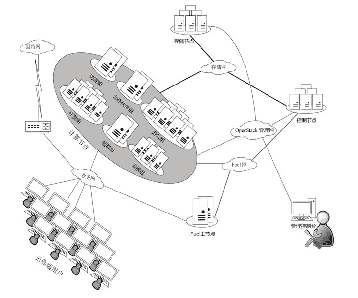
图 1  大型云计算方案框图

#### 3\. 网络设计

网络设计如图 2 所示。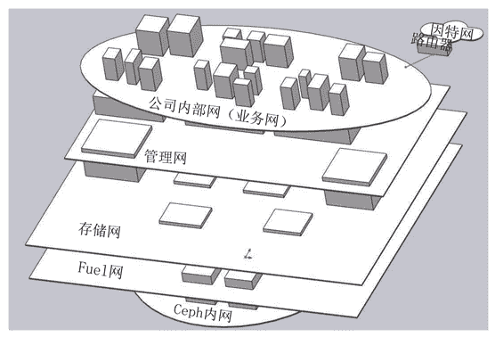
图 2  网络设计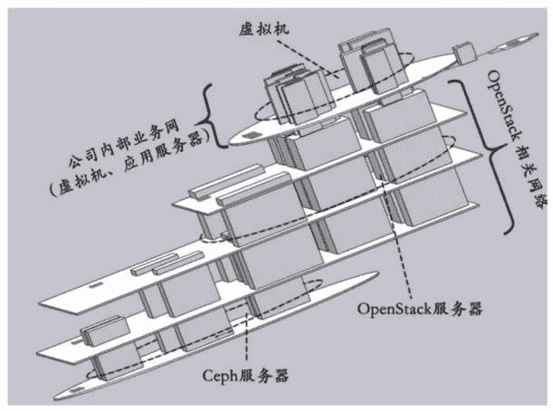
图 2  网络设计（续）
我们采用了 5 张网络平面，从上至下分别是公司内部网（或业务网）、管理网、存储网、Fuel 网和 Ceph 内网。其中，公司内部网相当于公司的传统 IT 系统网络，分配给员工使用的虚拟机和一些应用服务器（如网站、邮箱等）都属于这张网；而管理网、存储网、Fuel 网和 Ceph 内网组成 OpenStack 相关网络部分，OpenStack 的作用就是管理虚拟机，是手段。

在图 2 中，由 Ceph 内网支撑的立方体代表 OSD 服务器，由 Fuel 网支撑的立方体代表 OpenStack 中的控制和计算服务器，贯穿公司内部或者由其支撑的立方体代表虚拟机和应用服务器。

一个立方体的支撑网络平面和贯穿网络平面代表一台服务器同时处于几个网络平面中，如图 2 中的 OpenStack 服务器同时处于 3 个网络平面。各个网络平面的作用如表 3 所示。

**表 3 各个网络平面的作用**

| 网络名称 | 作用 | 网络参数 |
| --- | --- | --- |
| 公司内部网 | 云终端用户、虚拟机之间、应用服务器之间的通信包，以及与公司外部的交换数据包 | B 类地址 +VLAN，172.16.0.1/16，服务器和虚拟机采用固定 IP，终端采用动态  IP |
| 管理网 | 承载 OpenStack 各组件间的通信包、管理员的管理数据包 | 192.168.1.1/24，固定 IP |
| 存储网 | 中央存储与服务器、虚拟机的存储数据包 | 192.168.2.1/24，固定 IP |
| Fuel 网 | 服务器自动安装操作系统的数据包 | 192.168.3.1/24，固定 IP |
| Ceph 内网 | Ceph 内部各个节点之间同步数据包 | 192.168.4.1/24，固定 IP |

本大型方案决定采用 OpenStack 构建基础平台，全部的集群具备横向扩充的特征，对于 OpenStack 我们做如下设计。

在云端存在 8 个集群，其中管理集群用来运行 OpenStack 服务（但不包含业务计算节点），所以管理集群本身的虚拟机不纳入 OpenStack 中管理。而每个集群上的虚拟机不允许“漂移”到其他集群，所以我们采用 HA 对全部机器进行分组，同时只采用一个 Region 和一个 Cell。之所以要采用 Cell，是为了以后扩展，如图 3 所示。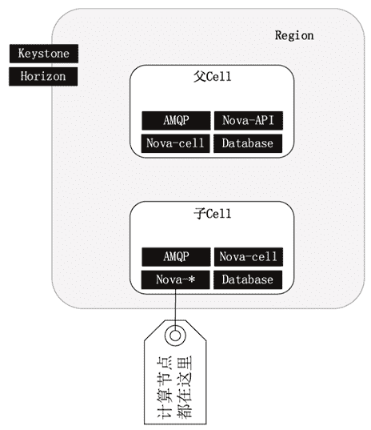
图 3  采用 Cell
为了便于区分和记忆，直接采用集群的名字作为 HA 分组的属性，属于同一个 HA 组的机器最好分布在不同的机柜，每个机柜一般都有各自的供电、网络、避雷和冷却等设施，这样就能最大限度地保证同一个 HA 内的机器不会同时损坏。分组情况如表 4 所示。

**表 4  分组情况**

| 序号 | HA 分组属性 | 对应的集群 | 机器数目 |
| --- | --- | --- | --- |
| 1 | guest | 访客群 | 2 |
| 2 | partner | 合作伙伴群 | 2 |
| 3 | office | 办公集群 | 10 |
| 4 | development | 开发集群 | 9 |
| 5 | leader | 领导集群 | 2 |
| 6 | support | 运维集群 | 5 |
| 7 | base | 基础服务集群 | 6 |

加上管理群等，差不多有 45 台机器，全部采用 2U 的机架式服务器，安装在 3 个机柜中，要求每个分组的机器分散到尽量多的机柜中，如图 4 所示。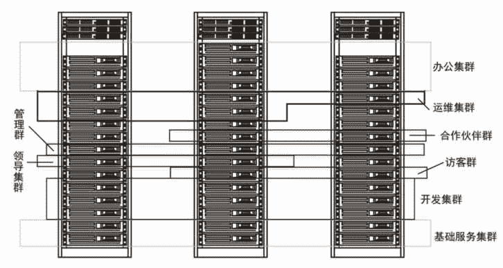
图 4  机柜布局
管理群中有 3 台服务器，每台服务器上运行 3 台虚拟机，第一台虚拟机运行 Keystone 和 Horizon 服务，第二台虚拟机运行父 Cell 中的 4 个服务，第三台虚拟机运行子 Cell 中的几个控制服务（AMQP、Database、Nova-cells、Nova-scheduler、Nova-network），通过负载均衡器把任务平均调度给 3 台服务器。

一共 9 台虚拟机，分成 3 组，每组 3 台虚拟机中运行相同的服务，共同承担由负载均衡器分配过来的任务。

系统架构图中的基础服务集群包括 DNS、域控、DHCP、局域网接入认证、单点登录、IT 设备监控、用户上网行为管理、病毒特征库、补丁中心、入侵检测、VPN 等。

#### 4\. 存储设计

中央存储部分保存公司与办公相关的数据，所以科学设计中央存储非常关键，必须从容量、性能、可靠性等方面仔细斟酌。本案例的存储需求说明如表 5 所示。

**表 5 存储需求说明**

| 需求项 | 值 | 备注 |
| --- | --- | --- |
| 1\. 预算多少？ | 200 万元 | 只包括存储服务器 |
| 2\. 业务类型是什么？ | 云桌面 | 移动办公私有云 |
| 3\. 访问存储的应用软件？ | Hypevisor | KVM |
| 4\. 存储的数据类型？ | 大文件 |   |
| 5\. 容量偏好还是性能偏好？ | 性能偏好 |   |
| 6\. 初始数据量多少？ | 1.5 TB |   |
| 7\. 数据增长率多少？ | 7GB/天 |   |
| 8\. 主机请求 IOPS 多少？ | 60000 | 1500 个用户，每个用户 40 个 IOPS。由于存在写惩罚，所以磁盘实际 IOPS 在 100 000 以上 |
| 9\. 吞吐（带宽）多少？ | 1 Gbit/s |   |

方案选型时，对以下几方面加以关注。

*   多副本存储。
*   万兆网络：万兆交换机、多网卡绑定。
*   分布式系统：每个节点都能单独提供服务。
*   多采用 SSD。
*   消除单点故障。

综上所述，我们决定采用 Ceph 来构建存储子系统。Ceph 发展很快，目前已能在生产环境中使用。它对外能提供 3 种存储服务，分别如下。

*   对象存储服务（Object）：有原生的 API，而且也兼容 Swift 和 S3 的 API。
*   块存储服务（Block）：支持精简配置、快照、克隆等。
*   文件存储服务（File System）：Posix 标准接口，支持快照。

Ceph 的优点如下。

*   高扩展性：使用普通 X86 服务器，支持上千台存储节点和数 PB 级的数据量。
*   高可靠性：不存在单点故障，多数据副本，自动管理，自动修复。
*   高性能：数据分布均衡，并行化程度高。对于对象存储和块存储，不需要元数据服务器，因此不存在瓶颈通道（短板）。

Ceph 的架构如图 5 所示。

外界可以通过以下四条途径访问 Ceph：

*   通过文件存储服务接口，如 NFS。
*   通过块存储服务，如 iSCSI。
*   通过对象存储服务，如 OpenStack 的 Swift 就是采用 RESTfull 调用方式访问 Ceph 的。
*   采用编程函数库编写应用软件来访问 Ceph。

我们设计的集中存储方案逻辑框图如图 6 所示。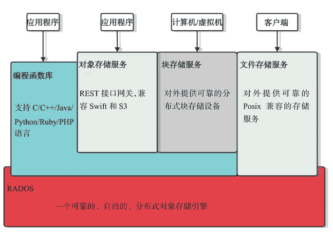
图 5  Ceph 架构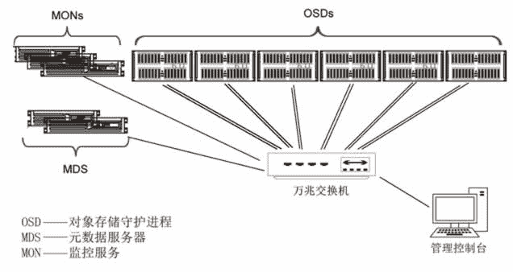
图 6  集中存储方案逻辑框图
在这个方案中，我们采用了 6 台存储节点、3 台监控节点、2 台文件系统元数据节点。其中，最关键的是运行对象存储守护进程（OSD 进程）的节点，Ceph 官方建议采用通用的服务器，比如惠普、戴尔品牌的机器都可以。

如果用不到 Ceph 的文件存储服务（如 NFS），那么元数据服务器（MDS）可以不要。客户端通过网络访问 Ceph 中的数据，负载被平均分配到全部的存储节点上，因此并没有瓶颈。访问数据的输入/输出通路如图 7 所示。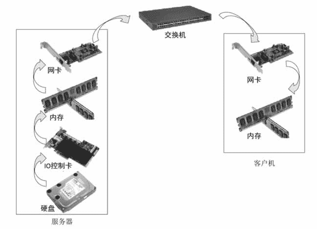
图 7  访问数据的输入/输出通路
在整个输入/输出通路上，带宽是由最慢的部件决定的。在这些部件中，内存的速度是最快的，“短板”必在硬盘、输入/输出控制卡、网卡、交换机中，下面分别加以阐述。

#### 1）硬盘：

混合使用固态硬盘（SSD）和多块机械硬盘（HDD）。固态硬盘性能高、容量小，机械硬盘性能低、容量大，混合使用大致可以达到固态硬盘的性能和机械硬盘的容量。当然，还需要软件的配合才能发挥其最大的优势。在 Ceph 方案中，固态硬盘做日志盘，多块机械硬盘做数据盘，多块硬盘做成 JBOD 或者 RAD0。

表 6 所示是截至发稿前一些硬盘的 IOPS 和吞吐统计值。

**表 6 一些硬盘的 IOPS 和吞吐统计值**

| 磁盘类型 | 容量 | IOPS | 顺序读写吞吐 |
| --- | --- | --- | --- |
| ATA 5400RPM | ≤4TB | 55~85 | 115~120MB/S |
| SATA 7200RPM | ≤4TB | 75~100 | 140~170MB/S |
| SAS10000RPM | ≤1.2TB | 125~150 | 115~190MB/S |
| SAS15000RPM | ≤600GB | 175~210 | 120~210MB/S |
| SATA SSD | ≤800GB | 5000~120000 | 300~550MB/S |
| mSATA SSD | ≤500GB | ≈18000 | 300~530MB/S |
| PCI~E SSD | ≤3.2TB | 120000~9608000 | 300~2800MB/S |

ATA 5400RPM 的硬盘在笔记本、移动硬盘产品中多见。

SAS 硬盘在传统服务器中用得较多，但是其价格高、容量小的缺陷注定其将逐渐退出市场。

SATA 7200RPM 目前是主流，尤其是台式机用得最普遍，结合 SSD 硬盘，做成混合存储方案，越来越得到重视。

相比 PCI-E SSD，SATA SSD 用得更普遍，尽管 PCI-E SSD 具备卓越的 IOPS 和巨量吞吐，但是其动辄上万元的价格使绝大多数消费者望而却步。

总结：SATA 7200RPM 的机械盘 +SATA SSD 混合存储方案是将来两三年内的流行方案。

#### 2）I/O 控制卡

硬盘控制器一般集成在主板上的南桥芯片中，尤其是台式机，很少需要额外添加硬盘控制卡。但是有时需要接入太多的硬盘或者需要更高的吞吐或者支持阵列，这时就要额外购买硬盘控制卡，并插入主板的 PCI-E 插槽中。无论是独立的控制卡还是集成到南桥芯片中，输入/输出控制芯片都至关重要（见表 7）。

**表 7 输入/输出控制芯片**

| 输入/输出控制芯片 | 芯片 | JBOD | 回写缓存 | 备注 |
| --- | --- | --- | --- | --- |
| HP P420i | Qlogic | 不支持 | 有 | 1Gbit/s |
| LSI 3081E-R | LSI SAS 1068E |   |   | PCI-E，3Gbit/s |
| 华硕 P8B-C 集成，LSI SAS 9211-8i | LSI SAS 2008 | 支持 | 无 | PCI-E 2.0，6Gbit/s，30 万 IOPS，吞吐 6000MB/s，8 口，支持电池供电保护数据 |
| LSI Logic LSI00345 9300-8i | LSI SAS 3008 | 支持 |   | PCI-E 3.0，SAS 12Gbit/s，SATA 6Gbit/s，百万计 IOPS，吞吐 6000 MB/s，8 口，支持电池供电保护数据 |
| MegalRAID SAS 9631-8i | LSI SAS 3108 | 支持 |   | PCI-E 3.0，每端口 12Gbit/s，百万计 IOPS，吞吐 6000MB/s，8 口，1GB 缓存，双核，支持电池供电保护数据 |
| 戴尔 H710 | LSI SAS2208 | 不支持 | 有 |   |
| 超微主板集成 | LSI SAS2208 | 支持 | 有 |   |
| HP H220 LSI00345 9300-8i | LSI SAS 3108 | 支持 | 无 | PCI-E 3.0，6Gbit/s，60 万 IOPS，8 口，支持电池供电保护数据 |

从表 7 中可以看出，输入/输出控制芯片几乎被 LSI 公司垄断。如果购买独立的 I/O 控制卡，建议芯片版本在 2008 以上。本方案中购买的是 LSI SAS 3008 芯片组产品，为以后预留足够的纵向扩展空间。

#### 3）内存

在 I/O 通路上，内存的速度是最快的，所以在速度上没有特别的要求（当然，在执行指令的通路上，内存又会成为“短板”）。但是内存的稳定性至关重要，内存的稳定性要求不能出错，即使出错了，也还能纠正错误。因此，强烈建议采用具备纠错功能的 ECC 内存、多通道内存、DDR Ⅲ 代内存、服务器内存，当然内存容量越大越好。

#### 4）网卡和交换机

网络很容易成为输入/输出通路上的瓶颈，可以肯定，如果采用单块千兆网卡或者千兆及以下的交换机，那么理论上网络的吞吐是 100 兆字节（约等于 1000/10），实验数据大概在 60 兆左右。表 6 中列出的最慢硬盘，其吞吐也在百兆以上。因此，组建 Ceph 存储时建议采用当时最快的网卡和网络设备。

比如 2014 年有万兆网卡和交换机，万兆网络理论吞吐是 1000MB，实验数据也在 600MB 以上，超过除 PCI-E 固态盘外的所有类型的硬盘吞吐。如果还嫌慢，就捆绑多块万兆网卡平摊流量，比如采用 n 块，那么理论吞吐就是 n×1000MB 了。注意，网卡的稳定性也很重要，所以要购买大品牌网卡，可能价格会贵很多，但是收益也很明显（减少一次数据丢失就赚了）。

Ceph 中的监控程序（MON）建议运行在单独的计算机上，至少三台。MON 监视整个存储集群的运行状态，记录 PG（对象的位置信息）和 OSD 日志，因此运行 MON 的计算机配置要求不高，采用一般配置（如 7GHz 的 CPU、16GB 内存、500GB 硬盘）即可。

## 硬件选型

#### 1\. 计算节点

各种集群中的服务器的主要任务是运行虚拟机，因此对 CPU 和内存比较敏感。基础服务集群中的计算机统一采用物理机直接安装法（不采用虚拟机），以便提高基础服务的快速响应能力，这部分机器对硬件配置要求不高，但是对可靠性要求很高，具体如表 8 所示。

**表 8 集群服务器硬件配置单**

| 配件名称 | 型号 | 参数 | 大致报价（元） |
| --- | --- | --- | --- |
| CPU | Intel 至强 E5-2620V2 | 6 核，2.1GHZ。购买 2 个 | 5600 |
| 主板 | 华硕 Z9PE-D16C/2L | 支持双路，最大 512GB 内存 | 3300 |
| 内存 | 8 根金士顿 DDR3 1600 16G RECC | 128GB 总容量 | 10000 |
| 固态盘（系统） | 英特尔（Intel）S3500 系列 | SATA 6Gbit/s 固态硬盘 2.5 英寸 120G | 980 |
| 电源 | 航嘉 HK700-12UEP |   | 950 |
|   |   |   | 合计：20830 |

#### 2\. 控制节点

控制节点包括网络基础服务节点和 OpenStack 控制节点，其中网络基础服务节点有 3 个，OpenStack 控制节点有 3 个。

网络基础服务包括 DHCP、DNS、AD、RADIUS、IDS、CA、打印服务、NTPD 等，关乎整个系统的可用性，因此机器要求稳定可靠，性能倒在其次。

网络基础服务节点硬件配置如表 9 所示。

**表 9 网络基础服务节点硬件配置**

| 配件名称 | 型号 | 参数 | 大致报价（元） |
| --- | --- | --- | --- |
| 主板 | 超微 MBD-AISAI-2750F-O | 集成 C2750 CPU（8 核，2.4GHZ），4 个千兆网口，1 个 IPMI 口，MINI-ITX | 2800 |
| 内存 | 2 根金士顿 DDR3 | 1600 8G RECC | 1200 |
| 固态盘（系统） | Intel DC S3500 | 120G | 1000 |
| 电源 | 台达电源适配器 | 主动 PFC 大功率 DCI2V 12.5A 额定 150W | 150 |
|   |   |   | 合计：5150 |

注意：系统做成只读的，可变数据放在 Ceph 中。

OpenStack 控制节点对计算资源没有特别偏好，要求 CPU、内存、网络和硬盘配备均衡，硬盘侧重于速度。OpenStack 控制节点硬件配置如表 10 所示。

**表 10 OpenStack 控制节点硬件配置**

| 配件名称 | 型号 | 参数 | 大致报价（元） |
| --- | --- | --- | --- |
| CPU | Intel Xeon E7-4807 | 6 核心 12 线程,1.86GHz,  LGA1567 |  3300 |
| 主板 | 华硕 Z9PE-D16C/2L | 支持双路，最大 512GB  内存 | 3300 |
| 内存 | 4 根金士顿 DDR3 1600 16G RECC | 64GB 总容量 | 5000 |
| 周态盘（系统） | 英特尔（Intel） S3700 系列 | SATA6Gbit/s 固 态硬盘  2.5 英寸 100G | 1700 |
| 电源  | 安钛克 TP 650C | 650W, 80PLUS 金牌 | 700 |
|   |   |   | 合计：13500 |

#### 3\. Fuel 节点

Fuel 节点侧重于输入/输出通路带宽，即配备高速的网络、磁盘、内存，合理的硬件配置如表 11 所示。

**表 11 Fuel 节点硬件配置**

| 配件名称 | 型号 | 参数 | 大致报价（元） |
| --- | --- | --- | --- |
| CPU | Intel Xeon E5-2620V2 | LGA2011/2.1GHz/15M, 6 核 | 2900 |
| 主板 | 华硕 Z9PE-D16C/2L | 支持双路，最大 512GB 内存 | 3300 |
| 内存 | 2 根金士顿 DDR3 1600 16GB RECC | 32GB 总容量 | 2500 |
| 固态盘（系统） | 英特尔 S3700 系列 | 200G, SATA3,企业级 | 2890 |
| 电源 | 安钛克 TP 650C | 650W，80PLUS 金牌 | 700 |
|   |   |   | 合计：12290 |

#### 4\. 存储节点之 OSD

Ceph 中央存储采用 6 台机器，三份备份模式，提供 96TB 的有效存储容量，物理磁盘容量为 288TB。单台计算机的配置参考如表 12 所示，可以自己组装，也可以购买类似配置的品牌计算机。

**表 12 OSD 计算机配置**

| 配件名称 | 型号 | 参数 | 大致报价（元） |
| --- | --- | --- | --- |
| CPU | Intel Xeon E3-1235 | 4 核 8 线程，3.2GHz | 1600 |
| 主板 | P9D-MH-10G-DUAL | 2 个万兆网口，2 个千兆网 口，集成 LSI 2308 磁盘卡，8 个 SAS 口，6 个 SATA 口 | 4000 |
| 内存 | 6 根金士顿 DDR3 1600  8G RECC | 48GB 总容量 | 3600 |
| 固态盘（系统） |  Intel/英特尔 | DC S3500 120G | 1000 |
| 固态盘（日志） | OCZ RVD3-FHPX4-240G | 240GB，IOPS=130000，吞吐：读 1000MB/S，写 900MB/S | 3500 |
| 电源 | 酷冷至尊白金龙影  1000W （RS-A00-SPPA） | 80PLUS 白金牌/全模组/支持双 CPU/支持 SLI/支持背线/12 个 SATA | 1900 |
| 硬盘(SAS) | 8 块 4TB WD4001FYYG  | 32TB | 20000 |
| 硬盘（SATA） | 4 块 4TB WD4000FYYZ | 16TB | 10000 |
|   |   |   | 合计：45740 |

根据 Ceph 部署经验值，一个 OSD 进程需要 1GHz 的 CPU 频率，1TB 的存储需要 1GB 内存，所以对本配置，一台计算机大约运行 12 个 OSD 进程（4×3.2），每个 OSD 进程大约分配 4GB 内存，并分别负责一块机械硬盘。240GB 的固态盘分为 12 个区，每个区 20GB，存放 OSD 进程的日志。

#### 5\. 存储节点之 MON

存储节点配置之 MON 配置如表 13 所示。

**表 13 存储节点配置之 MON 配置**

| 配件名称 | 型号 | 参数 | 大致报价（元） |
| --- | --- | --- | --- |
| 主板 | 超微 MBD-A1SAI-2750F-O | 集成 C2750 CPU （ 8 核，2.4GHz ）, 4 个千兆网口，1 个 IPMI 口，MINI-ITX  | 2800 |
| 内存 | 2 根金士顿 DDR3  1600 8G RECC | 16GB 总容量 | 1200 |
| 固态盘（系统） | Intel DC S3500 120G |   | 1000 |
| 固态盘（数据） | Intel DC S3500 480G | 240GB，IOPS=130 000，吞吐：读 lOOOMB/s，写 900MB/S | 4000 |
| 电源 | 台达电源适配器 | 主动 PFC 大功率 DC 12V  12.5A 额定 150W | 150 |
|   |   |   | 合计：9150 |

本配置方案采用了服务器版的凌动 CPU C2750，超微的这块小主板相当于嵌入式主板，运行稳定可靠、功耗低，整台计算机的功耗在 40W 以内。

## 软件选型

应用层软件先不做考虑，我们主要是针对系统层，同时遵循开源软件优先、类型尽量单一、结构尽量简单的原则，最终选定的软件如表 14 所示。

**表 14 系统层软件选型**

| 软件类型 | 软件选型 | 备注 |
| --- | --- | --- |
| 宿主操作系统 | CentOS 7.2X86_64 | 最小化安装 |
| 云管理平台 | OpenStack Newton | 2016 年是 M 版，马上就放出 N 版了 |
| 存储 | Ceph  | 实现对象存储、块设备和分布式文件系统 |
| 虚拟机 | KVM |   |
| 来宾操作系统 | Windows Server 2012 R2 | 域控、远程桌面会话 |
| Windows 10 | 办公 |
| CentOS 7.2 | 开发、运行中间件等 |
| 局域网接入认证 | FreeRADIUS |   |
| 入侵检测 | Snort | 易学、易用 |
| 上网行为管理 | Squid |   |
| VPN | OpenVPN |   |
| 单点登录 | OpenlD | 也可以采用耶鲁大学的 CAS |
| IT | 设备监控 | Zabbix |
| 消息队列 | RabbitMQ |   |
| SQL 数据库 | MariaDB/MySQL-Galera |   |
| 部署工具 | Mirantis Fuel  | 自动化部署 OpenStack |
| HA 工具 | HAProxy、Pacemaker  |   |

之所以选择 64 位的 CentOS 7.2，理由如下：它采用 Linux 内核 3.15 版，默认采用 XFS 文件系统（一个单文件系统容量可达 500TB），完美支持 Docker 容器，无缝衔接 Windows AD 域，还有其他众多的适合云计算的特征。

## 部署

整个系统的部署主要涉及 4 个部分，分别是 Ceph 的部署、OpenStack 的部署、基础服务集群的部署，以及虚拟机里的应用部署。这里只对前 3 部分做概括性介绍，应用部署不在本教程的讨论范围之内。

最著名的自动化部署 OpenStack 的工具有以下几个。

#### 1）Mirantis 公司的 Fuel

Mirantis 是一家专门围绕 OpenStack 推广和运维的公司，其发布的开源自动化部署工具 Fuel 非常强大，囊括了安装操作系统、高可靠性高计算（HA）、安装 OpenStack 和运维监控等，而且实现了 CLI 界面和基于 Web 的 GUI。官方网站为 [https：//www.mirantis.com](https://www.mirantis.com)。

#### 2）Puppet 公司的 puppetlabs-OpenStack

老牌经典，不过功能相对 Fuel 要弱。其他比较强大的工具都是基于它开发出来的。从 [https：//github.com/puppetlabs/puppetlabs-openstack](https://github.com/puppetlabs/puppetlabs-openstack) 网站可以下载其文档和脚本。

#### 3）红帽公司主导的 PackStack

基于 Puppet 开发，目前只支持 RedHat/CentOS 操作系统，支持多节点部署 OpenStack。项目网站为 [https：//github.com/stackforge/packstack](https://github.com/stackforge/packstack)。

#### 4）OpenStack 社区的 Devstack

这算是最早的一套从源码安装 OpenStack 的自动化脚本，适合搭建开发或者实验的 OpenStack 环境，不适合在生产环境中使用。项目网站为 [https：//github.com/openstack-dev/devstack](https://github.com/openstack-dev/devstack)。

#### 1\. 准备工作

Ceph 存储系统中的各个节点的名字和 IP 分配如表 15 所示。

**表 15  Ceph 节点**

| 主机名 | IP 地址 | 节点类型 | 备注 |
| --- | --- | --- | --- |
| monl | 192.168.4.11 | MON | IP 地址范围是 192.16&4.11〜20 |
| monl2 | 192.168.4.12 |
| monl3 | 192.168.4.13 |
| mdsl | 192.168.4.21 | MDS | IP 地址范围是 192.16&4.21〜30 |
| mds2 | 192.168.4.22 |
| osdl | 192.168.4.31 | OSD | IP 地址范围是 192.168.4.31〜100 |
| osd2 | 192.168.4.32  |
| osd3 | 192.168.4.33 |
| osd4 | 192.168.4.34 | OSD | IP 地址范围是 192.168.4.31〜100 |
| osd5 | 192.16&4.35 |
| osd6 | 192.168.4.36 |
| osd7 | 192.168.4.37 |
| osd8 | 192.16&4.38 |
| adml | 192.168.4.10 | ADM | 管理控制台，IP 地址范围是 192.168.4.6-10 |

单台 OSD 节点上的硬盘文件如表 16 所示。

**表 16  单台 OSD 节点硬盘文件**

| 设备文件 | 分区 | 大小 | 作用 |
| --- | --- | --- | --- |
| /dev/sda |  /*这是固态盘*/  |
|   | /dev/sda1 | 8GB | 交换区 |
|   | /dev/sda2 | 32GB | 根分区 |
|   | /dev/sda3 | 78GB | 系统数据分区 |
| /dev/sdb |  /*这是固态盘*/  |
|   | /dev/sdb5~/dev/sdbl6 | 每个 20GB,共 12 个 | 日志分区 |
| /dev/sdc |   | 4TB | OSD 数据区 |
| /dev/sdd |   | 4TB | OSD 数据区 |
| /dev/sde |   | 4TB | OSD 数据区 |
| /dev/sdf |   | 4TB | OSD 数据区 |
| /dev/sdg |   | 4TB | OSD 数据区 |
| /dev/sdh |   | 4TB | OSD 数据区 |
| /dev/sdi |   | 4TB | OSD 数据区 |
| /dev/sdj |   | 4TB | OSD 数据区 |
| /dev/sdk |   | 4TB | OSD 数据区 |
| /dev/sdl |   | 4TB | OSD 数据区 |
| /dev/sdm |   | 4TB | OSD 数据区 |
| /dev/sdn |   | 4TB | OSD 数据区 |

每个 4TB 的硬盘对应一个 20GB 的日志分区。

计算节点 120GB 的固态盘分成三个分区，即根分区 32GB、数据分区和交换分区 8GB。控制节点做同样的分区规划，Fuel 分区无须人工规划，在安装 Mirantis Fuel 时自动完成。

#### 2\. 具体部署

我们采用 Fuel 来部署 OpenStack，按照下面的任务列表进行部署。

#### 1）部署 Fuel 主机

从 Mirantis 官网下载最新的 Fuel 的 ISO 镜像文件并做成启动介质（USB 盘或光盘），启动计算机，在开始安装界面上按 Tab 键并修改 shomenu=yes，这样在 Fuel 安装过程中会跳出一个设置界面，可以设置如下参数：

*   为每块网卡设置动态或静态 IP 地址。
*   设置静态和动态 IP 地址池。
*   设置时钟同步。
*   设置操作系统的 root 密码，修改管理用户 admin 的密码。
*   设置 DNS 参数。
*   PXE 参数。

注意，事先记下各块网卡的 Mac 地址和链接的网络，这样配置时就不会搞乱。安装时人工干预不多，几乎是自动完成的，但是时间有点长，大概需要 20 多分钟。安装完成后打开网站[http：//ip：8000](http://ip：8000) 输入 admin 用户和密码登录可视化的管理界面（默认密码是 admin）。

#### 2）部署其他主机

其他节点机全部设置成从网卡启动，并开机，这些机器都会自动安装操作系统。一会儿 Fuel 就会检测到这些节点，并把数目显示在靠近右上角的地方，比如 X 个全部节点，Y 个未分配节点。

#### 3）部署 OpenStack

首先新建一个 OpenStack 环境，如图 8 所示（一个 OpenStack 环境包含控制节点、计算节点和存储）。在新建 OpenStack 环境的过程中指定如下参数。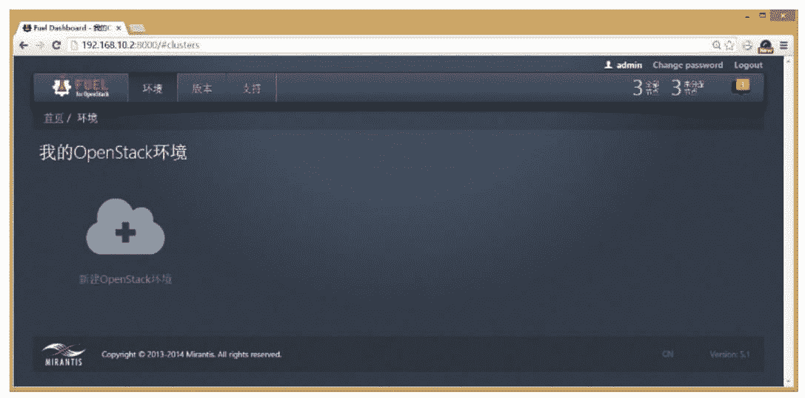
图 8  OpenStack 环境

*   名称和操作系统类型、OpenStack 版本：weisuan，Newton on CentOS 7.2。
*   选择部署模式：带 HA 的多点模式。
*   选择虚拟机软件：KVM。
*   选择网络拓扑类型：Neutron VLAN。
*   选择存储后端类型：Cinder 块存储和 Glance 对象存储都选择 Ceph。

在这个方案中，我们采用了三个控制节点，做成高可用性集群（HA），如图 9 所示。这是因为 MySQL 采用 Galera 以获取高可用性，而 Galera 采用少数服从多数的算法，所以至少需要三台服务器。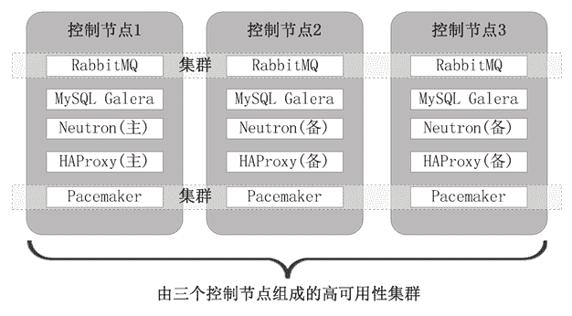
图 9  三个控制节点
接下来可对刚刚创建的 OpenStack 环境做更细致的配置，比如在“设置”页上可以修改 admin 用户的密码、安装额外的组件、改变虚拟机软件的类型等，在“节点”页上添加、删除节点等，如图 10 所示。 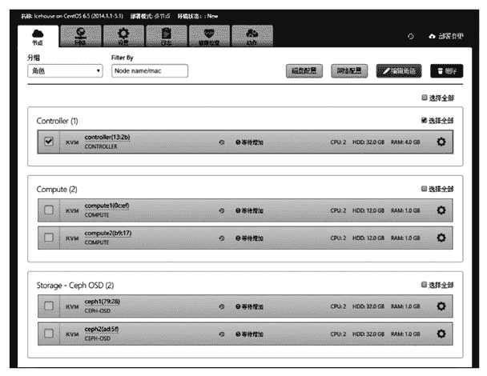
图 10  配置 OpenStack
在“节点”页上勾选一台或若干台机器，然后单击“网络配置”按钮，给每块物理网卡指定网络平面，单击“磁盘配置”按钮可对机器规划硬盘分区。

在“网络”页上为各个网络平面设置网络参数，在“动作”页上可以修改 OpenStack 环境名称或者删除整个环境。最后单击“部署变更”按钮开始部署，各台服务器开始安装操作系统，并根据分配的角色安装相应的 OpenStack 组件，如图 11 所示。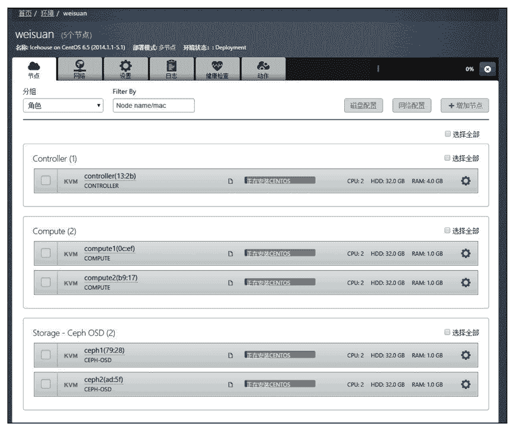
图 11 安装 OpenStack 组件
部署完成后，单击“健康检查”页，对整个 OpenStack 环境做一次全面的检查测试。如果发现问题，查看有关日志并解决问题，直到健康检查顺利通过。

最后在屏幕的上部会显示我们访问 OpenStack 仪表盘（Horizon）的 URL 地址：[http：//172.168.0.54/](http://172.168.0.54/)，打开这个 URL 进入 Horizon 的登录界面，如图 12 所示 ，登录之后就可以管理整个 OpenStack 了，当然主要是管理虚拟机。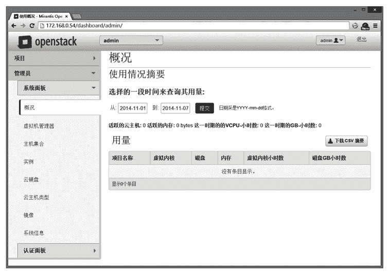
图 12  登录

#### 知识小贴士

OpenStack 部署之后一些默认的参数如下：

*   Fuel 管理 Web 页面的登录用户和密码：admin/admin。
*   Fuel 服务器和其他 OpenStack 节点的 root 密码：r00tme。
*   TestVM SSH user/password:cirros/cubswin:).
*   获取控制节点的 CLI 权限，运行命令：＃source/root/openrc。
*   Horizon 的登录用户和密码：admin/admin。

完成如下操作：
1）在“管理员→系统面板→虚拟机管理器”中查看各个计算节点信息和总数目。

2）在“管理员→系统面板→主机集合”中新建如下“主机集”：访客组、合作伙伴组、办公组、开发组、领导组、运维组，再把相应的计算节点归属到各自的主机集中。同时，取相同的可用域名称，这样可方便以后启动虚拟机时指定可用域。

3）在“管理员→认证面板→项目”中创建适当的项目，一般按公司部门创建，同时指定各个项目的资源配额。项目等同于租户，是资源配额的基本单位，一个租户可以包含若干个用户，这些用户消耗的资源不能超过租户的总配额。

4）在“管理员→认证面板→用户”中创建用户，为公司每个需要使用云计算的员工创建用户，同时指定其归口的项目（租户），角色统一为 Member。

5）在“管理员→系统面板→镜像”中创建镜像，分别创建 Windows XP、Windows 7、Windows 8、CentOS、Ubuntu 的镜像，并且在镜像中安装基本的办公软件。以后启动虚拟机时要用到镜像。

6）在“项目→计算→实例”中启动虚拟机，虚拟机算是镜像的实例，从一个镜像中可以启动多台虚拟机。