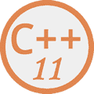

# C++11 教程：C++11 新特性大汇总

> 原文：[`c.biancheng.net/cplus/11/`](http://c.biancheng.net/cplus/11/)

C++11 是第二个真正意义上的 C++ 标准，也是 C++ 的一次重大升级。C++11 增加了很多现代编程语言的特性，比如自动类型推导、智能指针、lambda 表达式等，这使得 C++ 看起来又酷又潮，一点也不输 Java 和 C#。

虽然学习 C++11 需要花些时间，但这是非常值得的；C++11 非常实用，它不但提高了开发效率，还让程序更加健壮和优雅。程序员应该乐于升级换代已有的知识，而学习和使用 C++11 早就是大势所趋，请大家不要抗拒。

有些 C++11 新特性只是局限于某些特定的应用场景，比如链接库、多线程编程等，为了避免乏味枯燥，读者可以有选择性地阅读，先学习那些在实际开发中常用的知识点，而略过那些“偏难怪”的部分。

本教程针对有 C++ 基础的读者，如果你还不了解 C++，请转到《C++教程》。