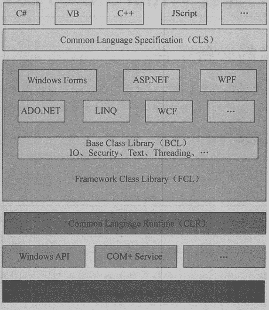

# .NET Framework 是什么？

> 原文：[`c.biancheng.net/view/2775.html`](http://c.biancheng.net/view/2775.html)

.NET Framework 是一个可以快速开发、部署网站服务及应用程序的开回发平台，是 Windows 中的一个组件，包括公共语言运行时（Common Language Runtime, CLR）虚拟执行系统和 .NET Framework 类库。

.NET Framework 的特点如下。

*   提供标准的面向对象开发环境。用户不仅可以在本地与对象交互，视频讲解还可以通过 Web Service 和 .NET Remoting 技术进行远程交互。
*   提供优化的代码执行环境，具有良好的版本兼容性，并允许在同一台计算机上安装不同版本的 .NET Framework。
*   使用 JIT（Just In Time）技术，提高代码的运行速度。

.NET Framework 的体系结构如下图所示。

下面从上而下详细介绍 .NET Framework 体系结构中各部分的具体内容。

#### 1) 编程语言

在 .NET Framework 框架中支持的编程语言包括 C#、VB、C++、J# 等， 但目前使用最多的是 C# 语言。

正是由于在 .NETFramework 中支持多种编程语言，因此 .NET Framework 也配备了对应的编译器。

#### 2) CLS

CLS（Common Language Specification, 公共语言运行规范）定义了一组规则，即可以通过不同的编程语言（C#、VB、J# 等）来创建 Windows 应用程序、ASP.NET 网站程序以及在 .NET Framework 中所有支持的程序。

#### 3) .NET Framework 类库（Framework Class Library, FCL）

在 FCL 中包括 Windows Forms （Windows 窗体程序）、ASP.NET（网站程序）、WPF（Windows 的界面程序的框架）、 WCF（Windows 平台上的工作流程序）等程序所用到的类库文件。

#### 4) CLR

CLR 是 .NET Framework 的基础。用户可以将 CLR 看作一个在执行时管理代码的代码，它提供内存管理、线程管理和远程处理等核心服务，并且还强制实施严格类型安全以及可提高安全性和可靠性的管理。

它与 Java 虚拟机类似。以公共语言运行库为目标的代码称为托管代码，不以公共语言运行库为目标的代码称为非托管代码。

#### 5) OS

操作系统（Operating System, OS）在目前的 .NET Framework 中仅支持在 Windows 上使用，在后续的版本中将支持在 Linux 和 Mac 操作系统上使用。