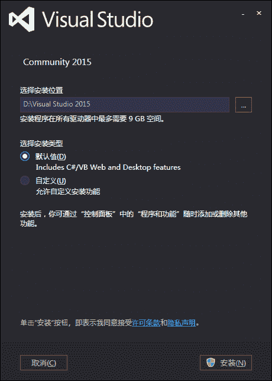

# 针对 C#的 VS2015 安装教程

> 原文：[`c.biancheng.net/view/2776.html`](http://c.biancheng.net/view/2776.html)

在 Windows 7 以上的操作系统中要求必须具备管理员权限才能安装 .NET Framework 框架。此外，在 Windows 7 系统上安装 .NET Framework 需要操作系统有 SP1 补丁。

目前，.NET Framework 仅支持在 Windows 操作系统上安装，其最高版本是 .NET Framework 4.6.2，本教程使用的是 .NET Framework 4.6.1。

 .NET Framework 4.6.1 支持的常用操作系统如下表所示。

| 操作系统 | 支持的版本 | 支持安装的最高版本 |
| Windows 10 | 32 位或 64 位 | .NET Framework 4.6.2 |
| Windows 8 | 32 位或 64 位 | .NET Framework 4.6.2 |
| Windows 7 | 32 位或 64 位 | .NET Framework 4.5 |
| Windows XP | 32 位或 64 位 | .NET Framework 4.0 |

安装 .NET Framework 的硬件要求如下表所示。

| 硬件名称 | 要求 |
| 处理器 | 1GHz |
| RAM | 512MB |
| 磁盘空间的最小值 | 4.5GB |

Visual Studio 2015 的详细下载及安装步骤可以参考 VS2015 下载地址和安装教程（图解），以下只对 Visual Studio 2015 的安装做简略介绍。

用户在安装 Visual Studio 2015 之前，可以在微软的官网上了解 Visual Studio 2015 中各版本的具体功能和特点，本教程中安装的版本是 Visual Studio Community 2015，以下简称 VS2015，安装的操作系统是 Windows 7。

具体的安装步骤如下。

#### 1) 启动安装程序

可以从 VS2015 下载地址和安装教程（图解）下载 VS2015 的安装程序，下载后解压会出 现如下图所示的文件夹。

单击上图中的 vs_enterprise.exe 文件进入安装界面，如下图所示。
 

#### 2) 选择安装位置并安装

单击上图中的“继续”按钮，进入如下图所示的界面。

在该界面中允许选择程序安装的位置，建议最好不要安装到操作系统所在的驱动器下以免占用过多资源，影响开机的速度。

此外，在该界面中可以选择 “默认值” 或 “自定义”， 本教程在安装时选择的是“默认值”，默认安装是将 Visual Studio 2015 中的主要功能全部安装。

单击 “安装” 按钮，按照提示依次单击 “继续” 按钮即可完成 Visual Studio 2015 的安装操作。

#### 3) 安装成功并启动

安装成功后启动 Visual Studio 2015 软件，效果如下图所示。

在 Visual Studio 2015 中能使用微软账号登录，并且能在不同的设备上共享程序，也可以不登录直接使用 Visual Studio 2015 工具。

卸载 Visual Studio 2015 也非常简单，和卸载 Windows 中的其他应用程序一样，直接在控 制面板中选择“添加或删除程序”，并在其中选择 Visual Studio 2015 程序卸载即可。