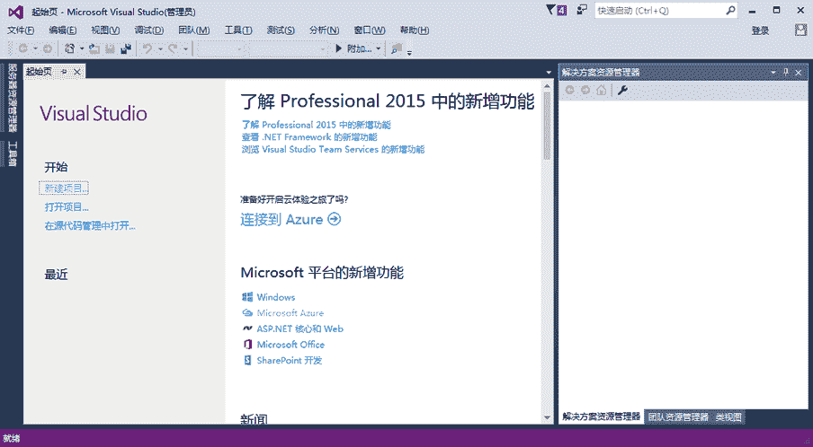
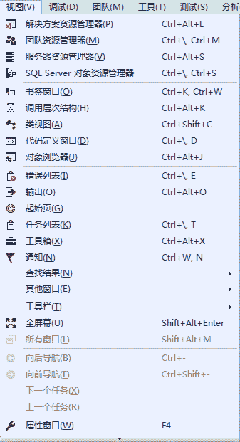

# VS2015 常用菜单和功能简介

> 原文：[`c.biancheng.net/view/2778.html`](http://c.biancheng.net/view/2778.html)

Visual Studio 2015 是一款便于学习和使用的开发工具，并提供了大量的帮助文档供用户参考。

本节将对 Visual Studio 2015 中的常用菜单及其功能进行介绍。

## Visual Studio 2015 中常用的菜单

启动 Visual Studio 2015，其主界面如下图所示。

在该界面中首先看到的是起始页，它用于显示最近打开的项目，并可以进行新建项目、 打开项目等操作。

此外，在该页面中还能了解 Visual Studio 2015 中的一些新功能。

在 Visual Studio 2015 中提供了与以往版本相同的、便利的菜单项和工具栏。

下面介绍菜单栏中常用 的功能。

#### 1) 文件

该菜单主要用于新建项目、打开现有项目以及保存项目等操作。

#### 2) 编辑

该菜单与 Word 软件中的编辑菜单类似，主要用于文件内容的复制、剪切、 保存、粘贴等操作。

#### 3) 视图

该菜单用于在 Visual Studio 2015 界面中显示不同的窗口，视图菜单中的菜单项如下图所示。

常用的窗口包括解决方案资源管理器、服务器资源管理器、SQL Server 对象资源管理器、错误列表、输出、工具箱、属性窗口等。

*   解决方案资源管理器用于管理在 Visual Studio 2015 中创建的项目。
*   服务器资源管理器用于管理数据库连接、移动服务、应用服务等。
*   SQL Server 对象资源管理器用于管理 Visual Studio 2015 中自带或其他的 SQL Server 数据库。
*   错误列表窗口用于显示程序在编 译或运行后出现的错误信息。
*   输出窗口用于显示在程序中的输出信息。
*   工具箱窗口用于显示在 Windows 窗体应用程序或 WPF 应用程序、网站应用程序中可以使用的控件。
*   属性窗口则用于设置项目或程序中使用的所有控件等内容的属性。

#### 4) 调试

该菜单主要在程序运行时调试使用。

#### 5) 团队

该菜单在团队开发时使用。

#### 6) 工具

该菜单用于连接到数据库、连接到服务器、选择工具箱中的工具等操作。

#### 7) 体系结构

该菜单用于创建 UML 模型或关系图。

#### 8) 测试

该菜单用于对程序进行测试。

#### 9) 分析

该菜单用于分析程序的性能。

#### 10) 窗口

该菜单用于设置在 Visual Studio 2015 界面中显示的窗口，并提供了重置窗口的选项，方便用户重置 Visual Studio 2015 的操作界面。