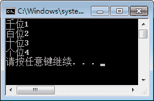
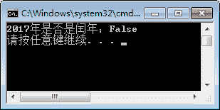
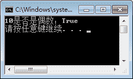
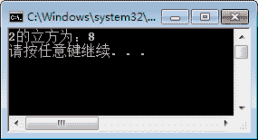
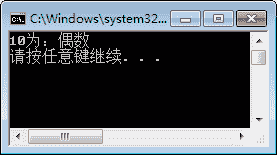
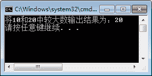

# C#运算符

> 原文：[`c.biancheng.net/view/2781.html`](http://c.biancheng.net/view/2781.html)

运算符是每一种编程语言中必备的符号，如果没有运算符，那么编程语言将无法实现任何运算。

运算符主要用于执行程序代码运算，例如加法、减法、大于、小于等。

下面我们将介绍算术运算符、逻辑运算符、比较运算符、三元运算符以及运算符的优先级。

## 算术运算符

算术运算符是最常用的一类运算符，包括加法、减法、乘法、除法等，

具体的表示符号如下表所示。

| 运算符 | 说 明 |
| + | 对两个操作数做加法运算 |
| - | 对两个操作数做减法运算 |
| * | 对两个操作数做乘法运算 |
| / | 对两个操作数做除法运算 |
| % | 对两个操作数做取余运算 |

这里需要强调的是：

*   当对两个字符串类型的值使用 + 运算符，代表的是两个字符串值的连接，例如 "123"+"456" 的结果为 "23456" 。
*   当使用 / 运算符时也要注意操作数的数据类型，如果两个操作数的数据类型都为整数，那么结果相当于取整运算，不包括余数；而两个操作数中如果有一个操作数的数据类型为浮点数，那么结果则是正常的除法运算。
*   当使用 % 运算符时，如果两个操作都为整数，那么结果相当于取余数。经常使用该运算符来判断某个数是否能被其他的数整除。

【实例 1】使用 / 和 % 运算符来取得数字 1234 中的千位、百位、十位、个位的值。

根据题目要求，代码如下。

```

class Program
{
    static void Main(string[] args)
    {
        Console.WriteLine("千位" +1234 / 1000);
        Console.WriteLine("百位" + 1234 / 100 % 10);
        Console.WriteLine("十位" + 1234 / 10 % 10);
        Console.WriteLine("个位" + 1234 % 10);
    }
}
```

执行上面的代码，效果如下图所示。


从上面的执行效果可以看出，在操作数中只要有一个值是字符串类型的，+ 运算符起到的作用就是连接，而不是相加运算。

## 逻辑运算符

逻辑运算符主要包括与、或、非等，它主要用于多个布尔型表达式之间的运算。

具体的表示符号如下表所示。

| 运算符 | 含义 | 说明 |
| && | 逻辑与 | 如果运算符两边都为 True，则整个表达式为 True,否则为 False;如果左边操作数为 False，则不对右边表达式进行计算，相当于“且”的含义 |
| &#124;&#124; | 逻辑或 | 如果运算符两边有一个或两个为 True，整个表达式为 True，否则为 False;如果左边为 True,则不对右边表达式进行计算，相当于“或”的含义 |
| ! | 逻辑非 | 表示和原来的逻辑相反的逻辑 |

在使用逻辑运算符时需要注意逻辑运算符两边的表达式返回的结果都必须是布尔型的。

【实例 2】判断 2017 年是否为闰年。

根据题目要求，闰年的判断是需要满足两个条件中的一个，一个是年份能被 4 整数但是不能被 100 整数，一个是能被 400 整除。代码如下。

```

class Program
{
    static void Main(string[] args)
    {
        Console.WriteLine("2017 年是否是闰年："+((2017 % 4 == 0 && 2017 % 100 != 0) || (2017 % 400 == 0)));
    }
}
```

执行上面代码结果如下图所示。


从上面的执行效果可以看出，2017 年不是闰年。此外，在实例的判断表达式中要注意括号的使用，括号可以改变表达式中运算的优先级。

## 比较运算符

比较运算符是在条件判断中经常使用的一类运算符，包括大于、小于、不等于、大于等于、小于等于等，具体的符号说明如下表所示。

| 运算符 | 说  明 |
| ==  | 表示两边表达式运算的结果相等，注意是两个等号 |
| != | 表示两边表达式运算的结果不相等 |
| > | 表示左边表达式的值大于右边表达式的值 |
| < | 表示左边表达式的值小于右边表达式的值 |
| >= | 表示左边表达式的值大于等于右边表达式的值 |
| <=  | 表示左边表达式的值小于等于右边表达式的值 |

使用比较运算符运算得到的结果是布尔型的值，因此经常将使用比较运算符的表达式用到逻辑运算符的运算中。

【实例 3】判断 10 是否为偶数。

根据题目要求，判断某一个数是否为偶数，实际上就是判断该数是否能被 2 整除，如果被 2 整除后余数为 0，则说明该数为偶数。代码如下。

```

class Program
{
    static void Main(string[] args)
    {
        Console.WriteLine("10 是否是偶数："+(10 % 2 == 0));
    }
}
```

执行上面代码，效果如下图所示。



## 位运算符

所谓的位运算，通常是指将数值型的值从十进制转换成二进制后的运算，由于是对二进制数进行运算，所以使用位运算符对操作数进行运算的速度稍快。

位运算包括与、或、 非、左移、右移等，具体的表示符号如下表所示。

| 运算符 | 说 明 |
| & | 按位与。两个运算数都为 1，则整个表达式为 1，否则为 0;也可以对布尔型的值进行比较，相当于“与”运算，但不是短路运算 |
| &#124; | 按位或。两个运算数都为 0，则整个表达式为 0，否则为 1;也可以对布尔型的值进行比较，相当于“或”运算，但不是短路运算 |
| ~ | 按位非。当被运算的值为 1 时，运算结果为 0;当被运算的值为 0 时，运算结果为 1。该操作符不能用于布尔型。对正整数取反，则在原来的数上加 1，然后取负数；对负整数取反，则在原来的数上加 1，然后取绝对值 |
| ^ | 按位异或。只有运算的两位不同结果才为 1，否则为 0 |
| << | 左移。把运算符左边的操作数向左移动运算符右边指定的位数，右边因移动空出的部分 补 0 |
| >> | 有符号右移。把运算符左边的操作数向右移动运算符右边指定的位数。如果是正值，左侧因移动空出的部分补 0;如果是负值，左侧因移动空出的部分补 1 |
| >>>  | 无符号右移。和 >> 的移动方式一样，只是不管正负，因移动空出的部分都补 0 |

在上面列出的运算符中比较常用的是左移运算符和右移运算符，左移 1 位相当于将操作数乘 2，右移 1 位相当于将操作数除 2。

【实例 4】使用位运算符计算 2 的立方。

根据题目要求，计算 2 的立方就是将 2 向左移两位得到的结果，代码如下。

```

class Program
{
    static void Main(string[] args)
    {
        Console.WriteLine("2 的立方为："+(2<<2));
    }
}
```

执行上面代码，效果如下图。



## 三元运算符

三元运算符也被称为条件运算符，与后面要学习的 if 条件语句非常类似。

在 C# 语言中三元运算符只有一个，具体的语法形式如下。

布尔表达式 ? 表达式 1: 表达式 2

其中：

*   布尔表达式：判断条件，它是一个结果为布尔型值的表达式。
*   表达式 1:如果布尔表达式的值为 True，该三元运算符得到的结果就是表达式 1 的运算结果。
*   表达式 2:如果布尔表达式的值为 False，该三元运算符得到的结果就是表达式 2 的运算结果。

需要注意的是，在三元运算符中表达式 1 和表达式 2 的结果的数据类型要兼容。

【实例 5】使用三元运算符判断，如果 10 为偶数则输出偶数，否则输出奇数。

根据题目要求，代码如下。

```

class Program
{
    static void Main(string[] args)
    {
        Console.WriteLine("10 为："+(10 % 2 == 0 ? "偶数":"奇数"));
    }
}
```

执行上面代码，效果如下图。


【实例 6】使用三元运算符完成两个数的比较，将其中较大的数输出。这里将两个数给 定为 10 和 20。

根据题目要求，代码如下。

```

class Program
{
    static void Main(string[] args)
    {
        Console.WriteLine("将 10 和 20 中较大数输出结果为："+(10 > 20 ? 10 : 20));
    }
}
```

执行上面代码，效果如下图。



## 赋值运算符

赋值运算符中最常见的是等号，除了等号以外还有很多赋值运算符，它们通常都是与其他运算符连用起到简化操作的作用。

赋值运算符如下表所示。

| 运算符 | 说 明 |
| = | x=y，等号右边的值给等号左边的变量，即把变量 y 的值赋给变量 x |
| += | x+=y，等同于 x=x+y |
| -= | x-=y，等同于 x=x-y |
| *= | x*=y，等同于 x=x*y |
| /= | x/=y，等同于 x=x/y |
| %= |  x%=y，等同于 x=x%y，表示求 x 除以 y 的余数 |
| ++ | x++ 或 ++x，等同于 x=x+1 |
| -- | x-- 或 --x，等同于 x=x-1 |

需要注意的是，++ 和 -- 运算符放在操作数前和操作数后是有区别的，如果放在操作数前，需要先将操作数加 1 或减 1，然后再与其他操作数进行运算；如果放在操作数后，需要先与其他操作数进行运算，然后操作数自身再加 1。

## 运算符的优先级

前面介绍了 C# 中基本的运算符，在表达式中使用多个运算符进行计算时，运算符的运算有先后顺序。

如果想改变运算符的运算顺序必须依靠括号。运算符的优先级如下表所示，表中显示的内容是按优先级从高到低排序的。

| 运算符 | 结合性 |
| .（点）、()（小括号）、[]（中括号） | 从左到右 |
| + （正）、-（负）、++ （自增）、--（自减）、~（按位非）、!（逻辑非） | 从右到左 |
| * （乘）、/ （除）、% （取余） | 从左向右 |
| + （加）、-（减） | 从左向右 |
| <<、>>、>>>  | 从左向右 |
| <、<=、>、>=  | 从左向右 |
| ==、!=  | 从左向右 |
| & | 从左向右 |
| &#124; | 从左向右 |
| ^ | 从左向右 |
| && | 从左向右 |
| &#124;&#124; | 从左向右 |
| ?: | 从右到左 |
| =、+=、-=、*=、/=、%=、&=、&#124;=、^=、~=、<<=、>>=、>>>=  | 从右到左 |

尽管运算符本身已经有了优先级，但在实际应用中还是建议读者尽量在复杂的表达式中多用括号来控制优先级，以增强代码的可读性。