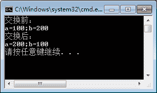

# C#变量的定义和使用

> 原文：[`c.biancheng.net/view/2793.html`](http://c.biancheng.net/view/2793.html)

变量（Variable）是 C# 编程中不可缺失的内容，使用变量可以更容易地完成程序的编写。

变量可以理解为存放数据的容器，并且在将值存放到变量中时还要为变量指定数据类型。

变量和常量是相对的：变量是指所存放的值是允许改变的，而常量表示存入的值不允许改变。

本节我们先讲解 C# 变量的定义和使用，下节《C#常量》再继续讲解常量。

## C#变量的定义

在定义变量时，首先要确认在变量中存放的值的数据类型，然后再确定变量的内容，最后根据 C# 变量命名规则定义好变量名。

定义变量的语法如下。

数据类型  变量名；

例如定义一个存放整数的变量，可以定义成：

int num;

在定义变量后如何为变量赋值呢？很简单，直接使用`=`来连接要在变量中存放的值即可。

## C#变量的赋值

赋值的语法有两种方式，一种是在定义变量的同时直接赋值，一种是先定义变量然后再赋值，它们的格式如下。

在定义变量的同时赋值：

数据类型  变量名 = 值;

先定义变量然后再赋值：
数据类型  变量名;
变量名 = 值;

在定义变量时需要注意变量中的值要与变量的数据类型相兼容。另外，在为变量赋值时也可以一次为多个变量赋值。例如：

```

int a = 1, b = 2;
```

虽然一次为多个变量赋值方便了很多，但在实际编程中为了增强程序的可读性，建议读者在编程中每次声明一个变量并为一个变量赋值。

## C#变量使用举例

【实例 1】分别定义整型、浮点型、布尔型以及字符串类型的变量并赋值，最后将变量值输出。

```

class Program
{
    static void Main(string[] args)
    {
        int num1 = 100;
        double num2 = 100.123;
        bool isFlag = true;
        String name = "Hello";

        Console.WriteLine("num1= "+ num1);
        Console.WriteLine("num2=" + num2);
        Console.WriteLine("isFlag=" + isFlag);
        Console.WriteLine("name=" + name);
    }
}
```

执行上面代码，效果如下图。


【实例 2】定义两个变量来存放值，然后将其中的大数加 10 后输出。

根据题目要求，在前面的实例中已经使用三元运算符完成了具体值的判断，下面使用定义变量的方式来实现。代码如下。

```

class Program
{
    static void Main(string[] args)
    {
        int a = 10;
        int b = 20;
        Console.WriteLine("将 a 与 b 中较大的数加 10 后结果为："+(a > b ? a + 10 : b + 10));
    }
}
```

执行上面的代码，效果如下图。


从上面的执行效果可以看出，由于 b 大于 a，原来 b 的值为 20，再加 10，则结果为 30。

【实例 3】定义两个变量，并将两个变量的值交换后输出。

根据题目要求，由于要交换两个变量中存放的值，最简单的方法是定义一个中间变量来存放交换的值，就像交换两个容器中存放的水需要借着第 3 个容器才能完成。代码如下。

```

class Program
{
    static void Main(string[] args)
    {
        int a = 100;
        int b = 200;
        Console.WriteLine("交换前：");
        Console.WriteLine("a=" + a + ";b=" + b);
        int temp;
        temp = a;
        a = b;
        b = temp;
        Console.WriteLine("交换后：");
        Console.WriteLine("a=" + a + ";b=" + b);
    }
}
```

执行上面的代码，效果如下图。


除了使用中间变量完成两个变量的值的交换以外，这里提供两种常用的方式供读者参考。

第 1 种方式是通过“加和再减”的方式实现，代码如下。

```

class Program
{
    static void Main(string[] args)
    {
        int a = 100;
        int b = 200;
        a = a + b;
        b = a - b;
        a = a - b;
        Console.WriteLine("交换后的值：");
        Console.WriteLine("a=" + a + ";b=" + b);
    }
}
```

执行上面的代码，即可完成与使用中间变量交换值同样的效果。

第 2 种方式则是使用位运算实现。在位运算符中选择的是异或运算符，异或运算是将计算的值转换成二进制，然后两个值之间的比较原则是相同为 0、不同为 1，因此经过一次异或操作会将数据的某些位翻转，但是同一个数如果用 2 次异或操作则数值保持不变。代 码如下。

```

class Program
{
    static void Main(string[] args)
    {
        int a = 100;
        int b = 200;
        a = a ^ b;
        b = a ^ b;
        a = a ^ b;
        Console.WriteLine("交换后的值：");
        Console.WriteLine("a=" + a + ";b=" + b);
    }
}
```

执行上面的代码，交换的效果也是一样的。有兴趣的读者可以将 100 和 200 转换成二进制的值进行相应的计算，再查看效果。