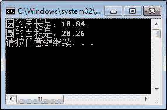

# C# const 详解：C#常量的定义和使用

> 原文：[`c.biancheng.net/view/2794.html`](http://c.biancheng.net/view/2794.html)

常量和变量都是用来存储数据的容器，在定义时都需要指明数据类型，它们唯一的区别是：变量（Variable）中所存放的值是允许改变的，而常量（Constant）中存放的值不允许改变。

上节《C#变量》中已经讲解了变量的定义和使用，这节我们来讲解常量的定义和使用。

## C#常量的定义

与变量不同的是，常量在第一次被赋值后值就不能再改变。定义常量需要使用关键字 **const** 来完成。

具体的语法形式如下：

const 数据类型 常量名 = 值;

需要注意的是，在定义常量时必须为其赋值，因为不赋值的话以后就再也不能赋值了。另外，也可以同时定义多个常量。

在程序中使用常量也会带来很多好处，包括增强了程序的可读性以及便于程序的修改。例如在一个计算率的程序中，为了保证程序中的税率统一，设置一个名为 TAX 的常量来完成，如果需要修改税率只修改该常量的值即可。

【实例 1】分别求圆的面积和周长，并使用常量存放 π 的值，将 π 的值定义为 3.14。

```

class Program
{
    static void Main(string[] args)
    {
        const double PI = 3.14;
        int r = 3;  //存放半径
        Console.WriteLine("圆的周长是：" + 2 * PI * r);
        Console.WriteLine("圆的面积是：" + PI * r * r);
    }
}
```

执行上面代码，效果如下图。

