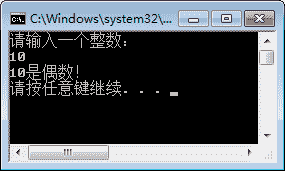

# C# if else 语句

> 原文：[`c.biancheng.net/view/2792.html`](http://c.biancheng.net/view/2792.html)

C# if else 语句是最常用的条件语句，并且 if else 语句的形式有多种，包括单一条件的 if 语句、二选一条件的 if else 语句以及多选一条件的 if else if 语句。下面将详细介绍这 3 种形式。

## 单一条件的 if 语句

单一条件的 if 语句是最简单的 if 语句，只有满足 if 语句中的条件才能执行相应的语句。

具体的语法形式如下。

if(布尔表达式)
{
    语句块;
}

这里语句块是指多条语句。当布尔表达式中的值为 True 时执行语句块中的内容，否则不执行。

## 二选一条件的 if 语句

二选一条件的 if 语句与前面介绍的三元运算符完成的效果是一样的，只是比三元运算符实现的过程灵活一些。

具体的语法形式如下。

if(布尔表达式)
{
    语句块 1;
}else{
    语句块 2;
}

上面语句的执行过程是当 if 中的布尔表达式的结果为 True 时执行语句块 1，否则执行语句块 2。

## 多选一条件的 if 语句

多选一条件是最复杂的 if 语句，但是语法形式并不难。

具体的语法形式如下。

if(布尔表达式 1)
{
    语句块 1;
}else if(布尔表达式 2){
    语句块 2;
}
...
else{
    语句块 n;
}

上面语句的执行过程是先判断布尔表达式 1 的值是否为 True，如果为 True，执行语句块 1，整个语句结束，否则依次判断每个布尔表达式的值，如果都不为 True，执行 else 语句中的语句块 n。

需要注意的是，在上面的语法中最后一个 else{} 语句是可以省略的。如果省略了 else{} 语句，那么多分支的 if 语句中如果没有布尔表达式的值为 True 的语句，则不会执行任何语句块。

【实例 1】使用 if 语句判断从控制台输入的整数是否为偶数。

根据题目要求，从控制台输入的值是字符串类型，因此需要将字符串类型的值转换成整数型，转换是通过“int.Parse(Console.ReadLine())”语句实现的。代码如下。

```

class Program
{
    static void Main(string[] args)
    {
        Console.WriteLine("请输入一个整数：");
        //将从控制台输入的值转换成 int 类型
        int num = int.Parse(Console.ReadLine());
        if (num % 2 == 0)
        {
            Console.WriteLine(num+"是偶数！");
        }
        else
        {
            Console.WriteLine(num+"不是偶数！");
        }
    }
}
```

执行上面的代码，效果如下图。


在上面的实例中使用的是二选一的 if 语句，也可以使用单一的 if 语句来实现，实现的代码如下。

```

class Program
{
    static void Main(string[] args)
    {
        Console.WriteLine("请输入一个整数：");
        //将从控制台输入的值转换成 int 类型
        int num = int.Parse(Console.ReadLine());
        String msg = num + "不是偶数！";
        if (num % 2 == 0)
        {
            msg = num + "是偶数！";
        }
        Console.WriteLine(msg);
    }
}
```

在上面的代码中为 msg 变量设置一个值，如果 if 语句中的布尔表达式的值为 True，则改变 msg 的值，这样就可以使用单一的 if 语句完成二选一的 if 语句的操作。

【实例 2】使用多分支 if 语句完成对游戏账户积分等级的判断，判断的条件是当游戏积分为 0~100 时是初级、100~200 时是中级、200~500 时是高 500 以上时是特级。

根据题目要求，代码如下。

```

class Program
{
    static void Main(string[] args)
    {
        Console.WriteLine("请输入游戏积分（大于 0 的整数）");
        int points = int.Parse(Console.ReadLine());
        //如果输入的积分小于 0 则将其设置为 0
        if (points < 0)
        {
            points = 0;
        }
        if (points <= 100)
        {
            Console.WriteLine("您的游戏等级为初级");
        }else if (points <= 300)
        {
            Console.WriteLine("您的游戏等级为中级");
        }else if (points <= 500)
        {
            Console.WriteLine("您的游戏等级为高级");
        }else
        {
            Console.WriteLine("您的游戏等级为特级");
        }
    }
}
```

执行上面的代码，效果如下图所示。


在上面的程序中，由于使用的是多选一的分支语句，所以在分支语句使用“points<=300”时实际上代表的是 points 大于 100 并小于 300 的值。