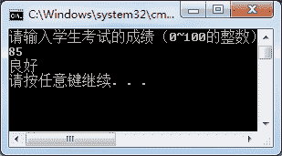

# C# switch case 语句

> 原文：[`c.biancheng.net/view/2796.html`](http://c.biancheng.net/view/2796.html)

C# switch case 语句也是条件语句的一种，与上一节介绍的《C# if else 语句》是类似的，但在判断条件的选择上会有一些局限性。

具体的语法形式如下。

switch(表达式)
{
    case 值 1:
        语句块 1;
        break;
    case 值 2:
        语句块 2;
        break;
        ...
    default:
        语句块 n;
        break;
}

在这里，switch 语句中表达式的结果必须是整型、字符串类型、字符型、布尔型等数据类型。

如果 switch 语句中表达式的值与 case 后面的值相同，则执行相应的 case 后面的语句块。

如果所有的 case 语句与 switch 语句表达式的值都不相同，则执行 default 语句后面的值。

default 语句是可以省略的。需要注意的是，case 语句后面的值是不能重复的。

【实例 1】使用 switch...case 语句根据学生的考试成绩来判断等级，如果成绩在 90 分以上是优秀；如果成绩为 80~90 分是良好；如果成绩为 60~80 分是及格，如果成绩在 60 分以下是不及格。

根据题目要求，代码如下。

```

class Program
{
    static void Main(string[] args)
    {
        Console.WriteLine("请输入学生考试的成绩（0~100 的整数）");
        int points = int.Parse(Console.ReadLine());
        switch (points / 10)
        {
            case 10:
                Console.WriteLine("优秀");
                break;
            case 9:
                Console.WriteLine("优秀");
                break;
            case 8:
                Console.WriteLine("良好");
                break;
            case 7:
                Console.WriteLine("及格");
                break;
            case 6:
                Console.WriteLine("及格");
                break;
            default:
                Console.WriteLine("不及格");
                break;
        }
    }
}
```

执行上面代码，效果如下图所示。


从上面的程序中不难看出有些语句是重复的，若在 switch 语句中遇到 case 语句，如果 case 语句中的值没有满足的条件就会自动转到下一个 case 语句中值的判断，但如果满足了 case 语句中的值，则会执行 case 语句后面对应的语句块，直到遇到 break 语句才会结束整个 switch 语句，否则会继续执行该 case 语句后面的所有对应的语句块，与是否满足 case 后面的值无关。

因此，由于 case 10 和 case 9 输出的语句一样，case 7 和 case 6 输出的语句一样，上面的程序可以简化成如下代码。

```

class Program
{
    static void Main(string[] args)
    {
        Console.WriteLine("请输入学生考试的成绩（0~100 的整数）");
        int points = int.Parse(Console.ReadLine());
        if(points < 0 || points > 100)
        {
            points = 0;
        }
        switch (points / 10)
        {
            case 10:
            case 9:
                Console.WriteLine("优秀");
                break;
            case 8:
                Console.WriteLine("良好");
                break;
            case 7:
            case 6:
                Console.WriteLine("及格");
                break;
            default:
                Console.WriteLine("不及格");
                break;
        }
    }
}
```

上面代码执行效果与简化前是一致的。