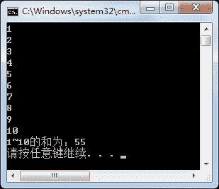
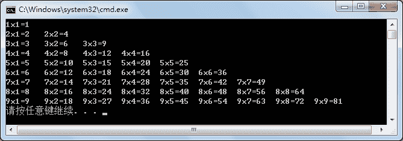
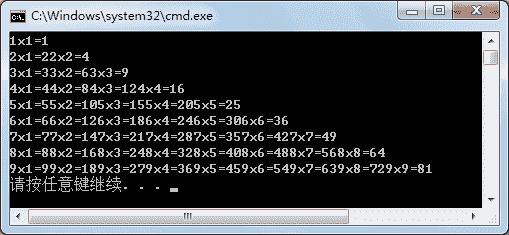
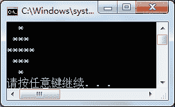

# C# for 循环

> 原文：[`c.biancheng.net/view/2797.html`](http://c.biancheng.net/view/2797.html)

循环语句和条件语句一样都是每个程序中必不可少的，循环语句是用来完成一些重复的工作的，以减少编写代码的工作量。

C# for 循环是最常用的循环语句，语法形式非常简单，多用于固定次数的循环。

具体的语法形式如下。

for(表达式 1; 表达式 2; 表达式 3)
{
    表达式 4;
}

其中：

*   表达式 1:为循环变量赋初值。
*   表达式 2:为循环设置循环条件，通常是布尔表达式。
*   表达式 3:用于改变循环变量的大小。
*   表达式 4:当满足循环条件时执行该表达式 4。

for 循环语句执行的过程是，先执行 for 循环中的表达式 1，然后执行表达式 2，如果表达式 2 的结果为 True，则执行表达式 4，再执行表达式 3 来改变循环变量，接着执行表达式 2 看是否为 True，如果为 True,则执行表达式 4，直到表达式 2 的结果为 False，循环结束。

> 提示：在 for 循环中表达式 1、表达式 2、表达式 3 以及表达式 4 都是可以省略的，但表达式 1、表达式 2、表达式 3 省略时它们之间的分号是不能省略的。

【实例 1】使用循环输出 1~10 的数，并输出这 10 个数的和。

根据题目要求，代码如下。

```

class Program
{
    static void Main(string[] args)
    {
        //设置存放和的变量
        int sum = 0;
        for(int i = 1; i <= 10; i++)
        {
            Console.WriteLine(i);
            sum += i;
        }
        Console.WriteLine("1~10 的和为：" + sum);
    }  
}
```

执行上面代码，效果如下图所示。


此外，在一个 for 循环语句中还可以嵌套 for 循环或者再添加条件语句，最常见的题目是打印九九乘法表和菱形，下面通过实例来演示实现的过程。

【实例 2】打印九九乘法表。

根据题目要求，代码如下。

```

class Program
{
    static void Main(string[] args)
    {
        for(int i = 1; i < 10; i++)
        {
            for(int j = 1; j <= i; j++)
            {
                Console.Write(i + "x" + j + "=" + i*j + "\t");
            }
            Console.WriteLine();
        }
    }  
}
```

执行上面代码，效果如下图所示。


在上面的代码中，`\t`是转义字符（制表符），如果不使用转义字符`\t`，则结果显示比较乱，如下图所示。


【实例 3】打印菱形

根据题目要求，菱形是由两个三角形构成的，具体的代码如下。

```

class Program
{
    static void Main(string[] args)
    {
        for(int i = 1; i <= 3; i++)
        {
            for(int j = 1; j <= 3 - i; j++)
            {
                Console.Write(" ");
            }
            for(int k = 1; k <= 2 * i - 1; k++)
            {
                Console.Write("*");
            }
            Console.WriteLine();
        }
        for(int i = 2; i >= 1; i--)
        {
            for(int j = 1; j <= 3 - i; j++)
            {
                Console.Write(" ");
            }
            for(int k = 1; k <= 2 * i - 1; k++)
            {
                Console.Write("*");
            }
            Console.WriteLine();
        }
    }  
}
```

执行上面的代码，效果如下图所示。


从上面的执行效果可以看出，首先打印出来的是由菱形上面 3 行构成的三角形，然后打印出来的是由下面两行构成的三角形。

循环语句是很灵活的，只要控制好循环的次数，可以使用多种方法完成菱形的打印。