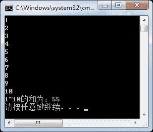

# C# while 循环

> 原文：[`c.biancheng.net/view/2799.html`](http://c.biancheng.net/view/2799.html)

在上一节《C# for 循环》我们讲解了 for 循环的使用方法及案例，本节我们来讲解 while 循环。

C# while 循环与 for 循环类似，但是 while 循环一般适用于不固定次数的循环。

while 循环的语法形式如下。

while(布尔表达式)
{
    语句块;
}

while 语句执行的过程是，当 while 中布尔表达式的结果为 True 时，执行语句块中的内容，否则不执行。通常使用 for 循环可以操作的语句都可以使用 while 循环完成。

【实例】使用 while 循环输出 1~10 的数并输出 1~10 的和。

根据题目要求，代码如下。

```

class Program
{
    static void Main(string[] args)
    {
        int i = 1;
        int sum = 0;//存放 1~10 的和
        while (i <= 10)
        {
            sum = sum + i;
            Console.WriteLine(i);
            i++;
        }
        Console.WriteLine("1~10 的和为：" + sum);
    }  
}
```

执行上面的代码，效果如下图所示，与上一节《C# for 循环》实例 1 的效果是一样。

