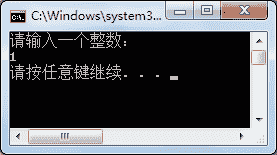
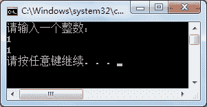

# C# do while 循环

> 原文：[`c.biancheng.net/view/2800.html`](http://c.biancheng.net/view/2800.html)

C# do while 循环可以说是上一节 C# while 循环的另一个版本，与 while 循环最大的区别是它至少会执行一次。

具体的语法形式如下。

do
{
    语句块；
}while(布尔表达式);

do while 语句执行的过程是，先执行 do{} 中语句块的内容，再判断 while() 中布尔表达式的值是否为 True,如果为 True,则继续执行语句块中的内容，否则不执行，因此 do while 语句中的语句块至少会执行一次。

【实例 1】使用 do while 循环输出 1~10 的数。

根据题目要求，代码如下。

```

class Program
{
    static void Main(string[] args)
    {
        int i = 1;
        do
        {
            Console.WriteLine(i);
            i++;
        } while (i <= 10);
    }  
}
```

执行上面的代码，即可直接输出 1~10 的数。

为了了解 while 和 do while 语句的区别，对比下面的实例。

【实例 2】从控制台输入一个数，分别使用 while 和 do while 语句完成从 1 到所输入数的输出。

根据题目要求，先使用 while 语句完成，代码如下。

```

class Program
{
    static void Main(string[] args)
    {
        Console.WriteLine("请输入一个整数：");
        int i = int.Parse(Console.ReadLine());
        int j = 1;
        while (j < i)
        {
            Console.WriteLine(j);
        }
    }  
}
```

执行上面的代码，效果如下图所示。


从输出结果可以看出，在控制台上输入的值是 1，由于 while 语句中“1<1”的值为 False， 因此不会执行循环中的语句。

下面使用 do while 循环完成上面的操作，代码如下。

```

class Program
{
    static void Main(string[] args)
    {
        Console.WriteLine("请输入一个整数：");
        int i = int.Parse(Console.ReadLine());
        int j = 1;
        do
        {
            Console.WriteLine(j);
        } while (j < i);
    }  
}
```

执行上面的语句，效果如下图所示。


从上面的执行效果可以看出，仍然从控制台输入 1，但使用 do while 语句输出 1 后会 再进行 while 语句中的条件判断。