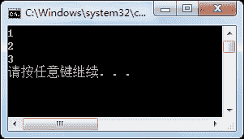

# C# break 语句

> 原文：[`c.biancheng.net/view/2801.html`](http://c.biancheng.net/view/2801.html)

C# break 语句用于中断循环，使循环不再执行。如果是多个循环语句嵌套使用，则 break 语句跳出的则是最内层循环。

在前面讲到的《C# switch case 语句》一节中就用到了 break 语句，用于退出 switch 语句。

【实例】使用 for 循环输出 1~10 的数，当输出到 4 时结束循环。

根据题目要求，代码如下。

```

class Program
{
    static void Main(string[] args)
    {
        for(int i = 1; i <= 10; i++)
        {
            if (i == 4)
            {
                break;
            }
            Console.WriteLine(i);
        }
    }  
}
```

执行上面的代码，效果如下图所示。


从上面的执行效果可以看出，for 循环要完成 1~10 的输出，但是当输出到 4 时使用了 break 语句，结束了 for 循环，因此仅输出了 1~3 的数。