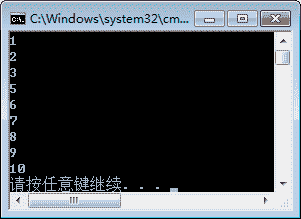

# C# continue 语句

> 原文：[`c.biancheng.net/view/2802.html`](http://c.biancheng.net/view/2802.html)

C# 中的 continue 语句有点像 break 语句。但它不是强制终止，continue 会跳过当前循环中的代码，强制开始下一次循环。

对于 for 循环，continue 语句会导致执行条件测试和循环增量部分。对于 while 和 do while 循环，continue 语句会导致程序控制回到条件测试上。

> 提示：C# continue 语句必须在循环语句中使用。

【实例】使用 for 循环输出 1~10 的数，但是不输出 4。

根据题目要求，在 for 循环中当值迭代到 4 时使用 continue 结束本次迭代，继续下一次迭代，代码如下。

```

class Program
{
    static void Main(string[] args)
    {
        for(int i = 1; i <= 10; i++)
        {
            if (i == 4)
            {
                continue;
            }
            Console.WriteLine(i);
        }
    }  
}
```

执行上面的代码，效果如下图所示。


从上面的执行效果可以看出，当 for 循环中的值迭代到 4 时 continue 语句结束了本次 迭代，继续下一次迭代，因此在输出结果中没有 4。