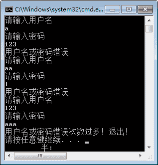

# C# goto 语句

> 原文：[`c.biancheng.net/view/2803.html`](http://c.biancheng.net/view/2803.html)

C# goto 语句用于直接在一个程序中转到程序中的标签指定的位置，标签实际上由标识符加上冒号构成。

语法形式如下。

goto Labell;
    语句块 1;
Labell
    语句块 2;

如果要跳转到某一个标签指定的位置，直接使用 goto 加标签名即可。

在上面的语句中使用了 goto 语句后，语句的执行顺序发生了变化，即先执行语句块 2，再执行语句块 1。

此外，需要注意的是 goto 语句不能跳转到循环语句中，也不能跳出类的范围。

由于 goto 语句不便于程序的理解，因此 goto 语句并不常用。

【实例】使用 goto 语句判断输入的用户名和密码是否正确，如果错误次数超过 3 次，则输出“用户名或密码错误次数过多！退出！”。

根据题目要求，假设用户名为 aaa、密码为 123，代码如下。

```

class Program
{
    static void Main(string[] args)
    {
        int count = 1;
    login:
        Console.WriteLine("请输入用户名");
        string username = Console.ReadLine();
        Console.WriteLine("请输入密码");
        string userpwd = Console.ReadLine();
        if (username == "aaa" && userpwd == "123")
        {
            Console.WriteLine("登录成功");
        }
        else
        {
            count++;
            if (count > 3)
            {
                Console.WriteLine("用户名或密码错误次数过多！退出！");
            }
            else
            {
                Console.WriteLine("用户名或密码错误");
                goto login;//返回 login 标签处重新输入用户名密码
            }
        }
    }
}
```

执行上面的代码，效果如下图所示。

