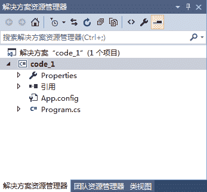

# C#类的定义（class）

> 原文：[`c.biancheng.net/view/2806.html`](http://c.biancheng.net/view/2806.html)

在 C# 语言中创建的任何项目都有类的存在，通过类能很好地体现面向对象语言中封装、继承、多态的特性。

本节将讲解 C# 中的类和定义类方式。

在前面的学习中已经多次使用过类，类定义的语法形式并不复杂，请记住 class 关键字，它是定义类的关键字。

类定义的具体语法形式如下。

类的访问修饰符    修饰符    类名
{
    类的成员
}

其中：

*   类的访问修饰符：用于设定对类的访问限制，包括 public、internal 或者不写，用 internal 或者不写时代表只能在当前项目中访问类；public 则代表可以在任何项目中访问类。
*   修饰符：修饰符是对类本身特点的描述，包括 abstract、sealed 和 static。abstract 是抽象的意思，使用它修饰符的类不能被实例化；sealed 修饰的类是密封类，不能 被继承；static 修饰的类是静态类，不能被实例化。
*   类名：类名用于描述类的功能，因此在定义类名时最好是具有实际意义，这样方便用户理解类中描述的内容。在同一个命名空间下类名必须是唯一的。
*   类的成员：在类中能定义的元素，主要包括字段、属性、方法。

【实例】在 Visual Studio 2015 的项目中添加类文件。

在 Visual Studio 2015 中首先创建一个控制台应用程序 code_1，创建后的效果如下图所示。


在上图中右击项目名称，在弹出的菜单中依次选择“添加”一“新建项”一“类”命令，并定义类名称为 Test，如下图所示。


单击“添加”按钮，添加后的类内容如下。

```

using System;
using System.Collections.Generic;
using System.Linq;
using System.Text;
using System.Threading.Tasks;

namespace code_1
{
    class Test
    {
    }
}
```

从创建的 Test 类可以看出，默认情况下创建的类在 class 关键字前面没有任何修饰符，因此默认创建的类能在同一个项目中被访问。

另外，在同一个命名空间中也可以定义多个类。例如上面代码所示的文件中再定义一个名为 Test1 的类，代码如下。

```

namespace code_1
{
    class Test
    {
    }
    class Test1
    {
    }
}
```

尽管可以在一个命名空间中定义多个类，但不建议使用这种方式，最好是每一个文件定义一个类，这样方便阅读和查找。

用户不仅可以在控制台应用程序中添加类，在之后的学习中我们还将会介绍的其他类型的应用程序中也可以添加类，添加的方法是类似的。