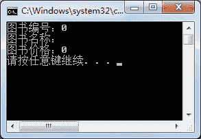
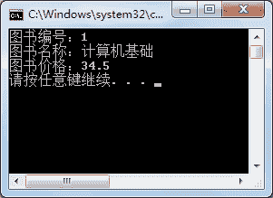

# C#调用类成员

> 原文：[`c.biancheng.net/view/2811.html`](http://c.biancheng.net/view/2811.html)

在前面的小节中已经了解了类中成员的定义，在本节将介绍如何访问类中的成员，即调用类的成员。

调用类的成员实际上使用的是类的对象，对于创建类的对象，首先可以将类理解成一个模板，类的对象则是按照这个模板定制的一个对象。

例如在创建一个 Word 文档时会自动按照 Word 中默认的文档模板(.dot)创建一个与之样式相同的文件。

创建类对象的语法 形式如下。

类名对象名 = new 类名();

上面的语法形式是一种简单形式，通过“对象名”即可调用类中的成员。调用的语法形式如下。

对象名 . 类的成员

下面通过实例来演示如何使用对象名调用类的成员。

【实例 1】在 Book 类中添加一个方法，用于输出该类中的所有属性。

根据题目要求，代码如下。

```

class Book
{
    public int Id { get; set; }
    public string Name { get; set; }
    public double Price { get; set; }

    public void PrintMsg()
    {
        Console.WriteLine("图书编号：" + Id);
        Console.WriteLine("图书名称：" + Name);
        Console.WriteLine("图书价格：" + Price);
    }
}
```

在项目的 Program.cs 文件里的 Main 方法中，加入调用 PrintMsg() 方法的代码。

```

class Program
{
    static void Main(string[] args)
    {
        Book book = new Book();
        book.PrintMsg();
    }
}
```

执行上面代码，效果如下图所示。


从上面的输出效果可以看出，如果没有对自定义的属性赋值，系统会默认为属性赋值。如果需要为属性赋值后做输出操作，则要在调用 PrintMsg() 前先对属性赋值，赋值并输出的代码如下。

```

class Program
{
    static void Main(string[] args)
    {
        Book book = new Book();
        //为属性赋值
        book.Id = 1;
        book.Name = "计算机基础";
        book.Price = 34.5;
        book.PrintMsg();
    }
}
```

执行上面的代码，效果如下图所示。


【实例 2】在 Book 类中添加一个向属性赋值的方法，并在 Main 方法中调用。

根据题目要求，代码如下。

```

class Book
{
    public int Id { get; set; }
    public string Name { get; set; }
    public double Price { get; set; }

    public void SetBook(int id, string name, double price)
    {
        Id = id;
        Name = name;
        Price = price;
    }
    public void PrintMsg()
    {
        Console.WriteLine("图书编号：" + Id);
        Console.WriteLine("图书名称：" + Name);
        Console.WriteLine("图书价格：" + Price);
    }
}
```

在 Main 方法中调用 SetBook 和 PrintMsg 方法，代码如下。

```

class Program
{
    static void Main(string[] args)
    {
        Book book = new Book();
        book.SetBook(1, "计算机基础", 34.5);
        book.PrintMsg();
    }
}
```

执行上面的代码，效果【实例 1】中一致。

通过上面的实例可以了解类的对象调用属性和方法的基本用法，给属性赋值的代码如下。

类的对象 . 属性名 = 值;

如果要取得属性的值，直接使用“类的对象.属性名”即可。 使用类的对象调用方法的代码如下。

类的对象 . 方法名(参数);

> 注意：在调用方法时需要传递对应类型的参数。

如果将类中的成员使用修饰符 static 声明，则在访问类成员时直接使用“类名.类成员”的方式即可。

需要注意的是，如果将一个方法声明成静态的，在方法中只能直接访问静态类成员，非静态成员通过类的对象调用才能访问。

例如将【实例 2】中的方法 PrintMsg 改成静态方法，则无法直接访问属性，而需要通过类的对象才能访问属性或者直接将属性定义成静态的。

【实例 3】将 Book 类中的属性和方法更改为静态的。

根据题目要求，将 Book 类中的属性和方法都更改为静态的，更改后的代码如下。

```

class Book
{
    public static int Id { get; set; }
    public static string Name { get; set; }
    public static double Price { get; set; }

    public static void SetBook(int id, string name, double price)
    {
        Id = id;
        Name = name;
        Price = price;
    }
    public static void PrintMsg()
    {
        Console.WriteLine("图书编号：" + Id);
        Console.WriteLine("图书名称：" + Name);
        Console.WriteLine("图书价格：" + Price);
    }
}
```

将 Book 类中的所有属性和方法都改成静态的修饰符，在静态方法中即可直接访问静态属性。

在 Main 方法中调用静态方法的代码如下。

```

class Program
{
    static void Main(string[] args)
    {
        Book.SetBook(1, "计算机基础", 34.5);
        Book.PrintMsg();
    }
}
```

执行上面的代码，效果与【实例 2】一致。从调用的方式可以看出，在调用 Book 类中的成员时不必再创建类的对象，而是直接通过类名即可调用类中的静态成员。通常将类中经常被调用的方法声明成静态的。