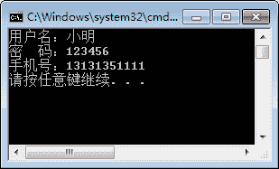

# C#构造函数（构造方法）

> 原文：[`c.biancheng.net/view/2812.html`](http://c.biancheng.net/view/2812.html)

创建类的对象是使用“类名 对象名 = new 类名()”的方式来实现的。

实际上，“类名()”的形式调用的是类的构造方法，也就是说构造方法的名字是与类的名称相同的。

但是，在上一节《C#调用类成员》中的 Book 类中并不存在与类名相同的构造方法。其实，在 Book 类中并没有自定义构造方法，而是由系统自动生成了一个构造方法，并且该构造方法不包含参数。

构造方法的定义语法形式如下。

访问修饰符  类名 (参数列表)
{
    语句块；
}

这里构造方法的访问修饰符通常是`public`类型的，这样在其他类中都可以创建该类的对象。

如果将访问修饰符设置成`private`类型的，则无法创建该类的对象。构造方法中的参数与其他方法一样，都是 0 到多个参数。

此外，构造方法是在创建类的对象时被调用的。通常会将一些对类中成员初始化的操作放到构造方法中去完成。

【实例】创建用户类 User，并创建构造方法为用户类中的属性赋值。在 Main 方法中 调用输出用户信息的方法，用户属性包括用户名、密码、手机号。

根据题目要求，代码如下。

```

class User
{
    public User(string name, string password, string tel)
    {
        this.Name = name;
        this.Password = password;
        this.Tel = tel;
    }
    public string Name { get; set; }
    public string Password { get; set; }
    public string Tel { get; set; }

    public void PrintMsg()
    {
        Console.WriteLine("用户名：" + this.Name);
        Console.WriteLine("密  码：" + this.Password);
        Console.WriteLine("手机号：" + this.Tel);
    }
}
```

在上面程序的构造方法中含有 3 个参数，为每一个属性赋值。这里用“this.属性名”的方式调用属性，`this`关键字表示当前类的对象。

在 Main 方法中调用方法的代码如下。

```

class Program
{
    static void Main(string[] args)
    {
        User user = new User("小明","123456","13131351111");
        user.PrintMsg();
    }
}
```

执行上面的代码，效果如下图所示。


从上面的输出结果可以看出，在创建类的对象 user 时就调用了带参数的构造方法为属性赋值。