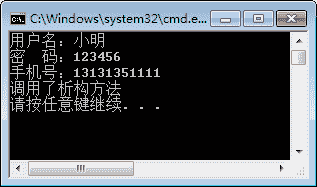

# C#析构函数（方法）

> 原文：[`c.biancheng.net/view/2813.html`](http://c.biancheng.net/view/2813.html)

在上一节讲的《C#构造方法》中介绍的构造方法是在创建类的对象时执行的，而析构方法则是在垃圾回收、释放资源时使用的。

析构方法的定义语法形式如下。

~类名()
{
    语句块；
}

在析构方法中不带任何参数，它实际上是保证在程序中会调用垃圾回收方法 Finalize()。

【实例】在 User 类中添加析构方法并验证析构方法的效果。

根据题目要求，析构方法是在类操作完成后调用的，代码如下。

```

~User()
{
    Console.WriteLine("调用了析构方法");
}
```

执行 Main 方法，效果如下图所示。


从调用结果可以看出，析构方法是在程序结束后自动被调用的。