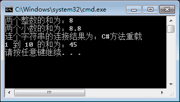

# C#方法重载（函数重载）

> 原文：[`c.biancheng.net/view/2817.html`](http://c.biancheng.net/view/2817.html)

在讲解《C#构造方法》时提到定义构造方法时提到可以定义带 0 到多个参数的构造方法，但构造方法的名称必须是类名。实际上，这就是一个典型的方法重载，即方法名称相同、参数列表不同。

参数列表不同主要体现在参数个数或参数的数据类型不同。在调用重载的方法时系统是根据所传 递参数的不同判断调用的是哪个方法。

【实例 1】创建一个名为 SumUtils 的类，在类中分别定义计算两个整数、两个小数、 两个字符串类型的和，以及从 1 到给定整数的和。在 Main 方法中分别调用定义好的方法。

根据题目要求，分别定义 3 个带两个参数的方法，以及一个带一个整型参数的方法，代码如下。

```

class SumUtils
{
    public int Sum(int a,int b)
    {
        return a + b;
    }
    public double Sum(double a,double b)
    {
        return a + b;
    }
    public string Sum(string a,string b)
    {
        return a + b;
    }
    public int Sum(int a)
    {
        int sum = 0;
        for(int i = 1; i < a; i++)
        {
            sum += i;
        }
        return sum;
    }
}
```

从上面的程序可以看出在该类中定义的方法名称都是 Sum,仅是参数的类型或个数不同而已。在 Main 方法中调用上述定义的方法，代码如下。

```

class Program
{
    static void Main(string[] args)
    {
        SumUtils s = new SumUtils();
        //调用两个整数求和的方法
        Console.WriteLine("两个整数的和为：" + s.Sum(3, 5));
        //调用两个小数求和的方法
        Console.WriteLine("两个小数的和为：" + s.Sum(3.2, 5.6));
        //调用两个字符串连接的方法
        Console.WriteLine("连个字符串的连接结果为：" + s.Sum("C#", "方法重载"));
        //输出 1 到 10 的和
        Console.WriteLine("1 到 10 的和为：" + s.Sum(10));
    }
}
```

在调用 Sum 时只是传递的参数不同，系统会自动识别参数来调用正确的方法。

执行上面的代码，效果如下图所示。


在该实例中演示的是一般方法的重载，构造方法也是可以重载的，在一个类中能定义 多个构造方法，以方便根据不同的需要完成不同的类成员初始化操作。

【实例 2】定义一个 SayHello 的类，在类中分别定义 3 个构造方法，一个是不带参数 的构造方法，用于打印“Hello”； 一个是带一个参数的构造方法传递一个用户名，用于打 印“Hello Army”(Army 为传入的用户名)；一个是带两个参数的构造方法传递一个用户名 和年龄，用于打印“Hello Army,20”(Army 为传入的用户名、20 为传入的年龄)。在 Main 方法中使用不同的构造器创建 SayHello 类的对象。

根据题目要求，代码如下。

```

class SayHello
{
    public SayHello()
    {
        Console.WriteLine("Hello");
    }
    public SayHello(string name)
    {
        Console.WriteLine("Hello " + name);
    }
    public SayHello(string name, int age)
    {
        Console.WriteLine("Hello " + name + "，" + age);
    }
}
```

在 Main 方法中分别通过上面定义的构造器创建类的对象，代码如下。

```

class Program
{
    static void Main(string[] args)
    {
        SayHello say1 = new SayHello();
        SayHello say2 = new SayHello("小明");
        SayHello say3 = new SayHello("张三", 20);
    }
}
```

执行上面的代码，效果如下图所示。

