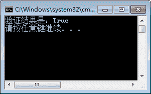
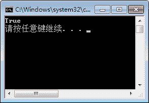

# C#方法的参数（实参和形参）

> 原文：[`c.biancheng.net/view/2820.html`](http://c.biancheng.net/view/2820.html)

方法中的参数分为实际参数和形式参数，实际参数被称为实参，是在调用方法时传递的参数；形式参数被称为形参，是在方法定义中所写的参数。

例如：

```

public int Add(int a,int b)
{
    return a+b;
}
```

在上面的方法定义中，a 和 b 是形式参数。在 Print 调用方法时使用如下代码：

```

public void Print()
{
    Add(3,4);
}
```

在调用 Add 方法时传递的参数 3 和 4 即为实际参数。

在 C# 语言中，方法中的参数除了定义数据类型外，还可以定义引用参数和输出参数。引用参数使用 ref 关键字定义，输出参数使用 out 关键字定义。

引用参数在方法中使用时必须为其值，并且必须是由变量赋予的值，不能是常量或表达式。

如果需要将方法中的每一个参数都设置为 ref 类型参数，则需要在每一个参数前面加上 ref 关键字修饰。

【实例 1】创建名为 RefClass 的类，在类中定义一个判断所输入整数是否为 5 的倍数的方法，并将方法中传入的整数参数定义为 ref 类型的。

根据题目要求，代码如下。

```

class RefClass
{
    public bool Judge(ref int num)
    {
        if (num % 5 == 0)
        {
            return true;
        }
        return false;
    }
}
```

在 Main 方法中调用 Judge 方法，代码如下。

```

class Program
{
    static void Main(string[] args)
    {
        RefClass refClass = new RefClass();
        int a = 20;
        bool result = refClass.Judge(ref a);
        Console.WriteLine("验证结果是：" + result);
    }
}

```

执行上面的代码，效果如下图所示。


从该实例中可以看出，在调用带有引用参数的方法时，实际参数必须是一个变量，并且在传值时必须加上 ref 关键字。

引用参数与我们平时使用的参数有些类似，但输出参数不同，输出参数相当于返回值,即在方法调用完成后可以将返回的结果存放到输出参数中。

输出参数多用于一个方法需要返回多个值的情况。需要注意的是，在使用输出参数时，必须在方法调用完成前为输出参数赋值。

【实例 2】创建一个 OutClass 类，在类中定义与【实例 1】类似的方法，只是在方法的参 数中增加一个输出参数，用于返回判断的结果。

根据题目要求，代码如下。

```

class OutClass
{
    public void Judge(int num, out bool result)
    {
        if (num % 5 == 0)
        {
            result = true;
        }
        else
        {
            result = false;
        }
    }
}
```

在 Main 中调用该方法，代码如下。

```

class Program
{
    static void Main(string[] args)
    {
        OutClass outClass = new OutClass();
        bool rs;
        outClass.Judge(20, out rs);
        Console.WriteLine(rs);
    }
}
```

执行上面的代码，效果如下图所示。


从该实例中可以看出，在使用输出参数时，必须在方法操作结束前为带输出参数的形式参数赋值。

在调用含有带输出参数的方法时，必须在传递参数时使用 out 关键字，但不必给输出参数赋值。