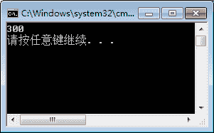

# C# lambda 表达式

> 原文：[`c.biancheng.net/view/2822.html`](http://c.biancheng.net/view/2822.html)

在 C# 语言中提供了 Lambda 表达式，给编写程序带来了很多的便利，在 C# 6.0 中还提供了表达式体方法(expTession-bodied method)的新功能，方法体直接使用 => 的形式来实现。

具体的语法形式如下。

访问修饰符    修饰符    返回值类型    方法名(参数列表) => 表达式;

这里需要注意的是，如果在方法定义中定义了返回值类型，在表达式中不必使用 return 关键字，只需要计算值即可。

这种形式只能用在方法中只有一条语句的情况下，方便方法的书写。

【实例】创建类 LambdaClass,在类中定义一个整数相加的方法，并在 Main 方法中调用。

根据题目要求，在该实例中直接使用 => 形式的方法体，为了方便调用将该方法定义成 静态的，代码如下。

```

class LambdaClass
{
    public static int Add(int a, int b) => a + b;
}
```

在 Main 方法中调用，代码如下。

```

class Program
{
    static void Main(string[] args)
    {
        Console.WriteLine(LambdaClass.Add(100, 200));
    }
}
```

执行效果如下图所示。


从该实例可以看出，在 Add 方法中只需要写一句话即可完成方法的需求。如果将 Add 方法中的返回值更改成 void,则 Add 方法的定义语句如下。

```

public static void Add(int a, int b) => Console.WriteLine(a + b);
```

这样在调用 Add 方法时直接调用即可，不需要再使用 Console.WriteLine 语句输出结果。