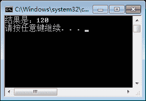

# C#递归

> 原文：[`c.biancheng.net/view/2823.html`](http://c.biancheng.net/view/2823.html)

递归是经常在企业笔试中考到的问题，也是一种特殊的执行程序，它是用方法调用自身的形式实现的，让程序代码循环执行。

下面通过一个实例来演示 C# 中方法递归调用的实现。

【实例】使用递归实现计算所输入数的阶乘。

例如计算 5 的阶乘，则是 5*4*3*2*1 的结果。根据题目要求，实现的代码如下。

```

class FactorialClass
{
    public static int Factorial(int n)
    {
        if(n == 0)
        {
            return 1;
        }
        return n * Factorial(n - 1);
    }
}
```

在 Main 方法中调用该静态方法，代码如下。

```

class Program
{
    static void Main(string[] args)
    {
        int rs = FactorialClass.Factorial(5);
        Console.WriteLine("结果是：" + rs);
    }
}
```

执行上面的代码，效果如下图所示。


从该代码可以看出，实现递归的部分是由 n * Factorial(n-l) 语句实现的，即在 Factorial 方法中再次调用该方法，每次只需要将 n 的值减 1 即可。

上面的实例也可以通过循环的方法直接计算阶乘。

实现计算 n 的阶乘的代码如下。

```

int rs=l; //存放阶乘的结果
for(int i=1; i<=n;i++)
{
    rs = rs*i;
}
```

循环计算完成后，变量 rs 中即为阶乘的结果。