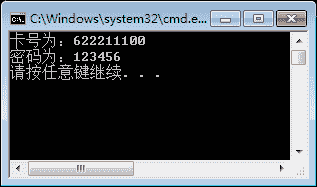

# C#嵌套类

> 原文：[`c.biancheng.net/view/2824.html`](http://c.biancheng.net/view/2824.html)

在类中除了能编写前面提到的类成员以外，还能直接定义类。将一个类定义在另一个类的内部，即可将在类内部定义的类称为嵌套类。

在 C# 中嵌套类相当于类中的成员，能使用类成员的访问修饰符和修饰符。但是，在访问嵌套类中的成员时必须加上外层类的名称。

【实例 1】定义名为 OuterClass 的类，在其中定义名为 InnerClass 的类，并在类中定义两个属性，即卡号和密码，而且定义方法输出属性的值。

根据题目要求，代码如下。

```

class OuterClass
{
    public class InnerClass
    {
        public string CardId { get; set; }
        public string Password { get; set; }
        public void PrintMsg()
        {
            Console.WriteLine("卡号为：" + CardId);
            Console.WriteLine("密码为：" + Password);
        }
    }
}
```

在 Main 方法中调用嵌套类的成员，代码如下。

```

class Program
{
    static void Main(string[] args)
    {
        OuterClass.InnerClass outInner = new OuterClass.InnerClass();
        outInner.CardId = "622211100";
        outInner.Password = "123456";
        outInner.PrintMsg();
    }
}
```

执行上面的代码，效果如下图所示。


从该实例中可以看出，如果在其他类中调用嵌套类的成员，需要使用“外部类.嵌套类”的方式创建嵌套类的对象，从而通过嵌套类的对象调用其成员。

如果调用的是嵌套类中的静态成员，直接通过“外部类 . 嵌套类 . 静态成员”的方式调用即可。