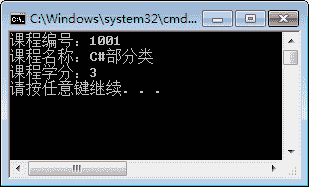

# C# partial 部分类详解

> 原文：[`c.biancheng.net/view/2826.html`](http://c.biancheng.net/view/2826.html)

在 C# 语言中提供了一个部分类，正如字面上的意思，它用于表示一个类中的一部分。

一个类可以由多个部分类构成，定义部分类的语法形式 如下。

访问修饰符   修饰符   partial class   类名{……}

在这里，partial 即为定义部分类的关键字。部分类主要用于当一个类中的内容较多时将相似类中的内容拆分到不同的类中，并且部分类的名称必须相同。

【实例 1】定义名为 Course 的类，分别使用两个部分类实现定义课程属性并输出的操作。在一个部分类中设定课程的属性，在一个部分类中定义方法输出课程的属性。

根据题目要求，课程的属性包括课程编号、课程名称、课程学分，代码如下。

```

public partial class Course
{
    public int Id { get; set; }
    public string Name { get; set; }
    public double Points { get; set; }
}
public partial class Course
{
    public void PrintCoures()
    {
        Console.WriteLine("课程编号：" + Id);
        Console.WriteLine("课程名称：" + Name);
        Console.WriteLine("课程学分：" + Points);
    }
}
```

在 Main 方法中为属性赋值并调用 PrintCourse 方法,代码如下。

```

static void Main(string[] args)
{
    Course course = new Course();
    course.Id = 1001;
    course.Name = "C#部分类";
    course.Points = 3;
    course.PrintCoures();
}
```

执行上面的代码，效果如下图所示。


从该实例可以看出，在不同的部分类中可以直接互相访问其成员，相当于所有的代码都写到一个类中。

此外，在访问类成员时也非常方便，直接通过类的对象即可访问不同部分类的成员。

除了定义部分类外，还可以在部分类中定义部分方法，实现的方式是在一个部分类中定义一个没有方法体的方法，在另一个部分类中完成方法体的内容。

部分方法用的不是特别多，这里咱们了解即可。

使用部分方法需要注意如下 3 点：

*   部分方法必须是私有的，并且不能使用 virtual、abstract、override、new、sealed、extern 等修饰符。
*   部分方法不能有返回值。
*   在部分方法中不能使用 out 类型的参数。

【实例 2】在实例 1 的基础上添加部分方法，在第一个部分类中添加一个没有方法体的 PrintCourse 方法。

根据题目要求，添加部分方法后的代码如下。

```

public partial class Course
{
    public int Id { get; set; }
    public string Name { get; set; }
    public double Points { get; set; }
    partial void PrintCourse();
    //调用 PrintCourse 方法
    public void PrintMsg()
    {
        PrintCourse();
    }
}
public partial class Course
{
    public void PrintCoures()
    {
        Console.WriteLine("课程编号：" + Id);
        Console.WriteLine("课程名称：" + Name);
        Console.WriteLine("课程学分：" + Points);
    }
}
```

由于部分方法是私有的，因此在 Course 类中添加一个打印方法 PrintMsg 来调用 PrintCourse 方法，以方便在其他类中调用。

在 Main 方法中调用 PrintMsg 方法的代码如下。

```

static void Main(string[] args)
{
    Course course = new Course();
    course.Id = 1001;
    course.Name = "C#部分类";
    course.Points = 3;
    course.PrintMsg();
}
```

执行上面的代码，效果与实例 1 中类似。

从上面的实例可以看出，在第一个部分类中 PrintCourse 方法并没有方法体，直接通过 PrintMsg 方法调用 PrintCourse 方法，也可以直接输出属性值，即调用第二个部分类中的 PrintCourse 方法实现的内容。