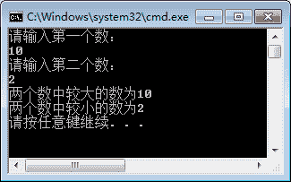

# C# Math 类

> 原文：[`c.biancheng.net/view/2828.html`](http://c.biancheng.net/view/2828.html)

C# Math 类主要用于一些与数学相关的计算，并提供了很多静态方法方便访问，常用的方法如下表所示。

| 方法 | 描述 |
| Abs | 取绝对值 |
| Ceiling | 返回大于或等于指定的双精度浮点数的最小整数值 |
| Floor | 返回小于或等于指定的双精度浮点数的最大整数值 |
| Equals | 返回指定的对象实例是否相等 |
| Max | 返回两个数中较大数的值 |
| Min | 返回两个数中较小数的值 |
| Sqrt | 返回指定数字的平方根 |
| Round | 返回四舍五入后的值 |

下面通过实例来演示 Math 类的使用。

【实例】从控制台输入两个数，分别使用 Max 和 Min 方法输出其中的最大值和最小值。 

根据题目要求，代码如下。

```

class Program
{
    static void Main(string[] args)
    {
        Console.WriteLine("请输入第一个数：");
        double num1 = Double.Parse(Console.ReadLine());
        Console.WriteLine("请输入第二个数：");
        double num2 = Double.Parse(Console.ReadLine());
        Console.WriteLine("两个数中较大的数为{0}", Math.Max(num1, num2));
        Console.WriteLine("两个数中较小的数为{0}", Math.Min(num1, num2));
    }
}
```

执行上面的代码，效果如下图所示。


从上面的代码可以看出，通过 Math 类中的 Max 和 Min 方法很容易实现获取两个数中最大值和最小值的操作。