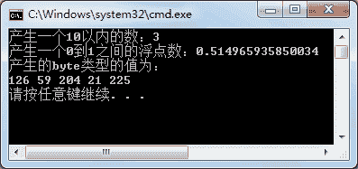

# C# Random 类

> 原文：[`c.biancheng.net/view/2830.html`](http://c.biancheng.net/view/2830.html)

C# Random 类是一个产生伪随机数字的类，它的构造函数有两种。

```

New Random()；
New Random(Int32)。
```

前者是根据触发那刻的系统时间做为种子，来产生一个随机数字，后者可以自己设定触发的种子，一般都是用 UnCheck((Int)DateTime.Now.Ticks) 做为参数种子。

因此如果计算机运行速度很快，如果触发 Randm 函数间隔时间很短，就有可能造成产生一样的随机数，因为伪随机的数字，在 Random 的内部产生机制中还是有一定规律的，并非是真正意义上的完全随机。

Random 类中提供的 Next、NextBytes 以及 NextDouble 方法可以生成整数类型、byte 数组类型以及双精度浮点型的随机数，详细说明如下表所示。

| 方法 | 描述 |
| Next() | 每次产生一个不同的随机正整数 |
| Next(int max Value) | 产生一个比 max Value 小的正整数 |
| Next(int min Value,int max Value) | 产生一个 minValue~maxValue 的正整数，但不包含 maxValue |
| NextDouble() | 产生一个 0.0~1.0 的浮点数 |
| NextBytes(byte[] buffer) | 用随机数填充指定字节数的数组 |

下面通过实例来演示 Random 类中方法的使用。

【实例】分别使用 Next、NextDouble 以及 NextBytes 方法生成随机数。

根据题目要求，代码如下。

```

class Program
{
    static void Main(string[] args)
    {
        Random rd = new Random();
        Console.WriteLine("产生一个 10 以内的数：{0}", rd.Next(0, 10));
        Console.WriteLine("产生一个 0 到 1 之间的浮点数：{0}", rd.NextDouble());
        byte[] b = new byte[5];
        rd.NextBytes(b);
        Console.WriteLine("产生的 byte 类型的值为：");
        foreach(byte i in b)
        {
            Console.Write(i + " ");
        }
        Console.WriteLine();
    }
}
```

执行上面的代码，效果如下图所示。


从结果可以看出，通过 Random 类中的方法产生了不同类型的随机数。