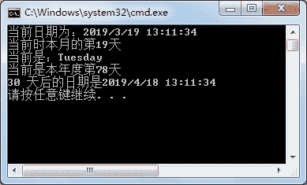

# C# DateTime 类

> 原文：[`c.biancheng.net/view/2831.html`](http://c.biancheng.net/view/2831.html)

C# DateTime 类用于表示时间，所表示的范围是从 0001 年 1 月 1 日 0 点到 9999 年 12 月 31 日 24 点。

在 DateTime 类中提供了静态属性 Now,用于获取当前的日期和时间，如下所示。

DateTime.Now

DateTime 类提供了 12 个构造方法来创建该类的实例，但经常使用不带参数的方法创建 DateTime 类的实例。

在 DateTime 类中提供了常用的属性和方 法用于获取或设置日期和时间，如下表所示。

| 方法 | 描述 |
| Date | 获取实例的日期部分 |
| Day | 获取该实例所表示的日期是一个月的第几天 |
| DayOfWeek | 获取该实例所表示的日期是一周的星期几 |
| DayOfYear | 获取该实例所表示的日期是一年的第几天 |
| Add(Timespan value) | 在指定的日期实例上添加时间间隔值 value |
| AddDays(double value) | 在指定的日期实例上添加指定天数 value |
| AddHours(double value) | 在指定的日期实例上添加指定的小时数 value |
| AddMinutes(double value) | 在指定的日期实例上添加指定的分钟数 value |
| AddSeconds(double value) | 在指定的日期实例上添加指定的秒数 value |
| AddMonths(int value) | 在指定的日期实例上添加指定的月份 value |
| AddYears (int value) | 在指定的日期实例上添加指定的年份 value |

下面通过实例来演示 DateTime 类的使用。

【实例】使用 DateTime 类获取当前时间，分别输出该日是当月的第几天、星期几以 及一年中的第几天，并计算 30 天后的日期。

根据题目要求，代码如下。

```

class Program
{
    static void Main(string[] args)
    {
        DateTime dt = DateTime.Now;
        Console.WriteLine("当前日期为：{0}", dt);
        Console.WriteLine("当前时本月的第{0}天", dt.Day);
        Console.WriteLine("当前是：{0}", dt.DayOfWeek);
        Console.WriteLine("当前是本年度第{0}天", dt.DayOfYear);
        Console.WriteLine("30 天后的日期是{0}", dt.AddDays(30));
    }
}
```

执行上面的代码，效果如下图所示。


在使用 DateTime 类中的 Add 方法时需要使用时间间隔类 TimeSpan,该类允许表示的时间间隔范围是 0 到 64 位整数。

两个日期的差可由时间间隔类 TimeSpan 的对象来存放。假设计算现在距离 2018 年 6 月 1 日儿童节的天数，代码如下。

```

class Program
{
    static void Main(string[] args)
    {
        DateTime dt1 = DateTime.Now;
        DateTime dt2 = new DateTime(2019, 6, 1);
        TimeSpan ts = dt2 - dt1;
        Console.WriteLine("间隔的天数为{0}天", ts.Days);
    }
}
```