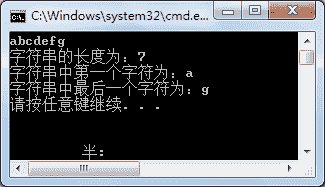
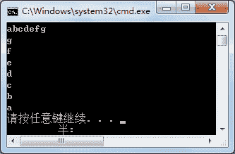

# C#获取字符串长度（string.Length）

> 原文：[`c.biancheng.net/view/2834.html`](http://c.biancheng.net/view/2834.html)

字符串实际上是由多个字符组成的，字符串中的第一个字符使用`字符串[0]`即可得。`[0]`中的 0 称为下标。

获取字符串中的第一个字符使用的下标是 0,则字符串中最后一个字符的下标是字符串的长度减 1。

使用 C# 语言如果要获取字符串的长度，使用`Length`属性即可，获取的方法如下。

字符串.Length

【实例 1】在 Main 方法中从控制台输入一个字符串，输出该字符串的长度，以及字符串中的第一个字符和最后一个字符。

根据题目要求，代码如下。

```

class Program
{
    static void Main(string[] args)
    {
        string str = Console.ReadLine();
        Console.WriteLine("字符串的长度为：" + str.Length);
        Console.WriteLine("字符串中第一个字符为：" + str[0]);
        Console.WriteLine("字符串中最后一个字符为：" + str[str.Length - 1]);
    }
}
```

执行上面的代码，效果如下图所示。


从该实例可以看出，获取字符串中的某个字符只需要通过下标即可完成。

【实例 2】在 Main 方法中从控制台输入一个字符串，并将字符串中的字符逆序输出。

根据题目要求，代码如下。

```

class Program
{
    static void Main(string[] args)
    {
        string str = Console.ReadLine();
        for(int i = str.Length - 1; i >= 0; i--)
        {
            Console.WriteLine(str[i]);
        }
    }
}
```

执行上面的代码，效果如下图所示。

