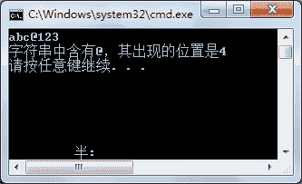
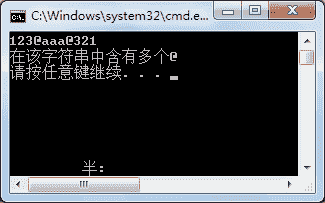

# C# IndexOf 和 LastIndexOf：查找字符串中的字符

> 原文：[`c.biancheng.net/view/2835.html`](http://c.biancheng.net/view/2835.html)

在字符串中查找是否含有某个字符串是常见的一个应用，例如在输入的字符串中查找特殊字符、获取某个字符串在原字符串中的位置等。

在 C# 中字符串的查找方法有 IndexOf、LastlndexOf，IndexOf 方法得到的是指定字符串在原字符串中第一次出现的位置，LastlndexOf 方法得到的是指定字符串在查找的字符串中最后一次出现的位置。

需要注意的是字符串中的每个字符的位置是从 0 开始的。

无论是哪个方法，只要指定的字符串在查找的字符串中不存在，结果都为 -1。

如果要判断字符串中是否仅含有一个指定的字符串，则需要将 IndexOf 和 LastlndexOf 方法一起使用，只要通过这两个方法得到的字符串出现的位置是同一个即可。

【实例 1】在 Main 方法中从控制台输入一个字符串，然后判断字符串中是否含有 @, 并输出 @ 的位置。

根据题目要求，使用 IndexOf 方法查找的代码如下。

```

class Program
{
    static void Main(string[] args)
    {
        string str = Console.ReadLine();
        if (str.IndexOf("@") != -1)
        {
            Console.WriteLine("字符串中含有@，其出现的位置是{0}", str.IndexOf("@") + 1);
        }
        else
        {
            Console.WriteLine("字符串中不含有@");
        }
    }
}
```

执行上面的代码，效果如下图所示。


【实例 2】在 Main 方法中从控制台输入一个字符串，判断该字符串中是否仅含有一个 @。

根据题目要求，使用 IndexOf 方法查找第一个 @ 出现的位置与使用 LastlndexOf 方法查找 @ 在字符串中最后一次出现的位置相同即可，实现的代码如下。

```

class Program
{
    static void Main(string[] args)
    {
        string str = Console.ReadLine();
        int firstIndex = str.IndexOf("@");
        int lastIndex = str.LastIndexOf("@");
        if(firstIndex != -1)
        {
            if (firstIndex == lastIndex)
            {
                Console.WriteLine("在该字符串中仅含有一个@");
            }
            else
            {
                Console.WriteLine("在该字符串中含有多个@");
            }
        }
        else
        {
            Console.WriteLine("在该字符串中不含有@");
        }
    }
}
```

执行上面的代码，效果如下图所示。
 
从上面的执行效果可以看出，在字符串中包含了两个 @,因此提示的结果是“在该字符串中含有多个@”。