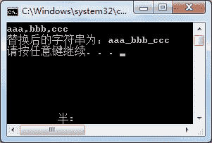

# C# Replace：字符串替换函

> 原文：[`c.biancheng.net/view/2836.html`](http://c.biancheng.net/view/2836.html)

字符串的替换操作是指将字符串中指定的字符串替换成新字符串。

在 C# 中替换字符串的方法是`Replace`方法。

【实例】在 Main 方法中从控制台输入一个字符串，然后将字符串中所有的‘,’替换成‘_’。

根据题目要求，代码如下。

```

class Program
{
    static void Main(string[] args)
    {
        string str = Console.ReadLine();
        if (str.IndexOf(",") != -1)
        {
            str = str.Replace(",", "_");
        }
        Console.WriteLine("替换后的字符串为：" + str);
    }
}
```

执行上面的代码，效果如下图所示。


 从上面的执行效果可以看出，通过 Replace 方法将字符串中所有的‘,’换成了‘_’。