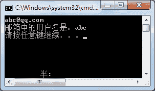

# C# Substring：字符串截取函数

> 原文：[`c.biancheng.net/view/2837.html`](http://c.biancheng.net/view/2837.html)

在一个字符串中截取一部分字符串也是经常用到的，例如从身份证号码中取得岀生年月日、截取手机号码的前 3 位、截取给定邮箱的用户名等。

在 C# 语言中截取字符串的方法是 Substring 方法，在使用该方法时有以下两种方法传递参数。

```

Substring(指定位置); //从字符串中的指定位置开始截取到字符串结束
Substring(指定位置, 截取的字符的个数); //从字符串中的指定位置开始截取指定字符个数的字符
```

【实例】在 Main 方法中从控制台输入邮箱，要求邮箱中仅含有一个 @，然后截取邮箱中的用户名输出。

根据题目要求，代码如下。

```

class Program
{
    static void Main(string[] args)
    {
        string str = Console.ReadLine();
        int firstIndex = str.IndexOf("@");
        int lastIndex = str.LastIndexOf("@");
        if(firstIndex != -1 && firstIndex == lastIndex)
        {
            str = str.Substring(0, firstIndex);
        }
        Console.WriteLine("邮箱中的用户名是：" + str);
    }
}
```

执行上面的代码，效果如下图所示。


在上面的代码中，在截取邮箱中的用户名时得到 @ 的位置即可清楚需要截取的字符的个数。